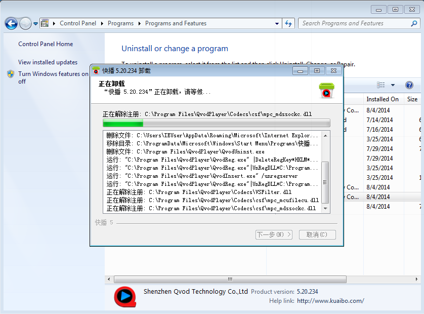
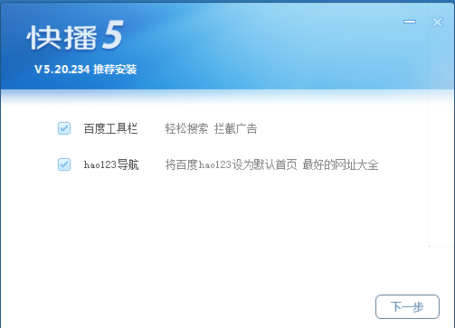

最近常常遇到一些朋友的問題：為什麼 Firefox 首頁莫名奇妙的就被 hao123 綁架了呢？

上圖即顯示了 Firefox 的首頁被綁架到：

http://www.hao123.com/?tn=97473572_hao_pg

就算怎麼更改首頁、顯示空白頁都沒有用……

我們該怎麼把 Firefox 的首頁救回來呢？

其實事出必有因啊！不會有莫名奇妙網頁就被綁架這回事。所以遇到這種問題，我最常先問的就是：

「你是不是最近又裝了什麼新軟體？」

一問之下，果然是在新裝了快播 QvodPlayer 之後， Firefox 的首頁就被綁架了。

接下來就用快播 QvodPlayer 5.20.234 版來示範怎麼解決這個問題。

如果你已經裝了這個版本的快播，那請到「安裝/移除程式」裡，把已經裝好的快播移除。

在移除快播之後，Firefox 被綁架的首頁就回來了。接下來再重新安裝快播，但是請特別注意，在安裝過程中看到以下畫面的時候，請先暫停安裝的動作，不要勾選「hao123 導航」這個選項，再按「下一步」往下安裝。

這樣一來，快播就不會去綁架 Firefox 的首頁，從此之後就可以快快樂樂的上網囉！是不是很簡單啊？

以上方式只有在快播 5.20.234 版上測試過。如果是因為其他軟體或版本造成的首頁綁架，也許可以試試看先移除該軟體，而後重新安裝時，注意在安裝過程中不要勾選「hao123 導航」，說不定同樣能解決首頁被綁架的問題。
