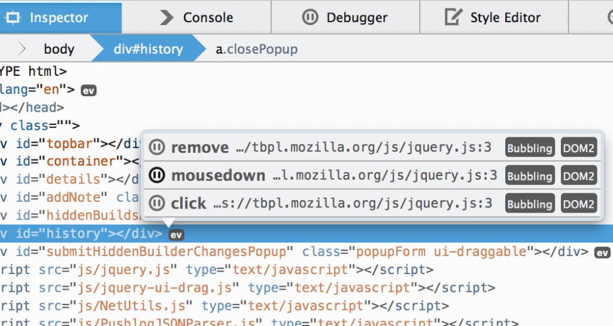
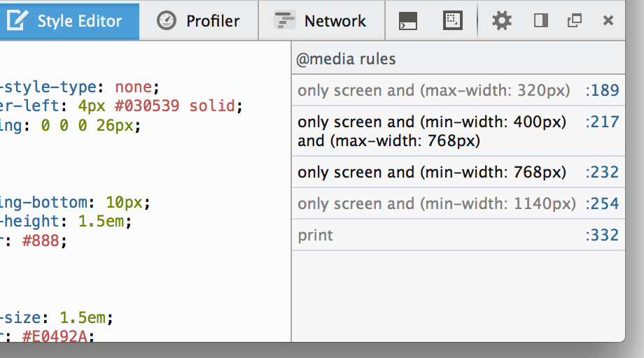
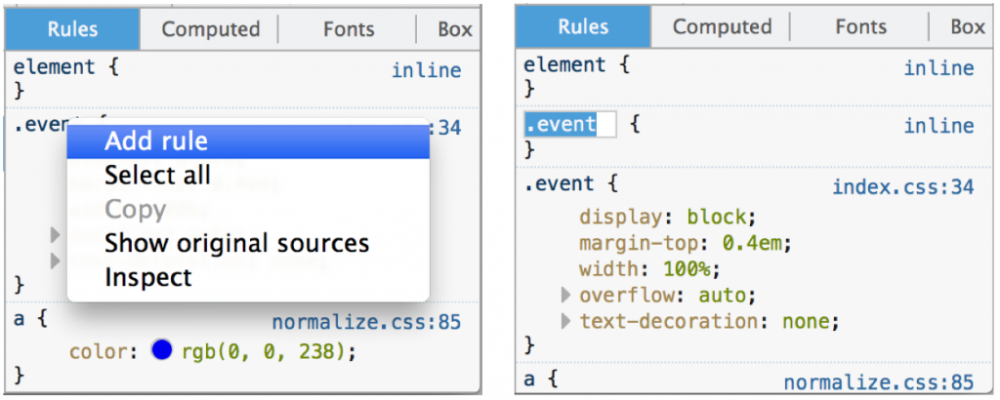
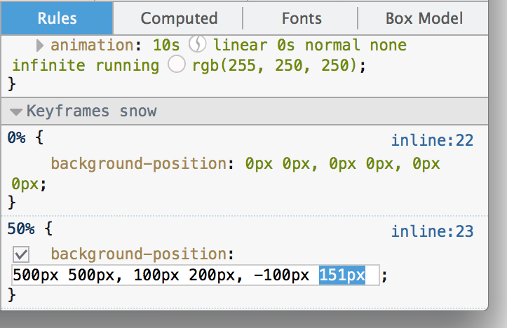
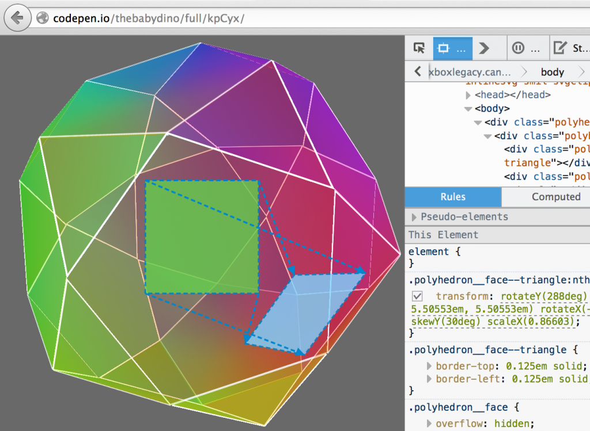

### 事件監聽器彈出型視窗、@media 側邊列、Cubic bezier 編輯器，還有更多功能

新的開發者工具已經進入 Firefox [曙光版 (Aurora) 釋出頻道](https://www.mozilla.org/firefox/aurora/)，並即將在 10 月發佈的 Firefox 33 正式現身。這次特別針對「檢測器 (Inspector)」提供多項新功能：

### 事件監聽器 (Event Listener) 彈出型視窗

任一節點若附加了 JavaScript 事件監聽器 (Event listener)，[檢測器 (Inspector)](https://developer.mozilla.org/docs/Tools/Page_Inspector) 就會在該節點旁顯示「ev」圖示。只要點擊該圖示，隨即列出該元素附加的所有事件監聽器。若點擊「暫停」圖示，就會進入[除錯器 (Debugger)](https://developer.mozilla.org/docs/Tools/Debugger) 中的函式，方便開發者設定中斷點並進一步除錯 (可參閱[開發討論記錄](https://bugzilla.mozilla.org/show_bug.cgi?id=736078)與[他人在 UserVoice 提出的需求](https://ffdevtools.uservoice.com/forums/246087-firefox-developer-tools-ideas/suggestions/5896562-provide-info-about-attached-event-listeners-when-i))。

另請留意「除錯器 (Debugger)」中的[事件窗格](https://developer.mozilla.org/docs/Tools/Debugger#Events_pane)，其內將列出該頁面上的所有事件監聽器。

### 「@media」側邊欄

針對開發者現正編輯的樣式表 (或 [Sass 原始碼](https://hacks.mozilla.org/2014/02/live-editing-sass-and-less-in-the-firefox-developer-tools/)) 之中所有 [@media 規則](https://css-tricks.com/css-media-queries/)，「[樣式編輯器 (Style Editor)](https://developer.mozilla.org/docs/Tools/Style_Editor)」可透過新的側邊欄進一步列出捷徑。點擊任一項目就會跳到該規則。如果該媒體查詢目前無法套用，則該規則的條件內容均顯示為灰色。此功能可妥善搭配「[適應性設計檢視模式(Responsive Design View)](https://developer.mozilla.org/en-US/docs/Tools/Responsive_Design_View)」(Opt+Cmd+M / Ctrl+Shift+M)，順利建立行動裝置所適用的版面並除錯(可參閱[開發討論記錄](https://bugzilla.mozilla.org/show_bug.cgi?id=1012806))。

### 添增新規則

只要在檢測器的「規則」區塊中按下滑鼠右鍵，就會看到「新增規則 (Add Rule)」選項。點選之後即可添增新的 CSS 規則，且所產生的 CSS 選擇器 (Selector) 將符合目前所選的節點 (可參閱[開發討論記錄](https://bugzilla.mozilla.org/show_bug.cgi?id=966895)與[他人在 UserVoice 上提出的需求](https://ffdevtools.uservoice.com/forums/246087-firefox-developer-tools-ideas/suggestions/5871330-adding-new-rules-to-the-current-selection-in-the-c))。

### 編輯 keyframes

只要是與目前所選元素相關的任何 @keyframes 規則，均會顯示於檢測器的「規則」區塊之中，並可進行編輯。這是我們能更順利進行 [CSS 動畫](https://developer.mozilla.org/docs/Web/Guide/CSS/Using_CSS_animations)除錯作業的第一步 (可參閱[開發討論記錄](https://bugzilla.mozilla.org/show_bug.cgi?id=1030889))。

### Cubic bezier 編輯器

為了協助編輯動畫的時間函式，使其能進行流暢 (Easing animation)，若在 CSS 規則中點擊動畫計時函式，就會看到 cubic bezier 編輯器功能。此功能取自於 [Lea Verou 所架設 cubic-bezier.com](https://cubic-bezier.com/) 網站上的開放源碼 ([開發討論記錄](https://bugzilla.mozilla.org/show_bug.cgi?id=711941))。

### Transform 強調功能

針對某個元素轉換原始位置與外觀，現在提供絕佳的視覺呈現效果。只要將滑鼠游標停在檢測器的 CSS「transform」屬性之上，就會顯示頁面上的元素原始位置，並繪製線條以比對原始點與新位置 ([開發討論記錄](https://bugzilla.mozilla.org/show_bug.cgi?id=1014547))。

### 永久停用快取

只要進入「[設定](https://developer.mozilla.org/docs/Tools/Tools_Toolbox#Settings_2) (即齒輪圖示)」，找到「進階設定」內的「停用快取 (Disable Cache)」，即可在開發期間停用瀏覽器的快取功能。而此設定將可保持不變，直到你下次啟動開發者工具為止。同樣的，一旦關閉工具，就會為分頁重新啟動快取 (可參閱[開發討論記錄](https://bugzilla.mozilla.org/show_bug.cgi?id=994732)與[他人在UserVoice 上提出的需求](https://ffdevtools.uservoice.com/forums/246087-firefox-developer-tools-ideas/suggestions/5895323-option-to-disable-cache-when-developer-tools-are-o))。

### 新指令

[開發者工具列](https://developer.mozilla.org/en-US/docs/Tools/GCLI) (Shift+F2) 現具備新的指令：

- inject Inject 可輕鬆將 jQuery 或其他 JavaScript 函式庫插入網頁。另可使用 inject jQuery、inject underscore，或透過 inject  提供自己的網址 (可參閱[開發討論記錄](https://bugzilla.mozilla.org/show_bug.cgi?id=1016578))。

- highlight highlight 指令會將選擇器作為參數，而網頁上符合該選擇器的所有節點，均會強調顯示之 ([觀看影片](https://www.youtube.com/watch?v=ImRQQb71gEI))(可參閱[開發討論記錄](https://bugzilla.mozilla.org/show_bug.cgi?id=971662))。

- folder folder 指令可於系統的檔案管理員中開設路徑。使用 folder openprofile 即可開啟自己的 [Firefox 設定檔目錄](https://support.mozilla.org/en-US/kb/profiles-where-firefox-stores-user-data) (可參閱[開發討論記錄](https://bugzilla.mozilla.org/show_bug.cgi?id=803831))。

### 編輯器偏好設定

現在可在「[設定](https://developer.mozilla.org/docs/Tools/Tools_Toolbox#Settings_2) (即齒輪圖示)」中找到「編輯器偏好設定 (Editor preferences)」，進而更改自己的縮排設定，並設定編輯器的鍵盤配置為 Sublime Text、Vim、Emacs (可參閱[開發討論記錄](https://bugzilla.mozilla.org/show_bug.cgi?id=964356))。

### WebIDE

現在正式導入重要功能「WebIDE」。但由於相關測試尚未完善，目前不建議在此版本中使用WebIDE。此工具可直接在瀏覽器中開發 App，可參閱《[WebIDE lands in Nightly](https://hacks.mozilla.org/2014/06/webide-lands-in-nightly/)》以進一步了解。

### 其他功能

- 編輯選擇器 於檢測器中點擊任一 CSS 規則的選擇器，即可進行編輯 (可參閱[開發討論記錄](https://bugzilla.mozilla.org/show_bug.cgi?id=966896))。

- 黑箱化「min」結尾的原始碼 只要 JavaScript 原始碼是以「min.js」結尾，現在均將自動進行「[黑箱化 (Black boxed)](https://developer.mozilla.org/en-US/docs/Tools/Debugger#Black_box_a_source)」。可到「除錯器」的設定選單中關閉此功能 (可參閱[開發討論記錄](https://bugzilla.mozilla.org/show_bug.cgi?id=1032379))。

- 自訂 Viewport 的長寬 現可編輯「適應性設計檢視模式」中的長、寬度，讓你輸入自己所需的確實尺寸 (可參閱[開發討論記錄](https://bugzilla.mozilla.org/show_bug.cgi?id=762848))。

特別感謝本次協助開發[所有功能與修正](https://mzl.la/1pGLFDs)共 33 位貢獻者。

此版本其中的三項功能，是根據[開發者工具頻道](https://mzl.la/devtools)上的反饋意見所開發。快點上來反應你想要的功能。另可在 Twitter 上的 [@FirefoxDevTools](https://twitter.com/firefoxdevtools) 提出建議。如果想實際幫忙，可參閱[相關指南並加入我們](https://wiki.mozilla.org/DevTools/GetInvolved)。

原文連結：[Event listeners popup, @media sidebar, Cubic bezier editor + more – Firefox Developer Tools Episode 33](https://hacks.mozilla.org/2014/07/event-listeners-popup-media-sidebar-cubic-bezier-editor-more-firefox-developer-tools-episode-33/)
