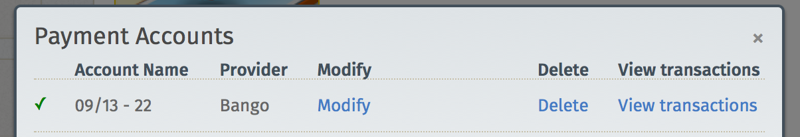

你是熱血的 Firefox OS 開發者，早已經開發了許多 App 準備讓自己的心血開花結果嗎？本文列出 Firefox Marketplace 目前已經正式運作收/付款服務的國家，並將持續更新相關情形，讓各位開發者都能順利將自己的 App 轉為實際收益。

[Firefox Marketplace](https://marketplace.firefox.com/) 付款服務均以「國家」為單位進行，且各國有不同的定價與付款方式。本文列出已開始 Marketplace 付款服務的國家，並附上進一步資訊的連結。

注意：另請參閱《[制定 App 的價格](https://developer.mozilla.org/zh-TW/docs/Mozilla/Marketplace/Monetization/App_pricing)》以了解價格點數，並[可透過 API 取得](https://firefox-marketplace-api.readthedocs.org/en/latest/topics/payment.html#pay-tiers)。

### 各國的付款服務

下列為 Marketplace 目前提供付款服務的國家。我們亦隨時努力於更多國家提供付款服務。若需要現已支援付款服務的國家清單，可參閱《[制定 App 的價格](https://developer.mozilla.org/zh-TW/docs/Mozilla/Marketplace/Monetization/App_pricing)》。

## App 支付

下列頁面將提供各國的付款服務資訊。另請注意，目前出帳作業僅支援當地貨幣；信用卡付款僅接受英鎊、美金、歐元計價。

- [巴西 (洽談中)](https://developer.mozilla.org/en-US/Marketplace/Monetization/App_pricing/Payout_Brazil)

- [哥倫比亞](https://developer.mozilla.org/en-US/Marketplace/Monetization/App_pricing/Payout_Colombia)

- [德國](https://developer.mozilla.org/en-US/Marketplace/Monetization/App_pricing/Payout_Germany)

- [匈牙利](https://developer.mozilla.org/en-US/Marketplace/Monetization/App_pricing/Payout_Hungary)

- [墨西哥](https://developer.mozilla.org/en-US/Marketplace/Monetization/App_pricing/Payout_Mexico)

- [波蘭](https://developer.mozilla.org/Marketplace/Monetization/App_pricing/Payout_Poland)

- [西班牙](https://developer.mozilla.org/en-US/Marketplace/Monetization/App_pricing/Payout_Spain)

- [英國](https://developer.mozilla.org/en-US/Marketplace/Monetization/App_pricing/Payout_UK)

- [美國](https://developer.mozilla.org/en-US/Marketplace/Monetization/App_pricing/Payout_US)

- [委內瑞拉](https://developer.mozilla.org/en-US/Marketplace/Monetization/App_pricing/Payout_Venezuela)

## 進一步了解收費費率

若要進一步了解收費費率，請至 Firefox Marketplace 找到你自己的 App 頁面。點擊「相容性與付款 (Compatibility & Payments)」→「新增、管理或檢視您的付款帳號中的交易 (Add manage or view transactions for your payment account)」→「檢視交易 (View Transactions)」連結，即如下所示：

Mozilla 開發者社群網站 (MDN) 原文連結：[Payments Status](https://developer.mozilla.org/en-US/Marketplace/Monetization/Payments_Status)

你也可參閱中文版《[付款服務狀態](https://developer.mozilla.org/zh-TW/docs/Mozilla/Marketplace/Monetization/Payments_Status)》，我們將根據原文而持續更新內容。另可參閱 MDN 上的更多 Firefox OS 或 Marketplace 相關文章。
