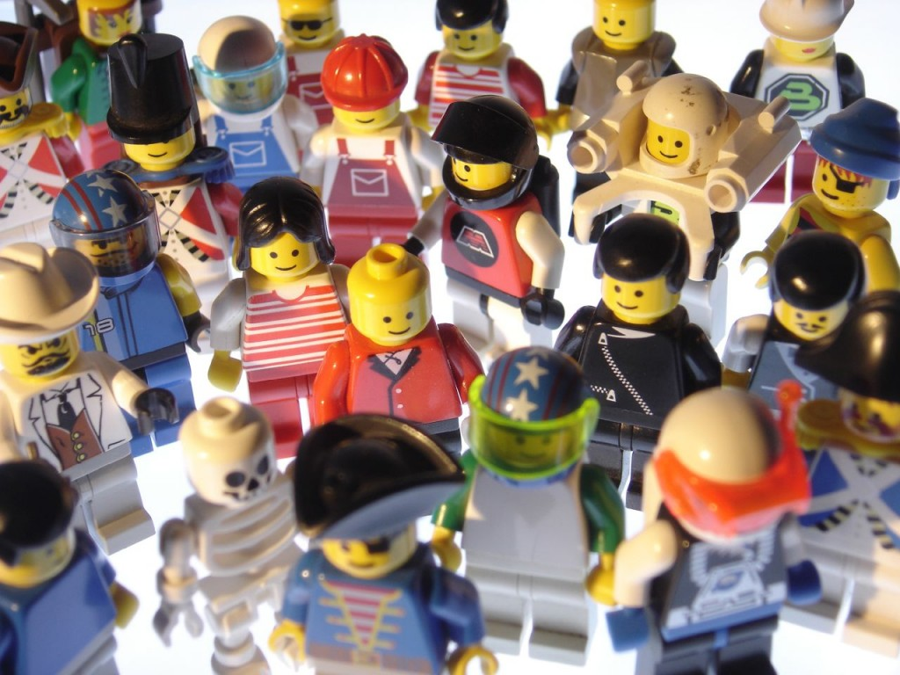

只要你能和一群人自由自在的相處，不需過度改變自我就能融入這個環境，並感覺大家都對世界抱持類似的理念。而且你能對「這些人跟我很像嗎」的問題給予肯定答案，就算是形成了一個社群。

圖片來源：University of York

當某個品牌足以代表特定世界觀時，該品牌的外圍也就會自然形成許多社群。聰明的公司會注意到這點，並積極與這些人交流以達到雙贏的合作局面；同時更為社群與組織創造額外價值。但要實際達到此一目標並不簡單。接著將簡略說明樂高 (LEGO) 公司是如何辦到的……

LEGO 極關心自己的社群，也知道社群成員可主導自己的品牌走向、提供最好的行銷模式，並協助開發新產品。成員都願意積極接觸類似嗜好的人，且本身不僅只於消費者卻趨近創造者的角色，並藉此獲得極高的成就感；進而催生出自己喜歡的 LEGO。遵守下列原則 (尚未完整收錄) 就能與LEGO 社群合作愉快：

- 每次的交流都必須達到雙贏 雙贏的合作關係非常重要，如此才能讓雙方享有絕佳的交流經驗，並讓社群持續成長。當然可能會出現反對的意見或阻力，但這類聲音反而能成為大家日後進步的動力。

- LEGO 並不干涉社群 全世界的成員都能自行組成最符合本身情況的社群。LEGO 不需浪費任何資源，放手讓各地社群找出最適合自己的模式，就能更深入觸及各地的風情與文化。

- 尊重所有成員，也期望成員能彼此尊重 各個社群均有行為規範，讓所有人都能相互尊重。這種共識讓每一位成員都有各自發揮的空間。

- 讓大家去做自己想做的事情 你不可能強迫社群去做他們毫無興趣的事。社群做任何事都需要熱情的支持。LEGO 很清楚這一點，也因此贏得社群的尊重。

LEGO 堅守高品質的標準，而社群合作時也不例外。成員之間已建立了溝通管道，讓大家能互相協助暨學習，且不是每個人都需要與 LEGO 溝通。專責的「[大使](https://ceeteamblog.com/2014/05/28/announcement-lego-ambassador-network/)」將扮演社群中的領導角色，負責找出對話重點並直接與 LEGO 溝通。這種方式讓 LEGO 公司可更專注於現有資源，協助成員培養更強的社群認同感 (雙贏)。

LEGO 現在擁有超過三十萬人的大型社群。Mozilla 目前的八千人社群可供你對照兩者的規模。但我們所做的事情更有所不同。基本上，大家都會受引導而成為團體的一部分，並再設法突破自我而獲得歸屬感與成就感；也是我們在生活中所追求的東西。這正是社群管理之所以重要的理由。若沒有管理的概念，就往往無法維持大型群體，也就容易失去歸屬感。

[[本文亦張貼於 Sean Bolton 的部落格中](https://seanbolton.me/2014/08/08/community-lessons-from-lego-and-other-thoughts-on-community/)]

原文連結：[Lessons from LEGO (and other thoughts on community)](https://blog.mozilla.org/community/2014/08/08/lessons-from-lego-and-other-thoughts-on-community/)
