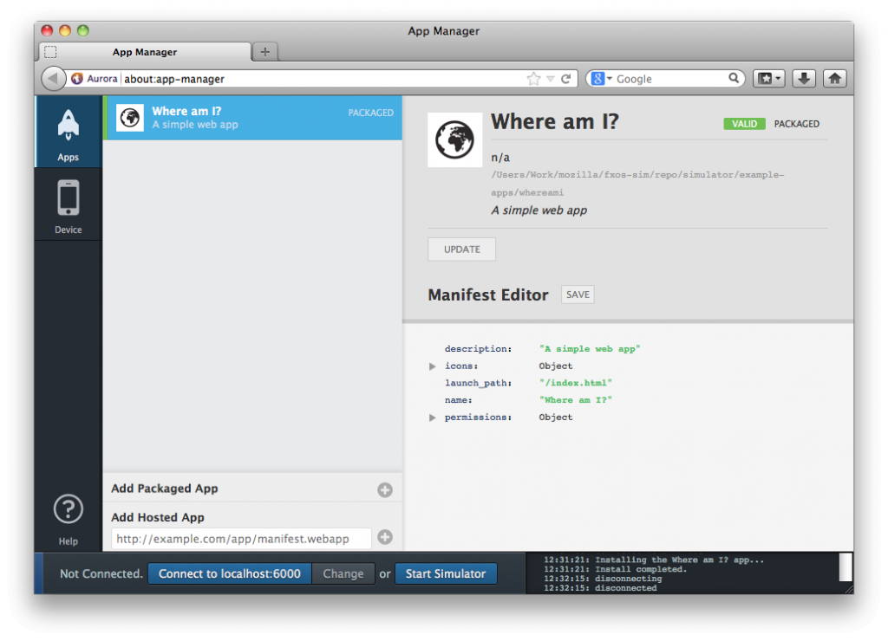

你是熱血的開發者，早已經準備了許多 Web App 要大展身手嗎？那你一定知道 Firefox OS 所適用的 Web App 必須搭配 manifest 檔案。我們蒐集了一些有關 manifest 檔案的常見問題，希望能對大家有所幫助。

注意：你會在「應用程式管理員 (Application Manager)」看到「manifest」中文翻譯為「安裝資訊檔」。

注意：本文中所提的「來源」均為「Origin」。鑑於工程師交談之間可能不會特別說「來源」，先於文前特別說明。

### 為何我的 App 需要 manifest 檔案？

App 的 manifest 檔案，即以簡單文件提供 App 的有效資訊 (如名稱、作者、圖示、說明)，對消費者與 App 商城都極為有用。最重要的，manifest 檔案亦包含 App 所需的 [Web API](https://developer.mozilla.org/en-US/docs/WebAPI) (如 [Geolocation 地理定位](https://developer.mozilla.org/en-US/docs/WebAPI/Using_geolocation)) 清單，讓消費者能獲得有效資訊之後再行安裝。

### Google Chrome 擴充套件，以及可安裝的 Web App 也同樣有 manifest 檔案，這與 Open Web App 的 manifest 檔案是否相同？那麼 W3C Widgets 的 manifest 檔案呢？HTML5 的 [cache manifest](https://developer.mozilla.org/en-US/docs/Web/HTML/Using_the_application_cache) 又如何？

全都不一樣。Open Web App 的 manifest 檔案，可能與 Google 的 manifest 檔案最為類似，但並非全然相同。而且 Open Web App 的 manifest 檔案未來將成為標準。

### 所謂的「來源 (Origin)」為何？

App 的「來源」包含了網址的協定 (protocol)、網域 (domain)、埠 (Port)。以下各個網址均為不同的來源：

- http://example.com

- http://example.com:8080 (不同埠)

- https://example.com (不同協定)

- http://www.example.com

- http://myapp.example.com (子網域)

下列網址則為相同來源：

- http://Example.com:80

- http://example.com

下列網址則為相同來源：

- http://example.com/drawingApp

- http://example.com/notesApp

可參閱《[同源政策 (Same-origin policy)](https://developer.mozilla.org/zh-TW/docs/Web/JavaScript/Same_origin_policy_for_JavaScript)》以進一步了解。

### 為何架設/托管 manifest 檔案的來源，必須與 App 的來源相同？

我們假設只有開發者本人，可在自己 App 的相同來源上架設/托管 manifest 檔案。也就是說，消費者應該能信任你的 App，知道安裝作業是根據你的 manifest 檔案所進行。而消費者不論是從 Firefox Marketplace、從其他 App 商城，或從開發者自己的網站安裝 App，都應該能放心相信 App 的來源。

如果 App 本身與 manifest 檔案的來源不同，就可能讓第三方直接利用你托管/架設的內容來開發 App。甚至也能用你自有的品牌或商標建立 manifest 檔案，進而欺騙消費者安裝 App，達到盜取密碼或其他不當行為。

### 這意思是我不能從其他來源嵌入圖像或 JavaScript？

不行。來源僅會限制內容 (HTML 頁面)。除了 App 的圖示必須置於 App 的來源之外，圖像或其他嵌入資源均可置於他處；例如在內容傳遞網路 (Content Delivery Network，CDN) 上。

### 我的來源可以放超過 1 個以上的 App 嗎？

目前為止，1 個來源僅能有 1 個 App。但在 FirefoxOS 未來的版本中，每個來源可能會有多個 App。你可透過 [bug 778277](https://bugzilla.mozilla.org/show_bug.cgi?id=778277) 的狀態了解未來發展。

同時，我們建議開發者能對各個 App 使用獨立的子網域。舉例來說，spreadsheet.mycoolapps.com 可給 1 個 App 使用；texteditor.mycoolapps.com 就是另一個 App 所用。可參閱《[為 App 添增子網域](https://developer.mozilla.org/zh-TW/docs/Mozilla/Marketplace/Publishing/Adding_a_subdomain)》進一步了解。

### 為何不直接將 manifest 檔案上傳到 Firefox Marketplace？

將 manifest 檔案架設/托管於自己的網域，再將網址提供給 Marketplace 有多個好處：

- 我們打算讓 Marketplace (以及其他 App 商城) 能定期透過既有網址，重新瀏覽所有 manifest 檔案並檢查更新。如此一來，開發者每次更新檔案之後，也不一定需要再次上傳 manifest 檔案。

- Marketplace 將同時傳送原始 manifest 檔案的內容及其網址，到消費者的裝置上。如此一來，裝置可檢查遭竄改而意外變更的 manifest 檔案。對使用 Web API (例如地理定位 Geolocation) 的 App 來說，此項特性格外重要。

### 在提供 manifest 檔案時，為何我的 Web 伺服器必須使用 HTTP 的正確 Content-Type 標頭？

此項限制，即針對可讓使用者產生內容的網站 (如 Pastebin)，避免使用者意外或錯誤的將整個網站視為自己所創造的 App。

### 我應該用 HTTPS 提供 manifest 檔案嗎？

當然好。Firefox Marketplace 未來將要求「只要是使用 Web API (如地理定位 Geolocation) 的 App，都必須透過 HTTPS 提供自己的 manifest 檔案」，如此可為抵禦「中間人攻擊 (Man-in-the-middle)」多一道保障。且如果 manifest 使用了 HTTPS，你網站上的所有頁面也必須採用 HTTPS。

### 如果別人把我的 App 提交到 Firefox Marketplace 上呢？

如果真有人猜到你 manifest 檔案的網址，並搶在你之前提交到 Firefox Marketplace 上，可隨時提報給 [Marketplace 支援團隊](https://marketplace.firefox.com/developers/support)處理。

### 另請參閱

[App 的 manifest 檔案](https://developer.mozilla.org/zh-TW/Apps/Developing/Manifest/Manifest-840092-dup)

Mozilla 開發者社群網站 (MDN) 原文連結：[App manifest FAQ](https://developer.mozilla.org/en-US/Apps/Build/installable_apps/App_manifest_FAQ)

你也可參閱中文版《[App 的 manifest 檔案常見問題](https://developer.mozilla.org/zh-TW/Apps/Build/installable_apps/App_manifest_FAQ)》，我們將根據原文而持續更新內容。另可參閱 MDN 上的更多 Firefox OS 或 Marketplace 相關文章。
