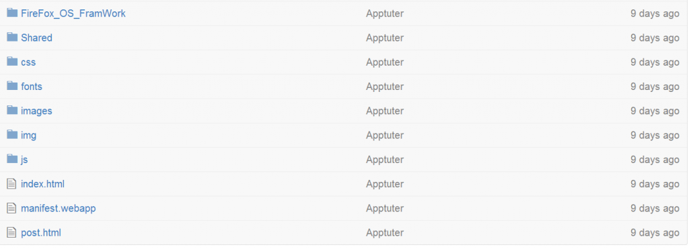
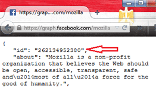
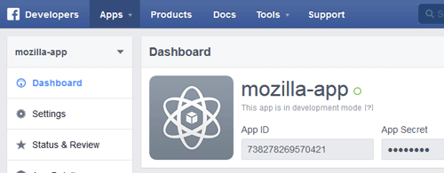
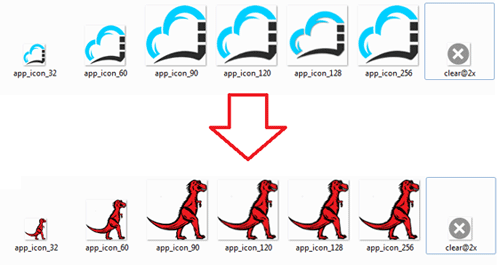
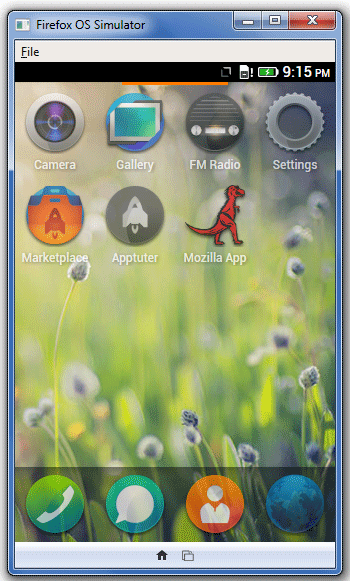
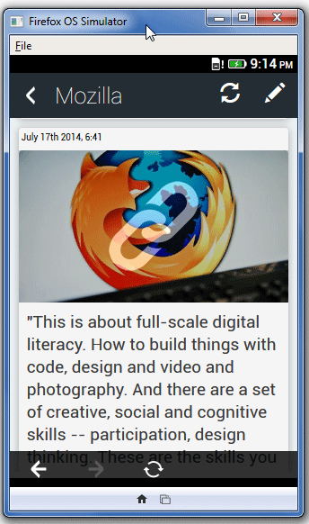
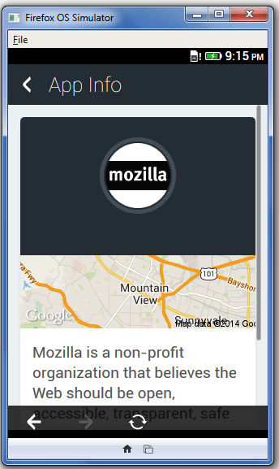

不論你負責經營的是公司或社群頁面，還有什麼能比獨立的行動 App 更能提高網頁的觸及度呢？

只要你具備最基本的程式開發知識，再完成 [Apptuter](https://www.apptuter.org/) 這個開放源碼框架的必要步驟，就能開發出自己的獨立行動 App。此框架目前支援 Facebook 頁面作為其內容來源，並可用以開發 Firefox OS 與 Android 平台的 App。

### 運作方式

先來看看 Apptuter 的運作方式。我們先以 Mozilla 的 Facebook 頁面作為內容來源，產生獨立的 App。

#### 複製 Repo

第一步就是到 [Apptuter repository](https://github.com/egirna/apptuter) 下載或複製 Apptuter-Firefox 目錄：

		
		

git clone https://github.com/egirna/apptuter.git
			
				
					
				
					1
				
						git clone https://github.com/egirna/apptuter.git
					
				
			
		

目錄結構如下：

#### 取得 Facebook 的數字識別碼

接著必須取得 Facebook 的頁面識別碼 (純數字)。如果你已經指定了好記又友善的頁面名稱，則網址上不會看到頁面識別碼。這種情形下，我們就必須前往下列網址以檢視之：

		
		

https://graph.facebook.com/mypagename
			
				
					
				
					1
				
						https://graph.facebook.com/mypagename
					
				
			
		

本文的範例就會是：[https://graph.facebook.com/mozilla](https://graph.facebook.com/mozilla)

頁面識別碼就是回傳資料的第一行：

#### 建立 Facebook App

下一步就是建立 Facebook App。只要組合 APP ID 與 APP SECRET，就會得到 App 的 ACCESS TOKEN；因此必要網址就會如下：

[http://graph.facebook.com/endpoint?key=value&access_token=app_id|app_secret](https://graph.facebook.com/endpoint?key=value&access_token=app_id|app_secret)

Requesting Page Info (Info.js) 可讓我們定義相關參數，且可於 /Apptuter-Firefox/js 找到取代 PageID 所用的數字：

		
		

var Main = function () {
    this.pageName = ‘pageID’;
    this.name = null;
    this.category = null;
    this.description = null;
    this.photoArray = null;
    this.postArray = null;
    this.infoArray = [];
    this.accessToken = 'AppID|AppSecret';
    this.pictureUrl = null;
    this.paging = 'https://graph.facebook.com/' + this.pageName + '/posts?limit=20&amp;access_token='+this.accessToken;
    this.pagingNext = 'https://graph.facebook.com/' + this.pageName + '/posts?limit=20&amp;access_token='+this.accessToken;
}
			
				
					
				
					12345678910111213
				
						var Main = function () {    this.pageName = ‘pageID’;    this.name = null;    this.category = null;    this.description = null;    this.photoArray = null;    this.postArray = null;    this.infoArray = [];    this.accessToken = 'AppID|AppSecret';    this.pictureUrl = null;    this.paging = 'https://graph.facebook.com/' + this.pageName + '/posts?limit=20&amp;access_token='+this.accessToken;    this.pagingNext = 'https://graph.facebook.com/' + this.pageName + '/posts?limit=20&amp;access_token='+this.accessToken;}
					
				
			
		

接著在根目錄找到 manifest.webapp 檔案，即可於其中定義新的 App 屬性：

		
		

{
  "name": "Mozilla App",
  "description": "This is an example app of apptuter framework",
  "launch_path": "/Shared/index.html",
  "icons": {
    "32": "/images/app_icon_32.png",
    "60": "/images/app_icon_60.png",
    "90": "/images/app_icon_90.png",
    "120": "/images/app_icon_120.png",
    "128": "/images/app_icon_128.png",
    "256": "/images/app_icon_256.png"
  },
  "chrome": {
    "navigation": true
  },
  "version": "1.0.1",
  "developer": {
    "name": "Egirna Technologies Limited",
    "url": "http://www.apptuter.org"
  },
  "orientation": [
    "portrait"
  ],
  "default_locale": "en"
			
				
					
				
					123456789101112131415161718192021222324
				
						{  "name": "Mozilla App",  "description": "This is an example app of apptuter framework",  "launch_path": "/Shared/index.html",  "icons": {    "32": "/images/app_icon_32.png",    "60": "/images/app_icon_60.png",    "90": "/images/app_icon_90.png",    "120": "/images/app_icon_120.png",    "128": "/images/app_icon_128.png",    "256": "/images/app_icon_256.png"  },  "chrome": {    "navigation": true  },  "version": "1.0.1",  "developer": {    "name": "Egirna Technologies Limited",    "url": "http://www.apptuter.org"  },  "orientation": [    "portrait"  ],  "default_locale": "en"
					
				
			
		

#### 圖素

最後就剩下圖素了。到 Repo 的 /Apptuter-Firefox/images 目錄中找到預設圖像，再用對應尺寸與檔案名稱的範例圖示取代。

### 成功了！

這樣就完成了！接著就透過 [Firefox OS 模擬器 (Firefox OS Simulator)](https://developer.mozilla.org/en/docs/Tools/Firefox_OS_Simulator) 測試 App 的樣子：

你最後必須確保軟體符合 Facebook、Google、Mozilla 的服務條款，以及消費者授權協定的規範。而且相關規定亦適用該軟體可整合的其他服務。

原文連結：[Turn your Facebook page into a Firefox OS mobile app](https://hacks.mozilla.org/2014/08/turn-your-facebook-page-into-a-firefox-os-mobile-app/)
