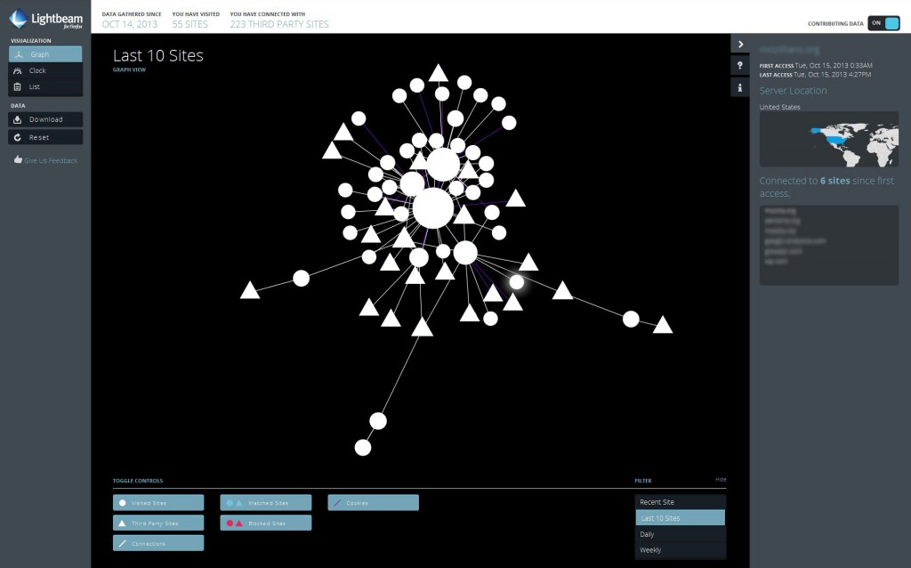

「廣告」一直是網路最具優勢的商業行為，端賴使用者的觸及率才能評斷廣告是否成功。但很諷刺的，如果以太直白的方式接觸消費者，廣告絕對會失敗。Mozilla 贊同透過廣告獲取收益，並進而推動網路的發展；這也已經深植於我們的核心理念與《[Mozilla 宣言](https://www.mozilla.org/zh-TW/about/manifesto/)》之中。而廣告不僅是這些商業活動之一，也連帶促成 Web 的茁壯。但廣告模式卻未以消費者為中心而漸失其焦點。

Mozilla 現呼籲廣告產業應重新正視「信任」、「透明度」、「使用者控制」共三項核心原則：

- 信任：使用者是否了解眼下看到這些內容的原因？是否清楚自己交出哪些資料才換到這些內容？

- 透明度：使用者是否知道為何接收到某些廣告？是否清楚自己資料被利用、被分享的方式？知道自己同意了這些公開的行為嗎？

- 控制：使用者能夠控制自己的資料嗎？他們能否選擇要完全隱藏、完全公開，或部分公開？

Mozilla 正重新省思這些廣告模式。我們希望行銷人員、產業團體、代銷/推銷商、廣告技術公司等，都能看到「以消費者為中心」所帶來的優勢。這三項原則可讓我們建構更強大、更長遠、更高價值的平台。

### 我們現正努力的東西為何？

Mozilla 期待能透過不斷的實驗與創新，在生態環境中提升消費者的使用經驗。我們所有工作都是依[使用者心中的信任感](https://blog.mozilla.org/netpolicy/2014/08/21/trust-should-be-the-currency/)所設計。[新分頁的首頁磚 (Tile)](https://blog.mozilla.org/futurereleases/2014/05/09/new-tab-experiments/) 就是第一次實驗，而且我們也的確從中獲益良多。現在我們會根據使用者「最常瀏覽的網站」，找出首頁磚所應顯示的內容，另搭配 Mozilla 的資訊、建議，以及受他方贊助的內容，且這些基本的使用經驗也會持續進化。我們目前均獲得正面的互動意見。而與 Mozilla 有關的內容相較，受贊助的內容甚至達到十倍觸及率。

Mozilla 接著要為使用者提供更高的透明度與控制性。我們的 [UP 平台](https://blog.mozilla.com.tw/posts/3301)會設法強化首頁磚，並協助找出應顯示給使用者的最佳內容。此平台本身就屬於創新的一部分，目前可將所有興趣度的資料置於用戶端，完全交由使用者自行掌握。即使位於 Firefox 用戶端之外，也不需 Mozilla 另外為使用者建立檔案，卻仍可存取這些資料。

我們接著將設立興趣量表 (現在已經進行中)，讓使用者隨時都能輕鬆更改自己的興趣主題，並獲得更適切的內容。這個量表另將持續提供意見管道，以便 Mozilla 順利獲得使用者的寶貴意見並強化後續專案。

### Mozilla 所能做出的承諾？

我們將繼續著眼於公眾利益，努力達到商業利益的平衡。另將根據上述的信任、透明、控制原則，打造出能兼顧使用者隱私與絕佳使用經驗的成功產品。

- 我們要向世界證明，Mozilla 能尊重使用者的隱私而提供有效的廣告內容。

- 只要是使用者經由瀏覽器所傳達的追蹤與隱私權意願，我們認為內容服務商均應予尊重。即使廠商不理會這些意願，Mozilla 仍將秉持一貫的尊重態度，且我們所有進階專案均將遵循「不要追蹤我 (DNT)」的設定。

- 我們會尊重 [Minimal Actionable Dataset](https://christacy.blogspot.com/2014/07/minimum-actionable-dataset.html) 的理念。此為其中一名 Mozillian 率先提出的想法：僅蒐集所需最低限度的資料就好，而且過程應完全透明公開。

- 我們會讓使用者能隨時自訂、變更、開/關產品的功能。

Mozilla 無法從旁觀者的角度改變 Web；也無法身處於生態系統之外，卻又企圖改變 Web 的廣告模式。我們對此任務深感信心，也正努力達成自己設定的目標。請持續注意接下來的更新消息。

如果上述理念獲得你的認同並讓你願意獻出一份力量，請隨時留下你的意見或[填寫這份表格](https://docs.google.com/forms/d/1r8YcwYstx7OpJKYw42MWOaQP56Hz774E6GXggVND3PU/viewform)。

原文連結：[A Call for Trust, Transparency and User Control in Advertising](https://blog.mozilla.org/advancingcontent/2014/08/21/a-call-for-trust-transparency-and-user-control-in-advertising/)
