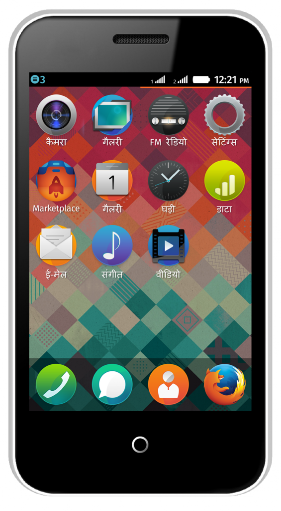
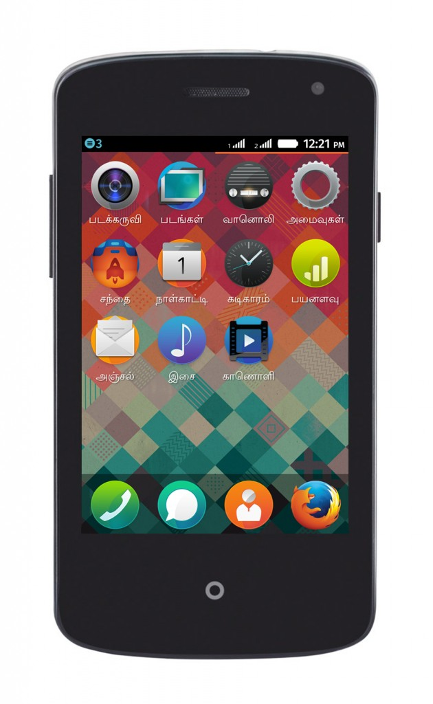

上週甫於印度發表的兩款 Firefox OS 手機，也代表 Mozilla 為推動 Web 開放與創新再度邁出的一大步，也促使數百萬名印度使用者換購自己的第一支智慧型手機。Firefox OS 將透過親民價格的裝置，同時提供電話、簡訊、相機，以及更多豐富的功能，如已內建的 Facebook 與 Twitter 社交網站、Firefox 瀏覽器、FM 收音機、高人氣的諸多 App 等。

Intex Technologies 已[發表「Cloud FX」](https://www.intexmobile.in/pdf/Revised-Intex-launches-India27-Lowest-Price-Smartphone-aug-23.pdf)並交由 Snapdeal.com 提供此款強大且可自訂的智慧型手機。Spice Retail Limited 則發佈了「Spice Fire One Mi – FX 1」，且在 Spice HotSpot 與 [www.saholic.com](https://www.saholic.com/) 主要零售媒介開始銷售之前，同樣先交給 Snapdeal.com 短暫販售。

Mozilla 總裁宮力博士說：「很高興看到 Intex 發售 Cloud FX 裝置。這不僅是印度，也是亞洲的第一款 Firefox OS 裝置。從其他市場所獲得的正面回應，讓我們知道大家都喜歡上了 Firefox OS 所帶來的獨特開放性與使用者經驗。而透過 Intex 所支援的超低價 Firefox OS 智慧型手機，勢必將重新定義所謂的初階智慧型手機，並在亞洲帶起一股新動能。」

Intex Technologies 行銷總監 Keshav Bansal 則表示：「Intex 所發表的 Cloud FX 將開啟印度智慧型手機市場的新頁，而且我們也很榮幸成為印度第一家能了解並滿足市場需求的公司。在發售 Cloud FX 之後，我們目標就是要以功能性手機的成本，提供智慧型手機的使用經驗給消費大眾。Intex 也很高興能與 Snapdeal.com 合作，讓我們能在泛印度區以革命性的價格提供智慧型手機。」

Spice Mobility Ltd 執行長 Prashant Bindal 也表示：「我們將透過親民價格的智慧型手機，滿足偏遠小鎮居民的連網渴望。有了超低價位的 Spice Fire One，我們期待激起功能性手機使用者的智慧型手機換購潮，進而讓他們享受網路的力量。我們必須在產品中整合科技與生活風格，並訂出一般人都能負擔的價格。而這次和 Mozilla 的合作經驗，更代表了我們要讓客戶第一手享受最佳創新科技的承諾，同時也是智慧型手機在產品設計與全新概念上的突破。」

Snapdeal.com 網站的創始人兼執行長 Kunal Bahl 另表示：「Intex 於印度首發並交由 Snapdeal.com 獨家發售的 Firefox OS 智慧型手機，讓我們能針對目前功能性手機的使用者，將其手上裝置升級為高品質的智慧型手機。我們相信很快就能獲得消費者的正面回應。」

Intex Cloud FX 北印度語版

Intex Cloud FX 搭載 1 組 1.0 GHz 處理器，並可擴充最高達 4GB 記憶體。另可插用雙 SIM 卡，並透過藍牙 (Bluetooth) 與 Wi-Fi 功能而輕鬆連線，更內建許多功能讓使用者監控自己的資料用量。該款手機上的 Firefox OS 更已支援多種語言，包含北印度語 (Hindi) 以及坦米爾語 (Tamil)。

Spice Fire One Mi – FX 1 具備 1 組 1GHz 處理器、2.5G 連線功能、8.89cm 的 HVGA 電容式觸控螢幕、1.3MP 主相機以及 0.3 MP 前置相機。此款裝置亦支援如北印度語、坦米爾語、孟加拉語 (Bangla) 等印度地區的語言。

Spice Fire One Mi – FX 1 – 坦米爾語版

Firefox OS 現已經由 7 家主要電信營運商，於 18 個國家中提供相關裝置，將讓全世界更多人享受 Web 的強大力量。而 Firefox OS 平台目前的成功經驗，也已促使合作夥伴在未來幾個月內，將於更多市場中發表不同規格的更多裝置。Mozilla 期待看到 Firefox OS 能解放行動產業，並降低消費者換購第一支智慧型手機時的門檻。

#### 更多資訊：

- [Intex 新聞稿](https://www.intexmobile.in/pdf/Revised-Intex-launches-India27-Lowest-Price-Smartphone-aug-23.pdf)

- 目前已推出的 [Firefox OS 裝置](https://www.mozilla.org/en-US/firefox/os/devices/)

原文連結：[Firefox OS Smartphones Change The Mobile Landscape Across India](https://blog.mozilla.org/blog/2014/08/29/firefox-os-smartphones-available-in-india-this-week/)
