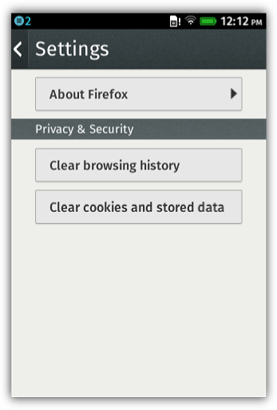
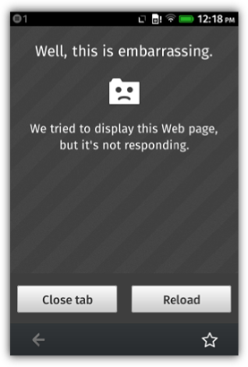
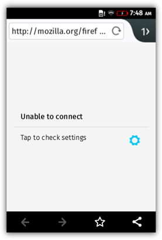
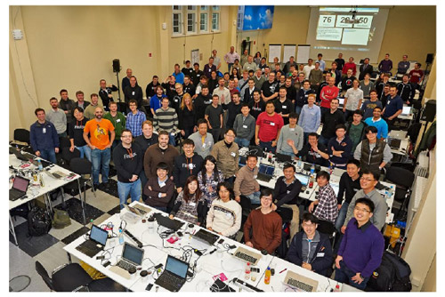
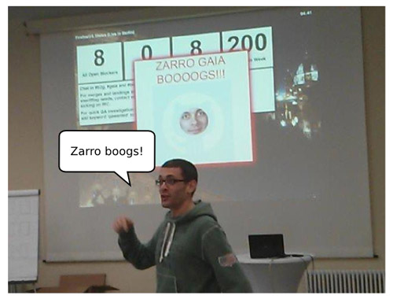
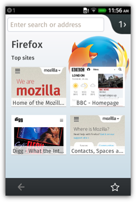

在看完了《[為 Firefox OS 打造 Firefox 瀏覽器 (上)](https://blog.mozilla.com.tw/posts/6155/)》之後，你應該已經知道 Firefox OS 發想背景的小故事了。緊接著快來看看開發期間的其他小故事與相關技術方面的考量。

### 捲動、平移、縮放

在桌機和行動裝置上滾動網頁的運作方式略有不同。相較於桌機的捲動列或滑鼠滾輪，行動裝置必須使用觸控輸入功能，以及所謂的「非同步平移與縮放 (Asynchronous Pan and Zoom，APZ)」系統，才能讓使用者以拖曳方式橫移網頁；另透過「動能捲動 (Kinetic scrolling)」直向移動網頁，讓使用者感覺到物理效果。

第一次建構的動能捲動效果，是由 Frenchman 與 [Vivien Nicolas](https://vingtetun.org/) (Gaia 組長) 以 JavaScript 特別為 Gaia 所撰寫，但不久之後即以跨平台的方式寫入至 Gecko 中，藉此統一 B2G 與 Android 上使用的程式碼。

其中一個需要完成的互動功能，就是往下滾動網頁時能隱藏網址列，藉以有更多空間顯示網頁內容，而且捲回網頁頂端時就能再次顯示網址列。

此功能必須將 asyncscroll 事件加入 APZ 程式碼中，讓瀏覽器知道使用者直接操作網頁的時間點，也能非同步的從使用者的互動方式，根據物理公式算出捲動的幅度。

### 儲存功能

Firefox 最受歡迎的功能之一就是「智慧位址列 (Awesomebar)」，整合了位址列與搜尋列 (行動版亦整合了標題列)，可讓你迅速找到所需的內容。只要鍵入幾個字母，就能立刻看到瀏覽記錄中的對應網頁，並經由[「frecency」演算法](https://developer.mozilla.org/en-US/docs/Mozilla/Tech/Places/Frecency_algorithm)所排列。

不論是桌面版或行動版 Firefox，這類資料均儲存於「Places」資料庫 (亦為專屬「chrome」程式碼的一部分)。為了能在 B2G 中建構此功能，我們必須使用網路的本端儲存功能，因此選用了 [IndexedDB](https://developer.mozilla.org/en/IndexedDB)。我們以 indexedDB 建構了 Place 資料庫，可儲存使用者在網路上瀏覽器所有「地點」，包含其網址、標題、圖示；而且每次使用者瀏覽該網頁都會再次儲存。此資料庫也儲存了使用者的書籤，並根據「[frecency](https://developer.mozilla.org/en-US/docs/Mozilla/Tech/Places/Frecency_algorithm)」排列出最常瀏覽的網站。

1.0 版本的「智慧位址列 (Awesomebar)」

### 清除功能

趁你瀏覽網站時，Gecko 也跟著不斷儲存相關資料，可能是 cookies、localStorage、IndexedDB 資料庫、離線網頁，或所有近似類型的資料。Firefox 當然也能清除這些資料。只要將必要函式加入 Browser API，即可從 B2G 瀏覽器的「設定」中清除資料。

1.0 版本的「設定」

### 處理當機

有時候網頁會讓瀏覽器當掉。而 B2G 的所有 Web App 與瀏覽器分頁，都是在自己的系統程序中執行，所以發生機率極低且僅會影響一個視窗/分頁。老實說，由於 B2G 一開始就是針對初階智慧型手機所設計，因此記憶體容量也受到限制。系統有時候會刻意關閉背景 App 或瀏覽器分頁，以空出更多記憶體容量。只要開始關閉作業，都必須告知瀏覽器 App 並能夠即時恢復，所以在大多數情況下，使用者根本不知道系統關閉了哪個程序。另必須為 Browser API 新增必要事件，以達到此功能。

1.0 版本當掉的分頁

### 與其他 App 溝通

行動版瀏覽器的常見使用情境，就是使用者會透過其他 App (如社交網站) 分享網址，或是讓其他 App 透過瀏覽器開啟/檢視網址。

B2G 為上述需求而建構了 [Web Activities](https://developer.mozilla.org/en-US/docs/Web/API/Web_Activities)，可讓互不認識的 App 也能彼此互動。舉例來說，使用者可點擊瀏覽器 App 上的「分享」按鈕，而 B2G 就會送出「share URL」的 Web Activity，接著已安裝的 App 只要註冊本身可處理這類型的 Web Activity，就會接手並處理之。

1.2 版本的「分享」Web Activity

### 離線作業

雖然 B2G 與 Gaia 都是以 Web 為架構的基礎，但只要遇上網路無法連線的問題，所有內建的 Gaia App 也應該要能離線作業，讓使用者還是能一樣照相、聽音樂、撥打電話。我們為此先使用了 [AppCache](https://www.w3.org/TR/2011/WD-html5-20110525/offline.html#appcache)；這也是 Web 首次嘗試要在離線狀態下運作 Web App。可惜的是，這項技術很快就遇上許多[問題與限制](https://alistapart.com/article/application-cache-is-a-douchebag)，且也無法滿足我們的所有需求。

為了能準時釋出 B2G 的 1.0 版本，我們一定要建構出「封裝式 App (Packaged App)」，才能滿足 Gaia 內建 App 的離線與安全需求。封裝式 App 雖然解決了上述問題，但因為其在網路上不具備實際網址，所以仍不算是真正的 Web App；而且[將之標準化的流程](https://www.w3.org/TR/2013/WD-runtime-20130321/)當時並未獲得太多關注眼神。封裝式 App 本來只是要當做暫時性的解決方案，而且我們也努力添增如 [ServiceWorkers](https://slightlyoff.github.io/ServiceWorker/spec/service_worker/)、[標準化的架設/托管 (Hosted) 封包](https://w3ctag.github.io/packaging-on-the-web/)、[manifest 檔案](https://w3c.github.io/manifest/)。最後甚至不需 Mozilla 專有的封裝式 App，就能達到完整的離線使用經驗。

1.4 版本的離線功能

### 努力打磨拋光

最後我們為瀏覽器 App 精心打造出許多 UI，提供簡潔好用的介面，並完整利用硬體加速的 CSS 動畫，以重新建構出 Firefox 風格的互動與視覺設計感。即使是 Firefox 瀏覽器家族中最年輕的成員，也同樣與其他成員擁有一致的使用經驗。

### 正式釋出 1.0 版

在 2013 年 1 月，德國電信 (Deutsche Telekom) 公司於柏林 (Berlin) 為整個 B2G 團隊舉辦了「史詩級」的 Work Week，而且另有多家競爭關係的行動網路與裝置製造商派出工程師參與，一同努力要讓 B2G 1.0 準時釋出，以能於 2 月在巴塞隆納 MWC 上展示。當時整個團隊要在一週的時間內解決兩百個臭蟲吶！

1.0 版本時的團隊，2013 年 1 月於柏林的 Work Week

在整個 Work Week 的最後幾分鐘，Andreas Gal 興奮的宣佈「我們解完臭蟲了」，也代表 Gaia 1.0 版正式完成，剩下就讓 B2G 團隊利用週末收尾。在將近十八個月的時間裡，一個專責團隊統合了許多組織與機構，完全以開放方式將空白的 GitHub repository 轉變為可運作的行動作業系統，緊接著就以 Firefox OS 1.0.1 之姿登上實際裝置。

解完臭蟲的 2013 年 1 月

1.0 版本的瀏覽器 App

因此，在 MWC 2012 上展示原型，並承諾要為市場帶來商用裝置之後，我們也就真的於 2013 年完整發佈了，另與多家行動網路營運商合作推出多款「Firefox OS」品牌的行動裝置，真正在世界最大的行動通訊展上虜獲眾人目光。Firefox OS 正式到來。

於巴塞隆納舉辦的 2013 MWC

看完比較技術性的小故事之後，你是否了解 Firefox OS 背後的技術考量與開發要點呢？敬請繼續《[為 Firefox OS 打造 Firefox 瀏覽器 (下)](https://blog.mozilla.com.tw/posts/6169/)》，看看 Firefox OS 的未來展望與趨勢吧！

原文連結：[Building the Firefox browser for Firefox OS](https://hacks.mozilla.org/2014/08/building-the-firefox-browser-for-firefox-os/)
