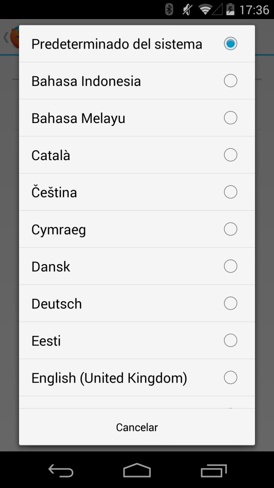
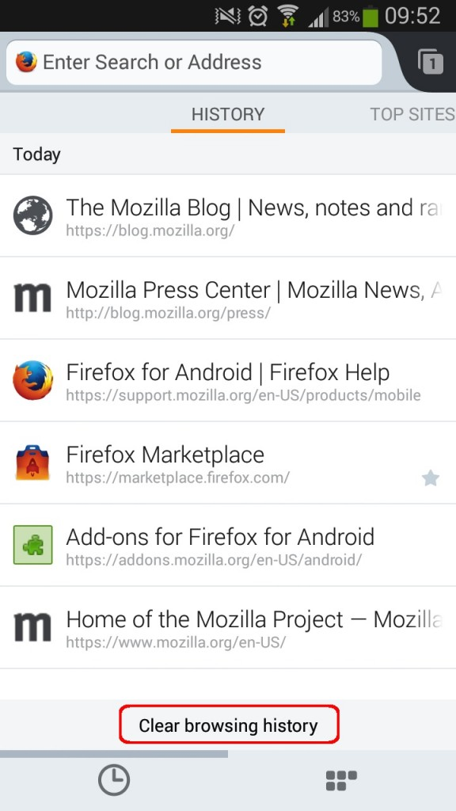

### 輕鬆切換語言、自訂主畫面、清除歷史紀錄

使用者現在可在 Firefox for Android 上打造個人化的 Web 經驗，不論身處於世界何方，都能更快、更輕鬆、更安全的找到自己所需的 Web 內容。

且不論你原先是以哪種語言版本的裝置下載 Firefox for Android，現在更能隨時切換達五十五種語言。透過新的語言切換功能，你不需重新啟動瀏覽器，即可輕鬆設定自己想要的語言。也就是說，不管你使用何種語系的 Android 裝置，都能輕鬆切換 Firefox for Android 的所有語言版本。我們今天另新增了亞美尼亞語 (Armenian)、巴斯克語 (Basque)、富拉赫語 (Fulah)、冰島語 (Icelandic)、蘇格蘭蓋爾語 (Scottish Gaelic)、威爾斯語 (Welsh) 等語言。

#### 可自訂主畫面

在最近的 Firefox 版本中，首頁的「歷史紀錄 (History)」、「最常瀏覽 (Top Sites)」、「閱讀清單 (Reading List)」、「書籤 (Bookmarks)」都提供了多樣的自訂選項。而使用者現在也能進一步自訂 Firefox for Android。我們讓你能直接透過主畫面存取不同的 RSS、網站、服務，如[Instagram](https://addons.mozilla.org/en-US/android/addon/instagram-panel/)[、](https://addons.mozilla.org/en-US/android/addon/pocket-panel/)[Pocket](https://addons.mozilla.org/en-US/android/addon/pocket-panel/)、[Vimeo](https://addons.mozilla.org/en-US/android/addon/vimeo-panel/)、[Wikipedia](https://addons.mozilla.org/en-US/android/addon/wikipedia-panel/)。

Pocket 的執行長 Nate Weiner 就說：「Firefox for Android 是最佳的行動瀏覽器，可迅速將文章、影片、連結儲存到 Pocket 之上。現在的新主畫面更具備 Pocket Hits，讓使用者輕動指尖就能在 Pocket 中享受最多儲存與分享次數的內容。」

你可直接將主畫面視為行動瀏覽器的新附加元件，輕點幾下就能收納自己最關心的事項。當然也能透過「設定 (Setting)」選單輕鬆管理主畫面。

#### 清除歷史紀錄

Mozilla 更讓你能輕鬆享受安全且隱私的瀏覽經驗，在使用者結束瀏覽活動之前，都能清除自己的歷史紀錄。只要注意「歷史紀錄」主畫面的底端，就能看到「清除瀏覽記錄 (Clear browsing history)」的選項。輕觸該選項就會立刻清除你的歷史紀錄。

#### Firefox Sync 同步功能

不論你是在桌機、平板電腦、智慧型手機上使用 Firefox 瀏覽器，Firefox Sync 同步功能都能讓你取得自己慣用的書籤、密碼、分頁，還有更多。如果你還沒用過 Firefox Sync，我們也會協助你輕鬆設定完畢。只要在分頁頂端找到「Sync」圖示並點擊，Firefox for Android 就會引導你逐步設定帳戶。

更多資訊

- [下載 Firefox for Android](https://play.google.com/store/apps/details?id=org.mozilla.firefox)

- [Firefox Sync 網頁](https://mozilla.com.tw/firefox/sync/)

- [Firefox for Android 版本說明](https://www.mozilla.org/en-US/mobile/32.0/releasenotes/)

- [下載 Windows、Mac、Linux 版 Firefox](https://www.mozilla.org/en-US/mobile/32.0/releasenotes/)

- [Windows、Mac、Linux 版 Firefox 版本說明](https://www.mozilla.org/en-US/firefox/32.0/releasenotes/)

原文連結：[Make Firefox for Android Yours: Switch Languages Easily, Customize Home Screens and Clear History](https://blog.mozilla.org/blog/2014/09/02/make-firefox-for-android-yours-switch-languages-easily-customize-home-screens-and-clear-history/)
