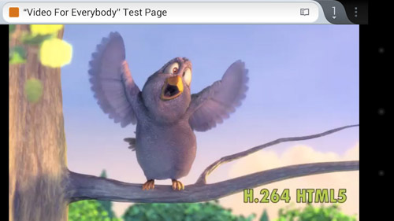
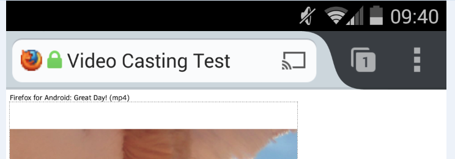

### 傳送影像到 Chromecast 與 Roku 串流裝置中播放

我們努力開發 Firefox for Android 測試版 (Beta) 中的多重畫面功能。現在只要是你瀏覽中網頁的影片內容，就能透過新的「傳送到裝置 (Send to device)」的影片傳送功能，傳送到第二個畫面並供你欣賞。現在就來協助我們測試此功能。

使用者現能更進一步掌握 Web 經驗，並將自己想要欣賞的影片內容送到較大的螢幕播放。任何影片在傳送到其他裝置上，仍同樣可透過 Firefox for Android 畫面底部的「媒體控制列 (Media Control Bar)」而直接播放、暫停、關閉影片。且影片播放期間均會持續顯示媒體控制列，即使切換分頁或瀏覽新網頁，該功能列也不會突然消失。

Firefox for Android 測試版的「媒體控制列」(圖為 Roku 串流媒體)

為了讓使用者知道「目前在 Firefox for Android 上觀看的影片，也能傳送到連線的媒體串流裝置上」，影片的播放控制列將 (在任何廣告結束之後) 顯示「傳送至」指示圖。

網址列於右側顯示的「傳送至」指示圖

點擊此圖示之後，就會帶出目前連線的串流媒體裝置清單。使用者可選擇想要傳送影片的裝置，以於大螢幕上觀看影片。而網址列中也會出現「傳送至」指示圖，提醒使用者該網頁的內容已經傳送到裝置上。

#### 著手測試

如果想在 Roku 或 Chromecast 上測試此功能，請按照下列說明進行：

- 確認已安裝 [Firefox for Android Beta](https://play.google.com/store/apps/details?id=org.mozilla.firefox_beta&hl=en)。

- 確認附近的電視機上已設定了 Roku 或 Chromecast，而且必須與你的 Android 手機共用相同的 WiFi 網路。

- 如果要串流至 Roku，請先將 Firefox 頻道新增至頻道清單中。可[在這裡](https://support.roku.com/entries/221063-How-do-I-add-a-new-channel-to-my-Roku-player-)了解該如何於 Roku 上新增頻道。

- 開啟如 [CNN.com](https://cnn.com/) 網站，找到首頁上的影片。只要開始播放可支援的影片 (在廣告播放完畢之後)，上述的「傳送至」圖示就會出現在影片控制列中，代表該影片可傳送到附近的串流裝置上。

- 只要點一下影片，再點擊影片控制列或網址列中的「傳送至」，就會將目前觀看中的影片傳送到附近的媒體串流裝置上。此兩個「傳送至」的功能，都會自動切換到 Roku 的 Firefox 頻道，或啟動Chromecast 的串流功能，以將影片傳送到鄰近的電視機上。

#### 另請注意

- 只要 Firefox for Android 所支援的播放格式，該裝置也同樣支援 (如 Roku 支援 MP4)，就能順利播放影片。

- 某些網站會隱藏或自訂 HTML5 的影片控制功能，也有網站不使用影片播放選單。如果要將這類網站的影片傳送到相容裝置 (如 Roku) 上播放就有點麻煩。其實這時就單純在網頁上播放影片即可。但若影片是 MP4 格式，且 Firefox for Android Beta 能抓到你的 Roku 裝置，就會在網址列中顯示「傳送至裝置 (Send to Device)」圖示。只要點擊該圖示就能在 Roku 上欣賞影片。

此項「將影片傳送到相容裝置 (如 Roku 與 Chromecast)」的功能，目前仍為預先釋出的版本。我們需要大家協助測試此有趣功能。請記得隨時提供你的寶貴意見並[提報任何問題](https://bugzilla.mozilla.org/enter_bug.cgi?component=Screencasting&product=Firefox%20for%20Android)。祝測試愉快！

#### 更多資訊：

- [下載 Firefox for Android Beta](https://mozilla.com.tw/firefox/channel/)

- [Firefox for Android Beta 版本說明](https://www.mozilla.org/mobile/33.0beta/releasenotes/)

- [下載 Windows、Mac、Linux 版的 Firefox Beta](https://mozilla.com.tw/firefox/channel/)

- Windows、Mac、Linux 版 Firefox Beta [版本說明](https://www.mozilla.org/firefox/33.0beta/releasenotes/)

原文連結：[Road-Test sending video to Chromecast and Roku in Firefox for Android Beta](https://blog.mozilla.org/futurereleases/2014/09/05/road-test-sending-video-to-chromecast-and-roku-in-firefox-for-android-beta/)
