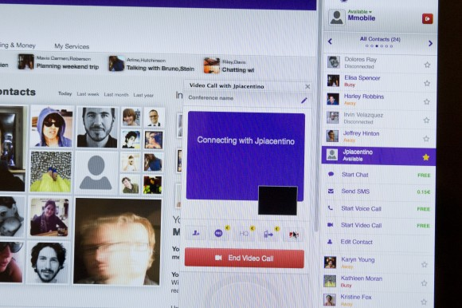

剛釋出的 Firefox Beta 測試版 (33) 已加入了實驗性的 Web Real Time (WebRTC) 通訊功能，要讓 Firefox 使用者擁有絕佳的瀏覽器經驗。我們徵求大家協助測試並踴躍反應意見。

目前為數眾多的線上通訊服務互不相容，若親友習慣使用不同的軟體、服務、設備，反而提高溝通的困難度。為了配合他人而使用任一項服務，你就可能要註冊新的帳戶並交出個人資訊，才能換得服務的使用權。

我們已經[在 Firefox 非正式版中測試 WebRTC](https://blog.mozilla.com.tw/posts/5714) 達數個月，今天也將 WebRTC 功能納入 Firefox 測試版中，希望能獲得更多使用者的意見。透過此 WebRTC 測試活動，我們要將通訊功能直接整合至 Firefox，藉以簡化視訊或音訊的通信功能。WebRTC 可免費撥打語音或視訊電話，而且不用下載任何軟體、外掛程式，甚至也不用再建立新帳戶。只要開啟 Firefox 測試版就能立刻使用。

Mozilla 在許多領域都是 WebRTC 的先鋒，像是率先業界建構[DataChannels](https://blog.mozilla.org/futurereleases/2012/11/30/webrtc-makes-social-api-even-more-social/)，也首先[用兩大瀏覽器](https://hacks.mozilla.org/2013/02/hello-chrome-its-firefox-calling/)撥打出第一通 WebRTC 電話。而透過 Firefox 測試版的實驗活動，我們將延續此創新動能，並讓 Firefox 使用者與開發者都能享受 WebRTC 的便利。

趕快根據[相關說明](https://support.mozilla.org/kb/webrtc-experiment)加入我們的測試活動。你可以在 Firefox 選單的「自訂 (Customize)」選項中，找到對話泡泡圖示所代表的 WebRTC 功能。在將此功能正式推出給使用者之前，我們還有很多需要改善的空間。

請記得隨時[提出自己的想法](https://input.mozilla.org/feedback)並[提報錯誤](https://bugzilla.mozilla.org/enter_bug.cgi?product=Loop&component=Client)，讓我們能持續改善 WebRTC 的效能。

我們將持續分享此功能的後續進展。

原文連結：[Help Test Experimental WebRTC Communications Feature in Firefox Beta](https://blog.mozilla.org/futurereleases/2014/09/04/help-test-experimental-webrtc-communications-feature-in-firefox-beta/)
