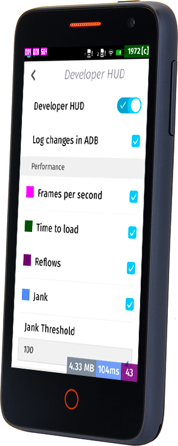

現在開發者已可訂購 [「Flame」開發者手機](https://developer.mozilla.org/en-US/Firefox_OS/Developer_phone_guide/Flame)，以順利進一步[撰寫適用的 App](https://blog.mozilla.com.tw/posts/5704/)。

任何人都能到 [everbuying 網站線上購買 Flame，美金 $170 即包含全球運費](https://www.everbuying.com/product549652.html)。此款開發者手機並未與任何電信營運商綁約或鎖機，可搭配使用你手邊的任何 SIM 卡。

接著要透過《影片：透過 Flame 入門 (上)》與《(下)》兩篇文章為大家獻上 Flame 手機的四支影片 (中文字幕)，說明應如何設定 Flame 為開發者手機、如何刷進新版 Firefox OS、如何設定 RAM 容量以模擬較慢速的裝置。

但請你需事先準備：

- Flame 可用的 USB 接線

- 先行安裝 ADB 與 Fastboot 完畢。只要安裝完整的 Android 開發者套件，亦可透過下列 [Windows](https://forum.xda-developers.com/showthread.php?t=2588979)或 [Linux 與 OSX](https://code.google.com/p/adb-fastboot-install/) 的簡易安裝程式，均可取得並安裝 ADB/Fastboot。

### 初步認識「Flame」

迅速讓你概略認識[「Flame」參考平台手機](https://www.youtube.com/watch?v=KbW8ogeJ234)，包含其功能與規格。

### 設定自己的「Flame」

你可了解該如何[將自己的 Flame 設定為開發者裝置](https://www.youtube.com/watch?v=5wblJvTjtxA)。如啟動「開發者」選單，並透過「[開發者 HUD](https://paulrouget.com/e/fxoshud/)」取得 App 執行時的詳細資訊。此工具不僅可告訴你詳細的 App 記憶體耗用資訊，也能得知 App 執行時的 fps 與記憶體情況。所有資訊可直接在裝置上一目了然。

請繼續欣賞《[影片：透過 Flame 入門開發 Web App (下)](https://blog.mozilla.com.tw/posts/6265/videos-getting-started-with-your-flame-device-2)》內所提供的兩支影片。為開發者說明該如何設定 Flame 的 RAM 容量，並為 Flame 刷進新版本的 Firefox OS。

原文連結：[Videos: getting started with your Flame device](https://hacks.mozilla.org/2014/08/videos-getting-started-with-your-flame-device/)
