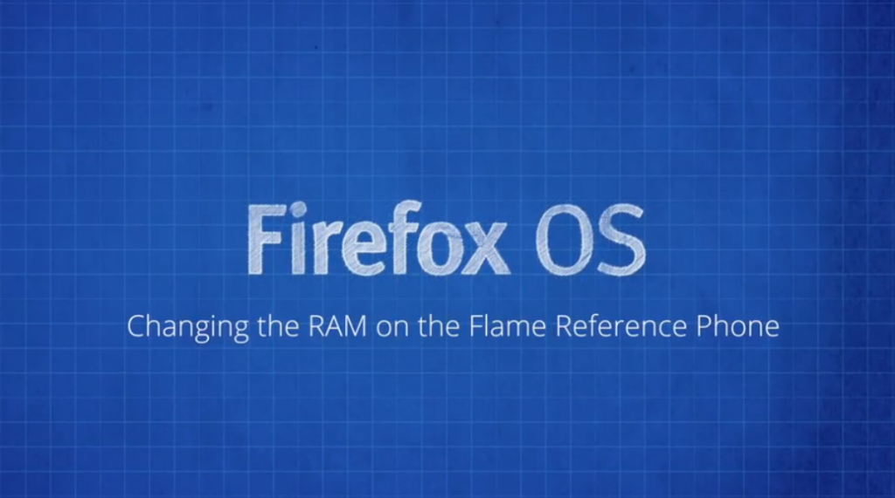

在看過《[影片：透過 Flame 入門 (上)](https://blog.mozilla.com.tw/posts/6263/)》之後，你一定不能錯過要接著介紹的兩支影片。

現在開發者已可訂購 [「Flame」開發者手機](https://developer.mozilla.org/en-US/Firefox_OS/Developer_phone_guide/Flame)，以順利進一步[撰寫適用的 App](https://blog.mozilla.com.tw/posts/5704/)。

任何人都能到 [everbuying 網站線上購買 Flame，美金 $170 即包含全球運費](https://www.everbuying.com/product549652.html)。此款開發者手機並未與任何電信營運商綁約或鎖機，可搭配使用你手邊的任何 SIM 卡。

接著要透過《[影片：透過 Flame 入門 (上)](https://blog.mozilla.com.tw/posts/6263/videos-getting-started-with-your-flame-device)》與《(下)》兩篇文章為大家獻上 Flame 手機的四支影片 (中文字幕)，說明應如何設定 Flame 為開發者手機、如何刷進新版 Firefox OS、如何設定 RAM 容量以模擬較慢速的裝置。

但請你需事先準備：

- Flame 可用的 USB 接線

- 先行安裝 ADB 與 Fastboot 完畢。只要安裝完整的 Android 開發者套件，亦可透過下列 [Windows](https://forum.xda-developers.com/showthread.php?t=2588979)或 [Linux 與 OSX](https://code.google.com/p/adb-fastboot-install/) 的簡易安裝程式，均可取得並安裝 ADB/Fastboot。

### 變更 Flame 的 RAM 容量

Flame 本身即具備 1GB 容量的 RAM，足以應付日常作業。但目前上市的 Firefox OS 商用機並未達此容量。因此我們讓開發者能輕鬆[透過 ADB 與 Fastboot 模擬較少 RAM 的初階裝置](https://www.youtube.com/watch?v=wtA6rxYZzqA)。

### 為 Flame 刷進新的 Firefox OS 映像檔

在大多數情況下，開發者只需讓 Flame 連上網路即可升級 Firefox OS。但如果你要隨時保持最新版本。則可[輕鬆取得 Mozilla 提供的映像檔並刷機](https://www.youtube.com/watch?v=U7o_YBVp3NA)。只要透過指令列下達重新開機並執行 Shell Script 即可。

###

### 先說到這了，請隨時留意 Wiki 的最新資訊

希望這些影片能帶領你透過 Flame 裝置，進一步接觸 App 與 Firefox OS 相關概念。你同樣可到[Flame 裝置的 Wiki 頁面](https://developer.mozilla.org/en-US/Firefox_OS/Developer_phone_guide/Flame)上取得所有資訊，而且將隨時提供最新消息。

原文連結：[Videos: getting started with your Flame device](https://hacks.mozilla.org/2014/08/videos-getting-started-with-your-flame-device/)
