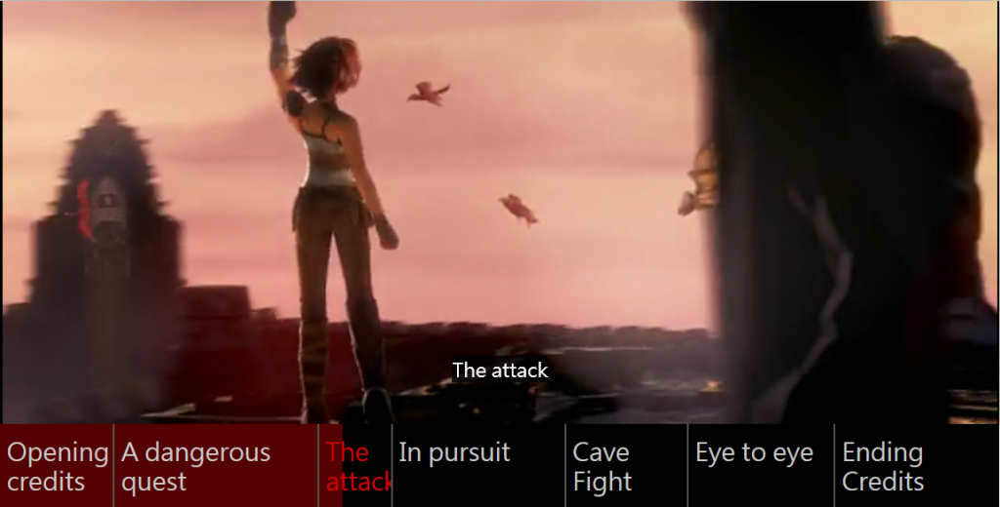

[HTML5](https://developer.mozilla.org/en/html/html5) 的 <video> 元素可在網頁中嵌入影片，就像嵌入圖片一樣簡單。各款主要瀏覽器均自 2011 年起支援 <video>，幾乎已經是最佳的動畫呈現方式。

而最近加入 HTML5 家族的 <track> 元素，其實就是 <video> 的子元素，可提供更好用的影片時間列，主要用以添增字幕 (Closed caption，CC)。這類字幕均以獨立的文字檔([WebVTT](https://developer.mozilla.org/en-US/docs/Web/API/Web_Video_Text_Tracks_Format) 檔案) 所載入，並顯示於影片底部。Ian Devlin 已針對這一點寫過一篇《[幫你的 HTML5 影片添加字幕](https://blog.mozilla.com.tw/posts/5916/)》。

除了字幕之外，<track> 元素也能用於影片時間列的互動功能。本文將概略說明三個範例：章節標記、預覽縮圖、時間列搜尋。你看完就能了解 <track> 元素及其 API，並建構自己的互動式影片。

### 章節標記

先來看看 DVD 光碟常見的「章節標記 (Chapter marker)」。此功能可跳到特定章節繼續觀看內容，特別適合如《辛特爾 (Sintel)》這類的長影片：

本範例所用的章節標記，是附掛於[外部 VTT 檔案](https://demo.jwplayer.com/text-tracks/assets/chapters.vtt)之中，並透過一組 <track> 元素 (搭配 kind 屬性設定為 chapters ) 載入至頁面上。且此「track」已設定為預設載入：

<video width="480" height="204" poster="assets/sintel.jpg" controls>
  <source src="assets/sintel.mp4" type="video/mp4">
  <track src="assets/chapters.vtt" kind="chapters" default>
</video>

					1234

						<video width="480" height="204" poster="assets/sintel.jpg" controls>  <source src="assets/sintel.mp4" type="video/mp4">  <track src="assets/chapters.vtt" kind="chapters" default></video>

接著我們用 JavaScript 載入各影音軌的文字提示、轉換其格式，並在影片底端的控制列中顯示提示文字。另請注意，這裡必須先等到外部 VTT 檔案載入完畢：

track.addEventListener('load',function() {
    var c = video.textTracks[0].cues;
    for (var i=0; i<c.length; i++) {
      var s = document.createElement("span");
      s.innerHTML = c[i].text;
      s.setAttribute('data-start',c[i].startTime);
      s.addEventListener("click",seek);
      controlbar.appendChild(s);
    }
});

					12345678910

						track.addEventListener('load',function() {    var c = video.textTracks[0].cues;    for (var i=0; i<c.length; i++) {      var s = document.createElement("span");      s.innerHTML = c[i].text;      s.setAttribute('data-start',c[i].startTime);      s.addEventListener("click",seek);      controlbar.appendChild(s);    }});

在上面的程式碼中，我們為各章節提示元素添增了兩項屬性，才得以達到互動功能。首先必須設定資料屬性，以儲存章節的起始位置；其次就是針對外部的搜尋 (Seek) 功能，添增點擊處理器 (Click handler)。此功能可直接讓影片跳到起始位置。如果還是不能播放影片，則如下處理：

function seek() {
  video.currentTime = this.getAttribute('data-start');
  if(video.paused){ video.play(); }
};

					1234

						function seek() {  video.currentTime = this.getAttribute('data-start');  if(video.paused){ video.play(); }};

就是這樣！現在你的影片就能透過 VTT 而顯示章節選單了。另請注意[此實際章節標記範例](https://demo.jwplayer.com/text-tracks/chapters.html)具有更多邏輯，例如點擊即可回播影片、根據影片播放進度而更新控制列、新增某些 CSS 風格等。

### 預覽縮圖

接著是因「Hulu」與「Netflix」兩大影音網站而廣為大家喜愛的酷炫功能：預覽縮圖。只要用滑鼠在控制列 (或行動裝置) 上拖曳，就能預覽目前搜尋位置的縮圖：

此功能同樣需透過[外部 VTT 檔案](https://demo.jwplayer.com/text-tracks/assets/thumbs.vtt)進行，並於後設資料 (Metadata) 影片軌中載入。此 VTT 檔案中的提示資料包含[獨立 JPG 圖像](https://demo.jwplayer.com/text-tracks/assets/thumbs.jpg)的連結，而非純文字；每個提示資料都能連上獨立的圖像，但此範例中僅使用單一 JPG sprite，進以達到較短延遲並方便管理。我們透過 [Media Fragment URI](https://www.w3.org/TR/media-frags/) 讓提示資料能連上 sprite 的正確區段。範例如下：

http://example.com/assets/thumbs.jpg?xywh=0,0,160,90

					1

						http://example.com/assets/thumbs.jpg?xywh=0,0,160,90

接著，所有取得正確縮圖並即時顯示的重要邏輯，都會在控制列的「mousemove」這個監聽器 (Listener) 中：

controlbar.addEventListener('mousemove',function(e) {
  // first we convert from mouse to time position ..
  var p = (e.pageX - controlbar.offsetLeft) * video.duration / 480;

  // ..then we find the matching cue..
  var c = video.textTracks[0].cues;
  for (var i=0; i<c.length; i++) {
      if(c[i].startTime <= p && c[i].endTime > p) {
          break;
      };
  }

  // ..next we unravel the JPG url and fragment query..
  var url =c[i].text.split('#')[0];
  var xywh = c[i].text.substr(c[i].text.indexOf("=")+1).split(',');

  // ..and last we style the thumbnail overlay
  thumbnail.style.backgroundImage = 'url('+c[i].text.split('#')[0]+')';
  thumbnail.style.backgroundPosition = '-'+xywh[0]+'px -'+xywh[1]+'px';
  thumbnail.style.left = e.pageX - xywh[2]/2+'px';
  thumbnail.style.top = controlbar.offsetTop - xywh[3]+8+'px';
  thumbnail.style.width = xywh[2]+'px';
  thumbnail.style.height = xywh[3]+'px';
});

					123456789101112131415161718192021222324

						controlbar.addEventListener('mousemove',function(e) {  // first we convert from mouse to time position ..  var p = (e.pageX - controlbar.offsetLeft) * video.duration / 480;   // ..then we find the matching cue..  var c = video.textTracks[0].cues;  for (var i=0; i<c.length; i++) {      if(c[i].startTime <= p && c[i].endTime > p) {          break;      };  }   // ..next we unravel the JPG url and fragment query..  var url =c[i].text.split('#')[0];  var xywh = c[i].text.substr(c[i].text.indexOf("=")+1).split(',');   // ..and last we style the thumbnail overlay  thumbnail.style.backgroundImage = 'url('+c[i].text.split('#')[0]+')';  thumbnail.style.backgroundPosition = '-'+xywh[0]+'px -'+xywh[1]+'px';  thumbnail.style.left = e.pageX - xywh[2]/2+'px';  thumbnail.style.top = controlbar.offsetTop - xywh[3]+8+'px';  thumbnail.style.width = xywh[2]+'px';  thumbnail.style.height = xywh[3]+'px';});

這樣就可以了！必須再次提醒，[即時預覽縮圖的實際範例](https://demo.jwplayer.com/text-tracks/thumbs.html)另包含額外程式碼；其啟動回播與搜尋的邏輯仍相同；且當滑鼠游標接觸/移出工具列時，其顯示/隱藏縮圖的邏輯也一樣。

### 時間軸搜尋

最後就是影片中的時間軸搜尋功能：

此範例將利用現有的 [VTT 字幕檔案](https://demo.jwplayer.com/text-tracks/assets/captions.vtt) (已載入至字幕軌中)。我們在影片與控制列下方另外提供搜尋框：

<form>
    <input type="search" />
    <button type="submit">Search</button>
</form>

					1234

						<form>    <input type="search" />    <button type="submit">Search</button></form>

如同剛剛的縮圖範例，所有的關鍵邏輯都包含於單一函式之中。但這裡則是提交搜尋表單的事件處理器 (Event handler)：

form.addEventListener('submit',function(e) {
  // First we’ll prevent page reload and grab the cues/query..
  e.preventDefault();
  var c = video.textTracks[0].cues;
  var q = document.querySelector("input").value.toLowerCase();

  // ..then we find all matching cues..
  var a = [];
  for(var j=0; j<c.length; j++) {
    if(c[j].text.toLowerCase().indexOf(q) > -1) {
      a.push(c[j]);
    }
  }

  // ..and last we highlight matching cues on the controlbar.
  for (var i=0; i<a.length; i++) {
    var s = document.createElement("span");
    s.style.left = (a[i].startTime/video.duration*480-2)+"px";
    bar.appendChild(s);
  }
});

					123456789101112131415161718192021

						form.addEventListener('submit',function(e) {  // First we’ll prevent page reload and grab the cues/query..  e.preventDefault();  var c = video.textTracks[0].cues;  var q = document.querySelector("input").value.toLowerCase();   // ..then we find all matching cues..  var a = [];  for(var j=0; j<c.length; j++) {    if(c[j].text.toLowerCase().indexOf(q) > -1) {      a.push(c[j]);    }  }   // ..and last we highlight matching cues on the controlbar.  for (var i=0; i<a.length; i++) {    var s = document.createElement("span");    s.style.left = (a[i].startTime/video.duration*480-2)+"px";    bar.appendChild(s);  }});

這樣又完成了！同樣的，[即時的時間列搜尋範例](https://demo.jwplayer.com/text-tracks/search.html)也有額外程式碼可啟動回播與搜尋作業，另有程式碼片段可更新工具列的輔助說明文字。

### 全部包起來用

上述範例可讓你設計出自己的互動式影片。如果需要更多靈感，可參考[可點擊的影片章節捷徑](https://www.jwplayer.com/labs/experiments/hot-spots/)、[互動式逐字稿](https://www.jwplayer.com/labs/experiments/interactive-transcripts/)、[時間軸互動](https://www.jwplayer.com/labs/experiments/timeline-interaction/)等影片。

整體來說，如果想提升自己影片的互動功能，[HTML5 的  元素](https://developer.mozilla.org/en-US/docs/Web/HTML/Element/track)絕對是簡單易用又能跨平台的好方法。只要你肯花時間寫出 VTT 檔案並打造類似的經驗，就能提高影片的能見度而獲得更高點閱率。祝你順利囉！

原文連結：[Building Interactive HTML5 Videos](https://hacks.mozilla.org/2014/08/building-interactive-html5-videos/)
