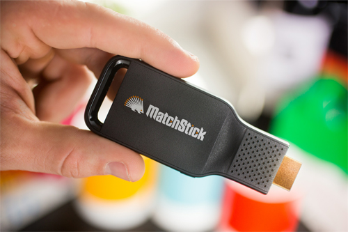
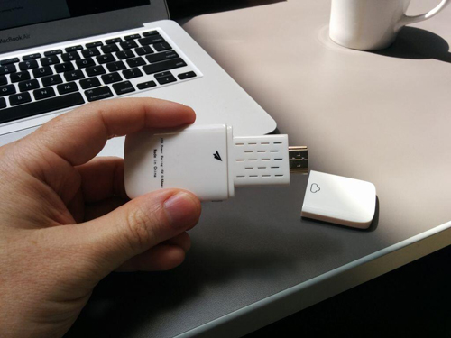

## 搶先取得開發者電視棒

首款搭載 Firefox OS 的 HDMI 電視棒 ─「[Matchstick](https://www.matchstick.tv/)」已經來了！我們希望能匯集大家的力量為這款新裝置開發 App。

### 背景

Matchstick 是由具備 Boot to Gecko、XBMC、Boxee 等豐富經驗的工程師團隊打造而成。在 Google 發表了「Chromecast」之後，我們高度期待其所帶來的可能性。但最後看到該款裝置仍未能達到大家所希望的最終功能 ─ 可隨時隨地於任何高畫質 (HD) 螢幕上提供各式影音內容，讓我們不免感到失望。

為了打造更好、更開放的裝置，我們選用的作業系統必須足以孕育高適應性的開放源碼平台 (也就是 Matchstick)。可堪此任的作業系統就是 [Firefox OS](https://www.mozilla.org/en-US/firefox/os/)，同時也讓我們得以翻越目前既有生態系統的高牆，而能開始免費建構我們的第一支電視棒。

Matchstick 與 Firefox OS 整合而成完全開放的平台，且軟、硬體皆然。不論是影片或遊戲，開發者都能自由探索相關內容與 App，並直接帶到自己家的客廳中享受。沒錯！就是開發者！現在開放的 SDK 可讓你打造個人化的串流與互動經驗，而不再需經過他人的審查與許可。

### 開發 Matchstick 的 App

我們現已開放[完整的開發者套件](https://www.matchstick.tv/developers/index.html)，讓你能取得 Matchstick 開發作業的所有必要資源。另將於專案啟動時一併支援 Firefox OS。我們也期待能將電視相關的 App 提交到 Firefox OS Marketplace 之上。而目前[完整函式庫所提供的 API](https://www.matchstick.tv/developers/documents/developers-guide.html)，可供開發 Android 與 iOS 的推送端 (Sender) App，以及可相容於 Matchstick Receiver 的接收端 (Receiver) App。

剛剛提到「Matchsticks 的 App」，即包含了推送端與接收端 App。你可透過推送端 API 啟動自己的 Firefox OS、Android、iOS 裝置，進而找到Matchstick 電視棒，再溝通接收端 App。要將 API 嵌入現有 App，或建立新的推送端 App 都不難。請參照我們已隨附於 SDK 內的範例程式碼。

Matchstick 的推送端 App 一般均依照下列執行流程：

1. 掃描 Matchstick

只要 Matchstick 裝置使用的 Wi-Fi 網路與推送端裝置相同，就可交由推送端 App 進行搜尋。掃描作業將友善顯示名稱、型號、圖示、製造商，以及裝置的 IP 位址。使用者可於完整清單上選擇所需的目標裝置。

2. 連上 Matchstick

推送端與接收端之間，我們現已同時支援 TLS 與 NON-TLS 的通訊方式。

3. 啟動接收端 App

推送端隨即開始溝通目標裝置，並透過 [HTML5](https://developer.mozilla.org/en/html/html5) 接收端 App 的網址，甚或是 Chromecast App ID 而啟動接收端 App。

4. 建立訊息通道

在啟動接收端 App 之後，Matchstick 隨即於推送端與接收端之間建立訊息通道。除了所有 Matchsticks App 與 Chromecast App 常見的媒體控制頻道之外，開發者亦可建立自己所需的 App 專屬頻道，以傳送給 App 任何必要的客製化資料。

接收端 App 是由 HTML5、CSS、Javascript 所組成，將載入至「Receiver container」(屬於 Firefox OS 的 Certified App)。如果要使用 Matchstick 的接收端 API，則只要將 fling_receiver.js 加入自己的 App 即可。

以下提供簡易視訊接收端 App 的範例：

<!DOCTYPE html>
<html>
    <head>
     <title>Example simplest receiver</title>
     <meta charset="UTF-8">
     <!--(need) include matchstick receiver sdk-->
     
    </head>
    <body>
     <!--(need) Give a video tag-->
     <video id="media"></video>
     
    </body>
</html>

					1234567891011121314151617181920212223242526

						<!DOCTYPE html><html>    <head>     <title>Example simplest receiver</title>     <meta charset="UTF-8">     <!--(need) include matchstick receiver sdk-->         </head>    <body>     <!--(need) Give a video tag-->     <video id="media"></video>         </body></html>

### 放送 Matchstick 以徵求 App

與其依賴模擬器，我們更希望開發者能實際擁有 Matchstick 的原型機，並立刻開始開發作業。只要開發者想針對 FirefoxOS 開發或移植 Matchstick 可用的App，都歡迎[透過「Matchsticks for Apps」企劃來申請免費的開發者預覽裝置](https://www.matchstick.tv/developers/register.html)。

一如 Mozilla 所發起的「Phones-for-Apps」企劃。只要開發者已經建構出 Firefox OS、Chrome、Android、iOS，甚至 Chromecast 的 App，都能再度投入我們的「Matchsticks for Apps」企劃！讓我們將自己的視界帶進大螢幕吧！

Matchstick 的開發者版本 (由技術傳教士 Christian Heilmann 所攝)

我們亦正尋找著酷炫的想法、影音內容、新視訊頻道，也歡迎遊戲、工具、圖/相片、公用程式，甚至使用者介面 (UI) 的佈景主題。如果你正打算為 Matchstick 開發 App 或進行有趣的事情，請立刻分享自己的計畫讓我們知道，就能獲得電視棒並儘快著手開發。

申請 Matchstick 的資格：

- 想針對大螢幕電視開發 App

- 已開發過 Web App 或行動 App，想進一步延伸到大螢幕之上

- 已是 HDMI Dongle 的開發者，想打造自己的 Matchstick

- 已是 Chromecast 開發者，想將 App 移植到開放平台之上

- 就是你了！

### 將於 11 月登場的 Matchstick 工作坊

我們正規劃 Matchstick 的 Firefox OS App 工作坊，將於 11 月 18日 (星期二) 讓受邀參加的開發者齊聚 Mozilla 的舊金山辦公室。現已開放報名表格，歡迎符合資格的開發者申請。

[報名舊金山工作坊](https://www.eventbrite.com/e/matchstick-hack-fest-tickets-13365734271)！

如果你離舊金山很遠，也不用擔心。我們也在規劃多個 App 工作坊，很快就會通知各位熱血的開發者！

祝開發愉快！

原文連結：[Matchstick Brings Firefox OS to Your HDTV: Be the First to get a Developer Stick](https://hacks.mozilla.org/2014/09/matchstick-brings-firefox-os-to-your-hdtv-be-the-first-to-get-a-developer-stick/)
