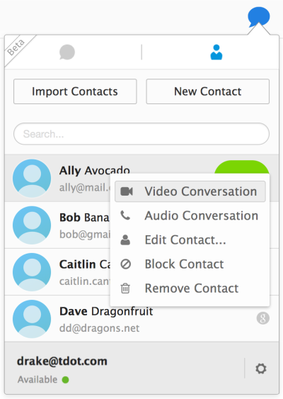

Mozilla 很高興又能為 Firefox 帶來新的 WebRTC 實驗功能，快來向「Firefox Hello」打個招呼吧！

即便你和親友所使用的視訊服務或軟、硬體不全然相同，也能透過 Firefox Hello 輕鬆互動溝通。Firefox Hello不需再另外下載軟體或外掛程式，更不用再建立新帳戶，就能撥打免費的語音或視訊電話；讓使用者能享受更全面的 Firefox 瀏覽器。你只需開啟 Firefox 測試版 (Beta)，點擊「自訂」選單下的「聊天泡泡」圖示，就能使用 Firefox Hello。而對方的瀏覽器只要支援 WebRTC 功能 (如 Firefox、Chrome、Opera)，就能直接和你聯繫。我們現在就可以直接呼叫[我們在 TokBox 的朋友](https://www.tokbox.com/blog/firefox-hello-mozilla-enhances-opentok-powered-video-chat-service/)，而對方用的 OpenTok 平台即可強化此新功能。

現為 Firefox 測試版新增的功能包含：

#### 新的通話選擇

[Firefox Hello 的絕佳功能](https://support.mozilla.org/zh-TW/kb/firefox-hello-send-and-receive-calls-webrtc)之一，就是不需建立新帳戶即可啟動通訊作業。你只要將回撥的連結分享給所要聯絡的人，對方再點擊該連結就可開始通話。

通話管理面板

如果你會定期聯絡某些人，也可[登入自己的 Firefox Account](https://www.mozilla.org/zh-TW/firefox/sync/) 而輕鬆連絡上其他同樣擁有 Firefox Account 的親友。在登入之後，即可撥打電話給其他 Firefox Account 使用者，反之亦可迅速接聽對方來電；如此就不用先分享回撥的連結才能通話。你也能透過 Firefox Account 設定自己的每一部電腦，不論在家或辦公室都能接聽電話。

#### 聯絡人整合

此版本另首次添加了聯絡人管理功能。你可手動將聯絡人資訊加入通訊錄，或可將儲存於 Google 帳戶中的聯絡人匯入到 Firefox Hello。只要選擇通訊錄中的「匯入聯絡人 (Import Contacts)」，再登入自己的 Google 帳戶提供授權即可。接著就能直接在 Firefox 中撥打給這些聯絡人。

這些只是 Firefox 測試版其中幾項重要的改良功能而已。現在就按照這些說明步驟 [insert SUMO post] 立刻體驗 Firefox Hello 吧。我們很期待能獲得大家的想法，所以特別設計了意見反饋表格，讓你結束通話時就能填寫。另請記得，目前此功能仍處於實驗階段，往後仍可能進行大幅修改。

Mozilla 歡迎你對這些新功能提出的建議與想法，才能讓我們提供更完整的 Firefox Hello 給全世界。

#### 更多資訊：

- [下載 Windows、Mac、Linux 版的 Firefox Beta](https://www.mozilla.org/firefox/channel/#beta)

- Windows、Mac、Linux 版的 Firefox Beta [版本說明](https://www.mozilla.org/firefox/34.0beta/releasenotes/)

原文連結：[Test the new Firefox Hello WebRTC feature in Firefox Beta](https://blog.mozilla.org/futurereleases/2014/10/16/test-the-new-firefox-hello-webrtc-feature-in-firefox-beta/)
