時間：10/18 (六) 10:00 – 16:30

地點：Mozilla Space

十月中天氣漸涼，但 Mozilla Space 卻充滿了熱情的活力與歡樂的笑聲。眾所期待的 「Firefox 校園大使年中聚會」在第一次約定日期巧遇颱風取消後，第二次終於如期於 10/18 順利舉行。

這次的活動邀請了過往及現任的 Firefox 校園大使一同歡聚、互動交流。活動以輕鬆有趣的破冰遊戲開場，所有大使圍成一個圈，每個人必須以一句話快速地回答主持人的提問。出人意料的答案讓現場笑聲連連，也順利化解了大家初見面的生澀。

緊接者破冰遊戲登場的是大使個人自我介紹，透過 3 分鐘的簡介，大使們在彼此之間找到了更多共通點，也讓接下來的 Maker 分組活動 – Firefox 十週年紅恐龍拼豆順利進行，不少組別都創作出令人驚豔的拼豆作品。

經過了午餐簡短的休息，下午來到了活動的重頭戲，由 MozTW 社群成員  Irvin 主持的 “Firefox 校園大使優秀小任務分享"、"Appmaker 音樂會" 及 “Mozilla 專案介紹" 都在預定時間內順利完成，也獲得了大使的熱烈回響。

透過照片與文字的解說，讓我們一同回顧當天的精彩花絮！

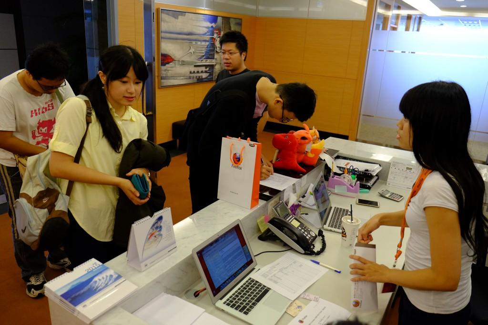

早上 10 點，大使們陸續來到活動現場

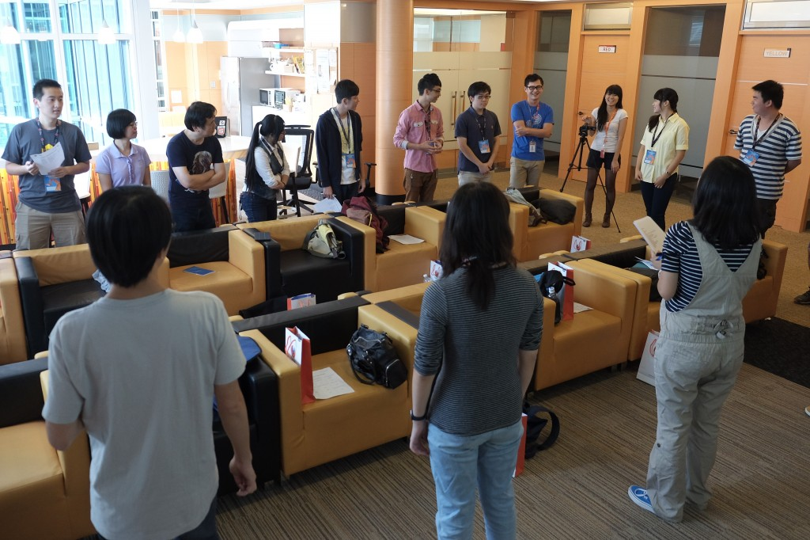

歡笑聲不斷的破冰遊戲

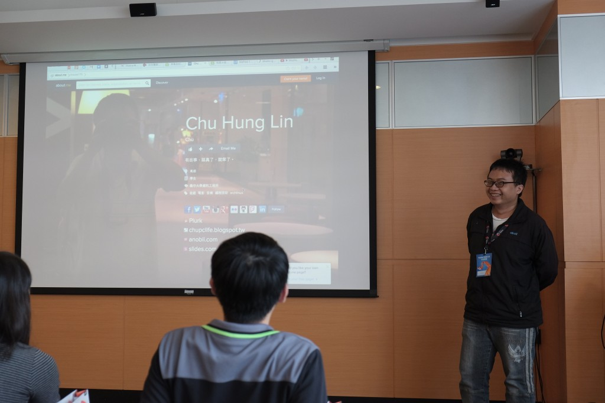

大使自我介紹

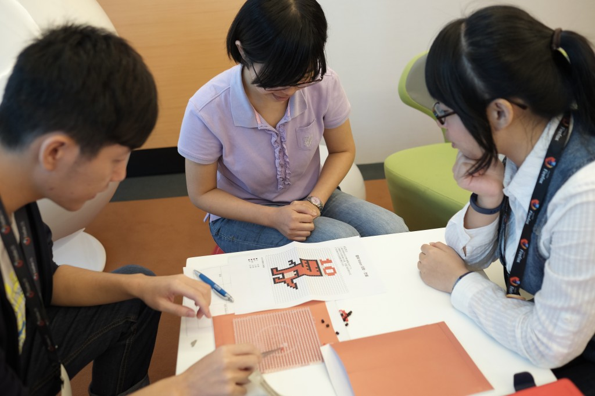

分組拼豆活動，考驗大家的默契與創意

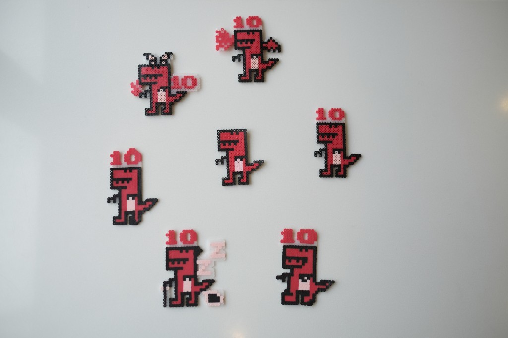

各種造型可愛的紅恐龍拼豆作品

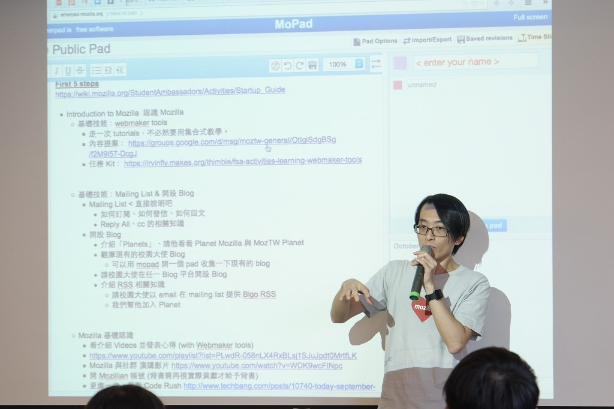

Firefox 校園大使小任務的設計過程揭密

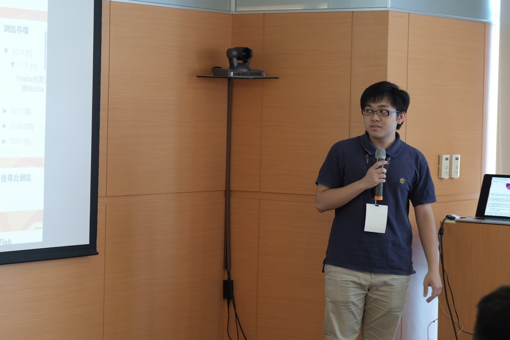

優秀小任務分享

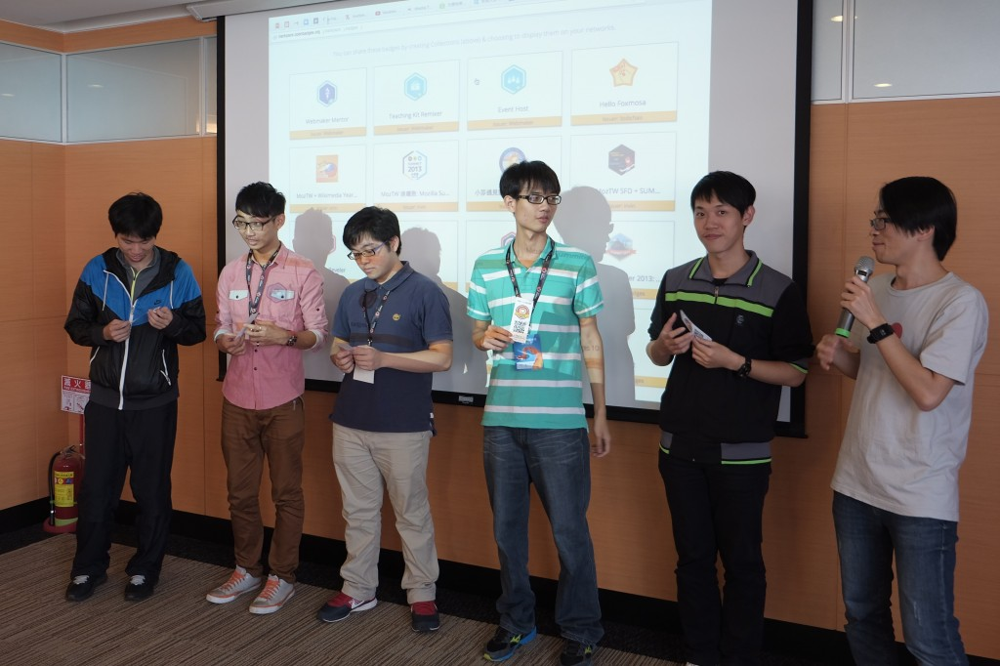

頒發優秀小任務作品破關 open badge

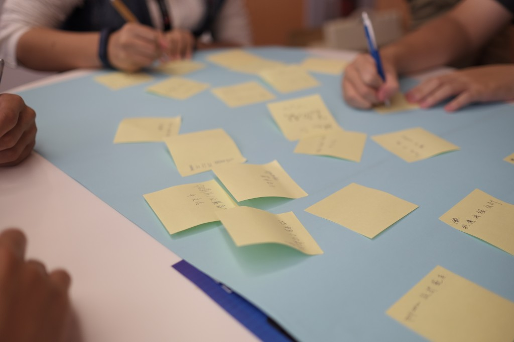

小任務內容提案

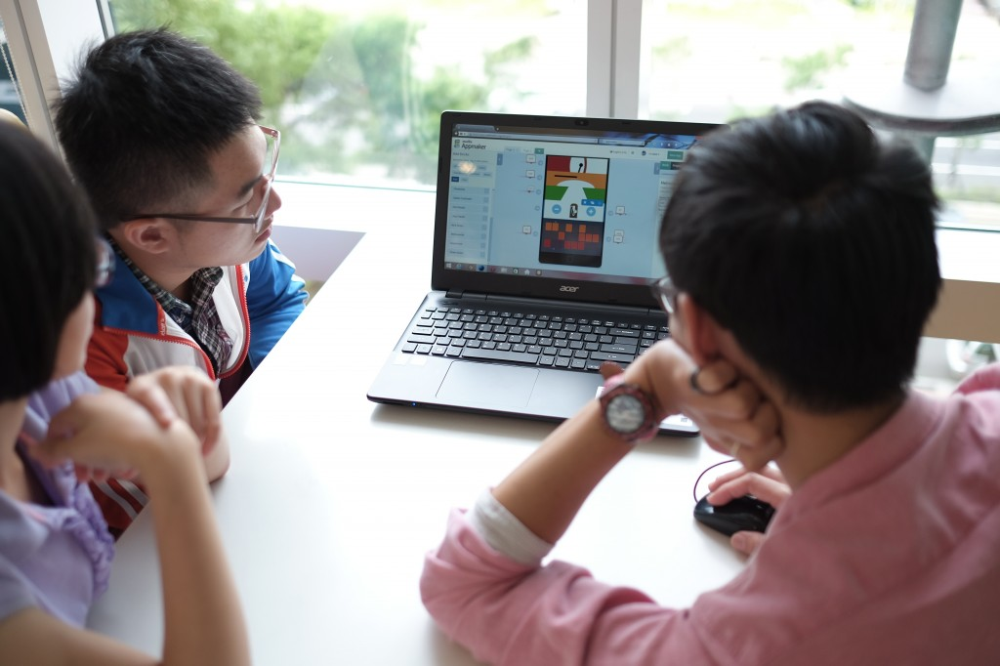

透過 Appmaker，大使們即興創作出有趣好玩的音樂作品

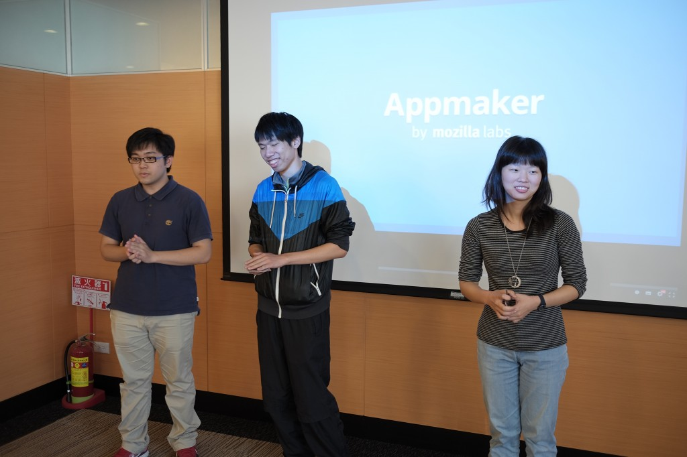

最受歡迎的音樂作品組別上台接受表揚

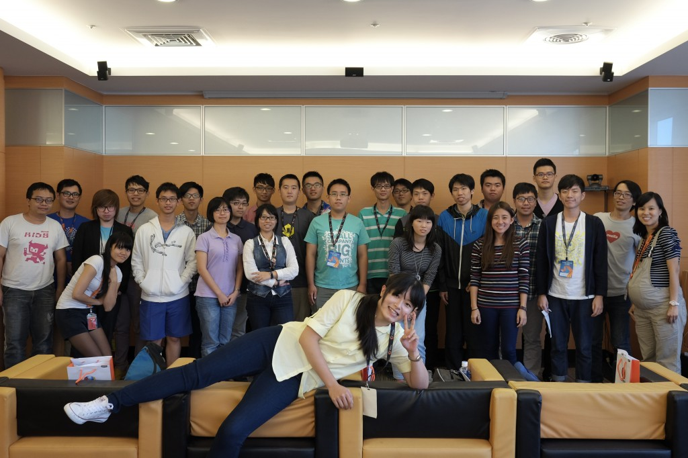

Firefox 校園大使年中聚會活動大合照

一整天的 Firefox 校園大使年中聚會活動就在現場不時傳出滿足的歡笑聲中圓滿結束，謝謝所有大使、社群成員參與這次的活動，期待下次的再次相見！
