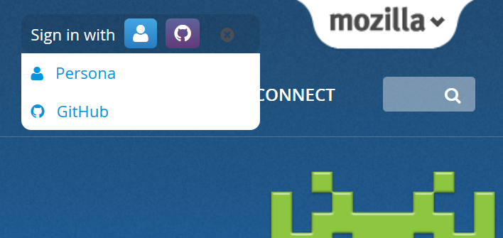

[Mozilla 開發者社群網站 (Mozilla Developer Network，MDN)](https://developer.mozilla.org/) 現有更多登入方式可供大家選擇！

之前必須註冊 Mozilla 的「Persona」網路身分識別服務帳戶才能登入 MDN。你能立刻[免費且輕鬆取得](https://support.mozilla.org/en-US/kb/what-is-persona-and-how-does-it-work) Persona 帳戶。但根據 MDN 的統計資料，在「以 Persona 登入」介面跳出網頁的比例異常偏高。舉例來說，跳出該網頁的人當中幾乎有 90% 只點擊了「編輯 (Edit)」之後，就沒再繼續登入，也就代表他們根本沒能編輯文章。這實在是 MDN 的一大損失！

我們理應讓大家能輕鬆加入 MDN 並貢獻。只要你點擊「編輯」，就應該能輕鬆開始編輯。而根據上述的分析結果，大多數願意編輯的人都在 Persona 的登入介面就退出。因此 Mozilla 要提供更多方式，讓潛在的貢獻者樂意且順利登入。

一般開發者幾乎都擁有 GitHub 帳戶，相關分析也證實這一點。如果 MDN 使用者已於自己的個人檔案中列出其他外部帳戶，更將近 30% 的人填寫了 GitHub 帳戶。而且 GitHub 更是常見外部帳戶的第二名，僅次於 Twitter 帳戶。

這種情況讓我們開始思考：如果能將 GitHub 帳戶整合到 MDN 個人檔案之中，就能讓大家透過 MDN 分享 GitHub 上的有趣活動。更有機會使用某些 GitHub 工具，為 MDN 使用者創造更高的價值。而現在馬上能做的，就是提供「以 GitHub 登入」功能給目前至少 30% (當然可能還更多) 的 MDN 使用者。

「以 GitHub 登入」更能另外接觸到超過 3 百萬名 GitHub 使用者。

所以整個工程團隊與 MDN 社群都跳進來建構此功能。

### 驗證函式庫

為了能用 GitHub 帳戶進行驗證，我們必須擴充 MDN 網站處理驗證的方式，讓 MDN 使用者能輕鬆新增自己的 GitHub 帳戶。Mozilla 重新審閱了目前的 [kuma](https://github.com/mozilla/kuma/) (即執行 MDN 的 Code base) 程式碼，發現 kuma 在技術上其實和 Persona 的運作方式有著極高的相依性。

Mozilla 一直在解決某些技術上的疑慮，也就是重新檢視多年前撰寫的驗證作業程式碼。最後我們決定汰換自家的 [django-browserid](https://github.com/mozilla/django-browserid) 系統，改用第三方的 [django-allauth](https://github.com/pennersr/django-allauth/) 函式庫；也是 Django 社群所熟知的系統。此系統可同步使用多重驗證服務，正好用於我們想整合的 Mozilla Persona 與GitHub。

我們所遇到的難題之一，就是要將現有的使用者資料庫無痛移轉到新系統，減少其對使用者產生的影響。但這出乎意料之外的不是什麼大問題，而且只要用特定程式碼將資料轉換為新格式，就能自動整合資料庫完畢。我們在數個月前就建構了新的驗證函式庫，並將帳戶移植進其內。MDN 就從這時開始使用 django-allauth 進行 Mozilla Persona 的驗證作業。

### 使用者經驗 (UX) 的難題

Mozilla 希望使用者獲得快速又簡單的登入經驗，並能順利編輯 MDN 的內容。所以我們又針對介面進行了幾項改善作業：

- 要能記得使用者登入的原因，且登入之後能導回使用者原本要進行的工作。

- 能取得 GitHub 的資料，預先填入使用者名稱與電子郵件位址 (如果確實有這兩項資料，亦可預先檢查)。

- 信任 GitHub 已確認的電子郵件位址。在使用者完成登入之前，我們就不用再次確認電子郵件位址。

- 統一我們的語言 (實際做起來比較難)。讓使用者連上其他「服務」的「帳戶」，進而於MDN 上「登入」自己的「MDN 個人檔案」。[可觀看此討論](https://bugzilla.mozilla.org/show_bug.cgi?id=1051000)。

而使用者經驗 (UX) 的難題之一，就是要讓現有使用者願意透過新的驗證服務登入。就 MDN 的案例來看，我們的使用者在登入新服務之後，就必須「宣示」自己擁有某筆個人檔案，或必須將新的登入服務添增到個人檔案中。我們在這方面下了很多苦心，希望不論是先後以 Persona 或 GitHub 登入，都能達到最簡化的流程。

因此我們針對 UX 擬定理想的計畫，另仍堅持先深入了解 allauth 與 GitHub API 的功能，才會進一步做出改變。我們會確認內部人員先測試無虞，再著手改善整個流程以外的細節。後續就透過功能開關 (Feature toggle) 進行測試。

### 階段測試與正式發佈

此專案有可能毀損個人資料或登入資料，也可能改變最基本的登入/登出介面。所以我們謹慎規劃發佈時程，期間更劃分出好幾波功能測試。

我們透過[功能開關](https://github.com/jsocol/django-waffle)套件，對 MDN 的改版進行封閉與開放測試。該套件即為 [James Socol](https://jamessocol.com/) (MDN 退休經理) 所提供的 [django-waffle](https://github.com/jsocol/django-waffle) 套件。

在 [MDN 開發環境](https://developer-dev.allizom.org/)之中，我們每天都會佈署新的程式碼到功能開關內。MDN 工程師在這段期間不斷重複測試新功能，另設法找到臭蟲回報至[主要追蹤系統](https://bugzilla.mozilla.org/showdependencytree.cgi?id=991351)中。

在功能已相對趨於完備之時，我們建立了[開放測試頁面](https://wiki.mozilla.org/MDN/Development/GitHub_Beta)，並於 [MDN 階段式環境](https://developer.allizom.org/)中開關功能以利進一步的審閱作業。我們測試 UX 的運作邏輯、邀請 Mozilla 內部員工協助開放測試、[提報了許多 UX 錯誤](https://bugzilla.mozilla.org/showdependencytree.cgi?id=1046775)，還排定除錯的優先順序。

接著就在網站上貼出橫幅消息，邀請大家加入測試並提報錯誤。這個階段的 QA 總計有 365 人參與測試。我們也找到 [Mozilla WebQA](https://quality.mozilla.org/teams/web-qa/) 加入測試階段的伺服器一同測試。至此所獲報的錯誤並不多，也讓我們對最終發佈更具信心。

### 發佈

過程很繁雜，但最後終於湊齊了正式發佈所需的拼圖。由於相關的測試與發佈計畫還頗為完整，發佈時並未發生任何意外 ─ 沒有當機、沒有印出呼叫堆疊 (Stacktraces)，也沒有發現新的錯誤。我們很高興能發佈此新功能，更開心能為 MDN 使用者與貢獻者提供更多功能。當然也很榮幸能邀請 GitHub 使用者加入 Mozilla 開發者交流網站，一同打造更好的 Web。[立刻登入](https://developer.mozilla.org/)。

### 展望

到目前為止，我們解決了多重帳戶驗證機制的基本架構與 UX 挑戰。接著希望能再整合更多驗證服務，例如 [Firefox Sync](https://www.mozilla.org/en-US/firefox/sync/) 所用的 [Firefox Accounts](https://blog.mozilla.org/blog/2014/02/07/introducing-mozilla-firefox-accounts/) (FxA) 驗證服務就是其中之一。FxA 不僅已整合到 Firefox，往後也將整合 Mozilla 的更多服務。隨著有越來越多開發者註冊 Firefox Accounts，我們也會嘗試發掘並納入更多驗證機制。

原文連結：[New on MDN: Sign in with Github!](https://hacks.mozilla.org/2014/10/new-on-mdn-sign-in-with-github/)
