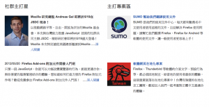
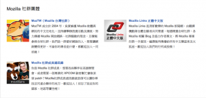

在上週五，Mozilla Taiwan 的[社群頁面](https://mozilla.com.tw/community/)終於上線了，且讓我快速為大家介紹組成此頁的三個部分：

### 依據角色，選擇適合的貢獻方式

我們為一般民眾、學生及開發人員各挑選了一些能快速貢獻 Mozilla 專案的方法，只要在頁面上選擇你的角色就可以看到。各角色及對應的推薦貢獻方式包括：

一般民眾： 可以上 SUMO 翻譯使用文件，或上 MozTW 討論區協助新手解決問題。
學生： 有在寫部落格的同學可以考慮參加 Mozilla 夥伴計畫，幫我們推廣 Firefox。也歡迎申請成為我們的校園大使！（校園大使相關事項，會另寫一篇說明。）
開發者： 對開發者來說最直接的方式就是開發，您可以使用 Add-on SDK 在數分鐘內做個附加元件，協助改善大家的網路體驗。
我們希望可以藉由這些幾分鐘就可以開始動手的方式，讓大家嘗試貢獻。這些推薦專案日後也可以視需求加以修改。

### 社群主打星、主打專案

社群主打星部分將引用與社群相關的 Blog 文章，規劃中有社群活動宣傳、社群人物訪問等等。如果你有什麼 Idea，也歡迎到我們的郵件群組一起討論。

主打專案則是我們將推薦大夥參與的重點專案。大家知道 Mozilla 的專案百百種，中文網頁主要還是會針對與中文比較相關的專案作為主打。目前列出的有 L10n（在地化）及 SUMO（使用文件），日後也可以依需求更換。

### Mozilla 社群團體

台灣及香港有不少支持 Mozilla 的社群成員，這邊則列出你可以找到他們的方法。目前列出的社群有 MozTW、Mozilla Links 中文版及作為社群通訊錄的 Mozillians.org，如果你也有個支持 Mozilla 的社群團體，歡迎告訴我們！

### 感謝

感謝行銷部的其他夥伴提供的意見，特別感謝 Erica 跟 Gary 設計與實作了這樣的頁面，以及 MozTW 社群提供的意見與協助。

如果你有什麼建議與想法，也歡迎到我們的郵件群組討論：[https://lists.mozilla.org/listinfo/community-taiwan](https://lists.mozilla.org/listinfo/community-taiwan)
