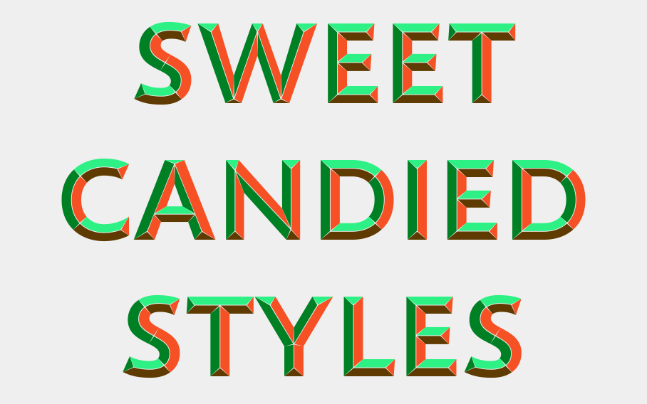
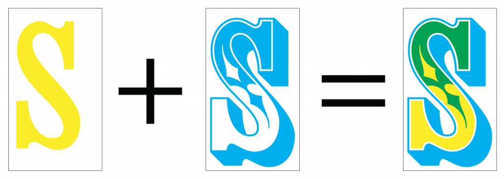
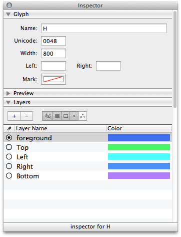
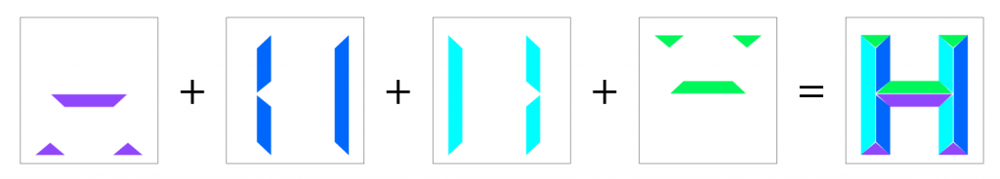
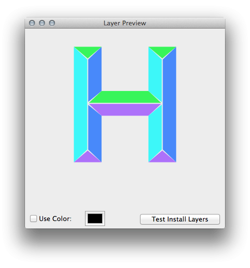

本文作者 [Johannes Lang](https://langustefonts.com/)，是在奧地利首都維也納工作的圖形設計師，也在維也納的應用藝術大學兼課傳授排版、字型等課。

### 簡介

才不久前，若想要在一組向量字型內放入一種以上的顏色，技術上來說根本不可能。一個多色字母往往需組合多種顏色的部分，而之前就必須搭配多項技術才能達到此效果。但現在的數位樣式卻可突破舊款技術的限制。如果要列印木質或鉛質的風格，每個字母本來就限制只有一種顏色 (隨機斜率不算在內)。但若一個字母要具備兩種以上的顏色，就必須將之分割成不同的色彩部位，而且還要分開列印各種顏色。線上已有[某些絕佳的範例圖素](https://archive.org/stream/ldpd_10147342_000#page/n0/mode/thumb)可供參考。另外再提一下「疊印 (Overprinting)」，也就是用兩種色彩達到三種顏色的圖像。

模擬雙色疊印，達到三色效果

數位字型格式，可讓各個字母保持僅一個「表面」。一個字母可分割為多個輪廓，但指定的顏色會套用到所有輪廓之上；這就像是凸版印刷，每個字母必須重複疊加才能達到一種顏色以上的效果。單純疊加不能算是理想的解決方案，而且很容易發生錯誤。

等到大家對多色字型的需求越來越大，才有人投入開發額外的表格 (Table)，以於 OpenType 字型內儲存這類資訊。本文撰稿之時，已有多種方式可實作出此字型。Adam Twardoch 則是透過「FontLab」部落格，詳細[比較了所有可能的解決方案](https://blog.fontlab.com/font-tech/color-fonts/color-font-format-proposals/)。

但對我來說，Adobe/Mozilla 的方法看起來比較有趣。

上述主題已經由 [W3C 社群](https://www.w3.org/community/svgopentype/)展開討論，並已經有[具體的文件記錄](https://www.w3.org/2013/10/SVG_in_OpenType/)。其基本概念就是將有色彩的字母儲存為 SVG 格式的 OpenType 字型。當然你的字型複雜度也可能有所影響，但 SVG 格式所佔的容量可較 PNG 來得小。隨著高解析度畫面的開發活動漸趨熱絡，「向量」似乎可達到比「畫素」更好的解析度。另外有越來越多人對 SVG 的「動畫化」有興趣，將來的運用方式勢必更有趣 (當然也會更煩人)。

### 技術

我自己並非字型設計師，也不是 Web 開發者，純粹是對這個新的開發領域好奇。我用以下方式設計了多彩的 OpenType 字型；當然應該有其他更好的方法。

你必須先選用字型編輯器，才能打造出自己的字型。字型編輯器有 [RoboFont](https://robofont.com/)、[Glyphs](https://www.glyphsapp.com/) (這兩項僅能用於 Mac)、[FontLab](https://www.fontlab.com/)，以及免費的 [FontForge](https://fontforge.github.io/en-US/)。我自己是選用了 RoboFont 編輯器，除了提供極高的自訂性之外，也能用 Python 打造自己所需的擴充套件。在最終定稿的字型中，我根據自己需要的顏色數量添加了對應的色彩層。你可以立刻繪製到各個色彩層中；或是在前景層 (Foreground layer) 中繪製之後，將各個部位複製到對應的色彩層中即可。有了這個方便的「[Layer Preview](https://github.com/typemytype/RoboFontExtensions/tree/master/LayerPreview)」擴充套件，你就能預覽所有的疊加層。你也可以提高字型視窗中的縮圖尺寸。有些地方會顯示所有的色彩層。因為這些都是預覽圖，所以你可以再依自己的喜好調整色彩。

先定義你想在「Layer Preview」中看到的顏色：

各個分割的色彩層與組合之後的外觀

在畫完了自己的字型輪廓之後，各個層/顏色必須逐一儲存為 [ufo](https://unifiedfontobject.org/)。我使用簡單的 python 指令碼，將這些檔案儲存在主要檔案的相同路徑之下……

看到這裡，你是否對字型設計有了基本的概念呢？如果你本來就對字型設計有興趣，請別錯過原文內更多的精采內容，另有相關範例程式碼及動畫效果可供你參考！

原文連結：[SVG & colors in OpenType fonts](https://hacks.mozilla.org/2014/10/svg-colors-in-opentype-fonts/)
