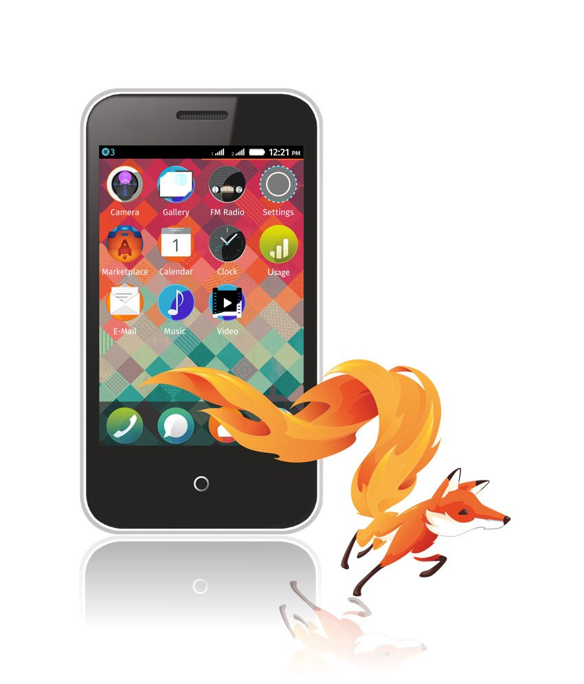

以推動網路創新、自由、開放為使命的全球性非營利組織 Mozilla，很高興宣佈 Firefox OS 即將登上非洲大陸。Firefox OS 生態系統現已獲得 Airtel、MTN South Africa，以及 Millicom 所營運的 Tigo 共三大合作夥伴強力支援。這些營運商均是首次與 Mozilla 結盟，將為非洲導入第一支 Firefox OS 智慧型手機。

Mozilla 規劃與生態系統副總 Rick Fant 說：「我們很開心能看到 Airtel、MTN South Africa、Tigo 共同支援 Firefox OS 拓展至非洲。Firefox OS 的持續成長，也代表又有數百萬人能夠以親民的價格接觸到行動 Web，同時更進一步打開目前仍封閉的行動生態系統。」

Firefox OS 是第一款完全以 Open Web 標準打造的裝置平台，且開發的所有功能均是 HTML5 規格的應用程式。且其靈活性、可調整性、強大的自訂功能，讓使用者、開發者、產業夥伴得以打造自己所需的行動經驗。

截至今天為止，Firefox OS 已擁有二十五個市場的本地合作夥伴，順利進入歐洲、亞洲、澳洲、拉丁美洲。一旦 Firefox OS 登上非洲之後，其行動版圖即擴及五大洲。

### 更多資訊：

- [Firefox OS Website](https://mozilla.com.tw/firefox/os/)

- [Firefox OS Press Kit](https://blog.mozilla.org/press/kits/firefox-os/)

原文連結：[Firefox OS Ecosystem To Expand To Africa With Support From New Partners](https://blog.mozilla.org/blog/2014/11/05/firefox-os-ecosystem-to-expand-to-africa-with-support-from-new-partners/)
