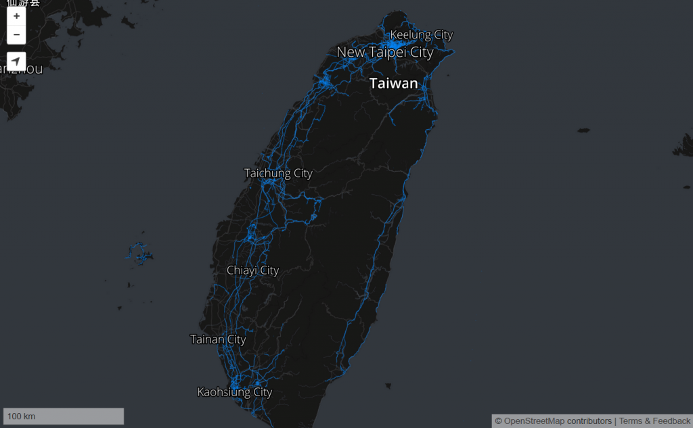

「[Mozilla Stumbler](https://play.google.com/store/apps/details?id=org.mozilla.mozstumbler)」是群眾外包 (Crowd-sourcing) 的開放源碼無線網路掃瞄器，可協助同樣是群眾外包的定位資料庫「[Mozilla Location Service (MLS)](https://location.services.mozilla.com/)」蒐集 GPS 資料。我們剛於 Google Play 商店釋出 1.0 版本，可讓使用者輕鬆安裝 Mozilla Stumbler 並隨時更新。如果你比較愛用 f-droid 版本，也可以到 [f-droid 上取得 Mozilla Stumbler](https://f-droid.org/repository/browse/?fdid=org.mozilla.mozstumbler)。

隨著你在大街小巷穿梭，此 App 也會不斷「絆到」新的 Wi-Fi 網路與基地台。Mozilla Location Service 可整合無線網路資訊而提供地理定位服務，並透過 Firefox OS 的地圖與「[Find My Device](https://find.firefox.com/)」來顯示你的位置。在你的 Android 裝置上，Stumbler 將透過本身的地圖畫面來顯示資料庫的圖資 (以藍點顯示)，並讓使用者得知接下來將行經的街道名稱。可[前往 Mozilla 的專案頁面](https://location.services.mozilla.com/)進一步了解。

#### 該如何使用 Mozilla Stumbler

- 前往尚未揭露過的區域 (未覆蓋藍色) 以豐富[地圖資訊](https://location.services.mozilla.com/map)。

- 每天都帶著 Mozilla Stumbler 走路、騎車、開車行經不同的路線。

- 先從主要街道與路口開始，再逐步探索小路或旁支巷弄。但請注意自身安全，避開陰暗的角落。

- 你所貢獻的圖資需時一天才會更新到地圖中。

- 當裝置的電力偏低時，App 將自動停止運作。

如果有多個貢獻者想一決高下，也可以在 Stumbler 的「設定 (Settings)」中輸入自己喜歡的暱稱，並透過[排行榜](https://location.services.mozilla.com/leaders)追蹤他人的進度。[週排行榜](https://location.services.mozilla.com/leaders/weekly)的變化可是非常劇烈的。而新加入的貢獻者可自行探索新的區域，設法回報尚無人發現的無線網路，因此也有機會跳上週排行榜的前幾名。

為了避免行動電話的資料傳輸量暴增，Stumbler 只會在連上可用的 Wi-Fi 網路時，才會顯示高解析度的地圖。如果你只要看高解析度的地圖，可逕行更改 Stumbler 的「開發者設定 (Developer Settings)」。

你可透過 [GitHub bug tracker](https://github.com/mozilla/MozStumbler/issues)，或 [Mozilla 的 IRC 伺服器](https://wiki.mozilla.org/IRC)「#geo」頻道上回報錯誤。Mozilla Stumbler 是開放源碼，當然可到 [GitHub 上取得程式碼](https://github.com/mozilla/MozStumbler)。

原文連結：[Mozilla Stumbler 1.0 geolocation crowd-sourcing app now in Google Play Store](https://blog.mozilla.org/services/2014/11/03/mozilla-stumbler-1-0/)
