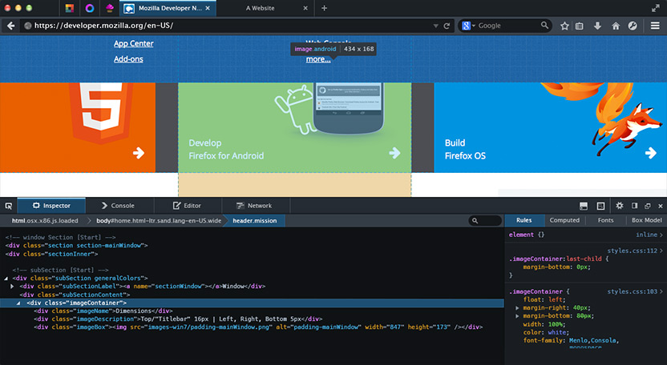

Web 要能不斷成功創新，端賴開發者是否積極參與。他們所撰寫的 App 與內容，讓我們每天都必須透過電腦或行動裝置流連忘返於 Web 之上。

為了慶祝 Firefox 十周年，Mozilla 開心宣佈 [Firefox 開發者版本 (Firefox Developer Edition)](https://mozilla.com.tw/firefox/channel/#aurora) 瀏覽器，也是第一款專為開發者所打造的瀏覽器 (中文字幕)。

回到十年前，Mozilla 為早期採用者與開發者打造了 Firefox，期待能為大家提供更多的選擇與控制性。Firefox 整合了 WebAPI 與附加元件 (Add-on)，要讓所有人都能妥善利用 Web 的強大威力。現在我們要讓整個瀏覽器都成為開發者的遊樂場，提供與開發者最息息相關的前端與核心功能。透過開發者專屬的瀏覽器量身訂做出瀏覽體驗。

因為 Firefox 本身就屬於開放源碼、獨立社群的一部分，而非專利的生態系統，所以能夠擺脫平台或裝置的限制。只要 Web 所及之處就能套用我們的工具，進而提供其他瀏覽器沒有的功能。

最讓開發者頭痛的問題之一，就是要使用多種互不往來的開發環境，再針對不同的 App 商店建構內容。因此開發者往往必須切換不同的平台與瀏覽器，進而拖慢開發速度並影響產能。

Firefox 開發者版本則專注簡化整個開發流程，進而解決了相關問題。此款開發者專用瀏覽器不僅是功能強大的撰寫工具，也可足以應付每天的瀏覽作業。另更添增了許多新功能，不論是要針對行動裝置或桌機平台進行開發，都能輕鬆建構完整的網頁。

如果你是老經驗的開發者，應該早已熟悉了多項內建工具，所以只要開啟瀏覽器就能專心開發自己的 App 或網頁內容。且不需下載額外的外掛程式，即可為行動裝置進行除錯。如果你剛開始接觸 Web，這些已經設定完畢的現成工具，再加上簡化過的作業流程，就能讓你輕鬆著手撰寫完整的應用程式。

#### 其內又有哪些特色呢？

你首先會注意到別具特色的暗色調設計。我們將開發者工具的主題套用到整個瀏覽器之上。這種簡潔的呈現方式，可針對整個內容省下更多螢幕的顯示空間，也適合目前 App 開發工具的暗色系外觀。

我們同時整合 Valence 與 WebIDE 此兩項強大的新功能，除了可提升工作流程之外，並可直接在Firefox 開發者版本中對其他 App 與瀏覽器進行除錯。

Valence (之前稱為 Firefox Tools Adapter) 可將 Firefox 開發者工具連上其他瀏覽器引擎，藉以橫跨裝置與瀏覽器而開發 App 並除錯。Valence 亦可延伸到既有的 [Firefox OS](https://developer.mozilla.org/en-US/Firefox_OS) 與 [Firefox for Android](https://play.google.com/store/apps/details?id=org.mozilla.firefox&hl=en) 除錯工具，而對其他主要的行動瀏覽器 (包含 Android 的 Chrome 與 iOS 的 Safari) 進行除錯。目前相關工具包含檢測器 (Inspector)、除錯器 (Debugger)、主控台 (Console)、樣式編輯器 (Style Editor)。

WebIDE 則可直接於瀏覽器或 Firefox OS 裝置上進行 Web App 的開發、佈署、除錯等作業。開發者另可從範本著手，直接建構出新的 [Firefox OS](https://developer.mozilla.org/Firefox_OS) App (仍是單純的 Web App)；或可用以開啟現成App 的程式碼，進而編輯 App 檔案。只要輕鬆點擊一下就能在模擬器中執行 App，再點擊一次就能用開發者工具進行除錯。

Firefox 開發者版本亦具備 Web 開發者所熟悉的工具，包含：

- 適應性設計 (Responsive Design) 檢視模式 ─ 在不更改瀏覽器視窗尺寸的情況下，觀看網站或 Web App 於不同螢幕尺寸中的外觀。

- 頁面檢測器 (Page Inspector) ─ 可檢測任何網頁的 HTML 與 CSS，並可輕鬆修改頁面的架構與配置。

- 網頁主控台 (Web Console) ─ 觀看網頁的相關記錄資訊，並透過 JavaScript 與網頁產生互動。

- JavaScript 除錯器 (JavaScript Debugger) ─ 逐行審視 JavaScript 程式碼，進而檢查或修改其狀態，以利追蹤可能的錯誤。

- 網路監測器 (Network Monitor) ─ 觀看自己瀏覽器所發出的網路請求，各個請求所需的時間及其詳細資訊。

- 樣式編輯器 (Style Editor) ─ 可檢視並編輯網頁相關的 CSS 樣式、建立新樣式，並套用現成的 CSS 樣式表至任何頁面。

- Web Audio 編輯器 (Web Audio Editor) ─ 可即時檢視 Web Audio API，確保所有音訊節點均照開發者的設定連線完畢。

請立刻體驗並提供你的想法。Mozilla 歡迎任何人反應意見給我們。

#### 更多資訊：

- [下載 Firefox 開發者版本 (Developer)](https://mozilla.com.tw/firefox/channel/#aurora)

- [版本說明](https://www.mozilla.org/en-US/firefox/35.0a2/auroranotes/)

原文連結：[Mozilla Introduces the First Browser Built For Developers: Firefox Developer Edition](https://hacks.mozilla.org/2014/11/mozilla-introduces-the-first-browser-built-for-developers-firefox-developer-edition/)
