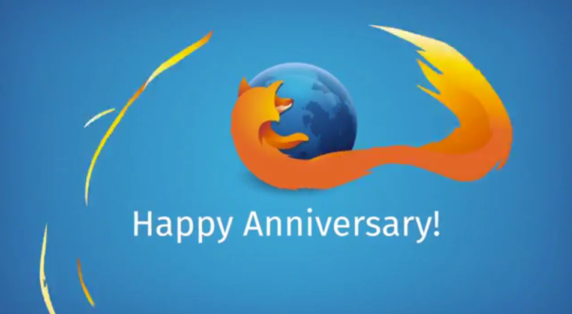

Firefox 的十年生日，也誕生了許多酷炫的新技術可供開發者體驗。

近十年來，Mozilla 不只建構了 Firefox，同時也橫跨 Firefox 與其他瀏覽器，塑造出使用者目前所熟悉的諸多 Web 體驗。

當初就是為了擺脫微軟 (Microsoft) 對網路的控制，才誕生了「Mozilla」專案。由於早先 IE 6 達到 98% 瀏覽器市佔率，Microsoft 可說是扼住網路演進的咽喉。為了扭轉此一局勢，Mozilla 當時並不僅告知全世界：「如果讓單一公司不成比例的掌握日常生活的重要生態系統 (如網路)，將是多麼可怕的一件事」，同時也努力打造更好、更強大的 Web 與瀏覽器 ─ Firefox。Firefox 為網路所引領的競爭力與創新力，讓 Web 急遽改變 Open Web 與瀏覽器的版圖長達十年。

今天，再也沒有任一瀏覽器廠商可達到之前 Microsoft 的市佔率。使用者可自行選用Microsoft、Google、Apple，當然還有 Mozilla 的瀏覽器。達到這種多強鼎立的現況，就是使用者對我們最近十年努力方向最直接的肯定。

Mozilla 不只打造消費者導向的瀏覽器，也塑造了 Web 本身。為了滿足專利或私有的生態系統，Web 必須迎合甚至超越原生平台的功能與效能。而我們過去十年持續創新 Web 技術並努力推廣，以期能早日完成標準化。

### 遊戲

遊戲已經成為諸多重要的娛樂形式之一。先前的遊戲必須依賴外掛程式，才能在瀏覽器上運作，也因此限制了遊戲在 Web 上的普及度與能見度。Mozilla 率先開發的多項新技術，足可解放 Web 成為更身歷其境的遊戲平台。而 WebGL 更已經遍及於所有的新款瀏覽器中。另外還有新的 JavaScript 子集 ─ asm.js，也讓[遊戲引擎](https://developer.mozilla.org/en-US/demos/detail/unity-5-angry-bots/?utm_source=mozilla.org&utm_medium=referral&utm_campaign=FX10)能更接近原生效能。

### 效能強化

另必須很驕傲的說，Mozilla 的 JavaScript 引擎目前在[多樣效能指標](https://arewefastyet.com/)上，已經執市場 JavaScript 效能之牛耳，也達到瀏覽器之間的最佳遊戲體驗。我們目前也已經開始在「每夜更新版 (Nightly)」中實驗 E10，要讓網頁內容[獨立於 Firefox 的執行程序](https://wiki.mozilla.org/Electrolysis)之外，進而為 Firefox 使用者提供更高的效能與安全優勢。針對效能方面的進展，我們即將推出 64 位元 Windows 的版本，以造福日常工作需要額外效能的使用者。

### 進階音訊與視訊

Mozilla 身為 WebRTC 的提倡者之一，Web 的音訊與視訊也正發生跳躍式的進展。此新的 Web API 即透過音訊、視訊、資料通道而進行即時通訊作業。另在與 Telefonica 的長期合作下，我們更帶來了 WebRTC架構的視訊＼音訊功能「[Firefox Hello](https://blog.mozilla.com.tw/posts/6541/)」，讓使用者不需另外下載軟體或建立帳戶，也能即時開始聯絡溝通。

### 打造 Web

我們的志工社群仍持續在 Firefox 與 Web 的演進中扮演重要角色。來自於巴西社群的 [Andre Natal](https://hacks.mozilla.org/2014/09/enabling-voice-input-into-the-open-web-and-firefox-os/)，就為Firefox 與 Firefox OS 貢獻了語音辨識功能。使用者只要透過自己的聲音，就能與桌面版瀏覽器或 Firefox OS 裝置輕鬆互動。此 Web Speech API 目前已經加入 Gecko 引擎。

如果你就是 Web 開發者，也對上述的技術躍躍欲試，我們另在十周年期間提供其他特殊功能。在建構 Web 之時，端賴開發者打造出 Web 能用的內容與經驗。為彰顯這些人的努力成果，以及我們對 Web 開發者社群的承諾，我們專為開發者打造 [Firefox 開發者版本 (Developer Edition)](https://blog.mozilla.com.tw/posts/6679)，其內已依照開發者的需求而預設開啟了多項功能。此版簡化了開發流程，且不論是以桌機或行動裝置為目標系統，新增的功能亦可橫跨多個平台而簡化 Web 的建構程序。

### 未來方向

在十年前，Mozilla 就開始「將 Web 從 Microsoft 的專利控制中解放出來」的漫長旅途。而今天我們可說大致上已完成了此一目標。為 Open Web 奮戰的下個階段，就是 iOS 與 Android 雙強壟斷的行動產業。如同我們十年前透過 Firefox 對微軟採取的行動，現在我們也希望能用 Firefox OS 打破現由 Google 與 Apple 所支配的行動 Web。從 Firefox OS 在去年發表以來，已經擴及全球共 24 個國家，其中包含最近才加入此版圖的[印度](https://blog.mozilla.com.tw/posts/6147/)。如果你已經在用我們的 Firefox OS 開發者手機，現在也已經有新的 [Firefox OS 2.0 開發者版本](https://blog.mozilla.com.tw/posts/6744/)供你開發。

我們另亦透過 [Servo](https://github.com/servo/servo) 與 [Rust](https://www.rust-lang.org/) 強化 Web 的基礎技術。Servo 是新一代 Web 的繪圖引擎，除了進階支援多工機制之外，也提升了安全性與穩定度。而多虧有新系統程式設計語言 Rust，經過我們的初步建構並獲得社群的強力支援，才得以完成 Servo。

最後，Mozilla 已經開始探索 Web 的下一個可能：虛擬實境。我們將率先開發 Web 上的虛擬實境功能，並啟動 [mozvr.com](https://mozvr.com/content/2014/11/10/mozvr-launches.html) 作為技術展示的平台，讓開發者能夠將虛擬實境的體驗帶上 Web。

─ Mozilla 技術長 Andreas Gal

原文連結：[10 Years of Firefox and Innovation for the Web Platform](https://andreasgal.com/2014/11/10/10-years-of-firefox-and-innovation-for-the-web-platform/)
