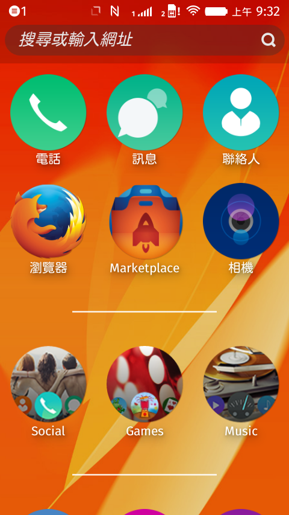

如果你手上有「Flame」手機的話，現在即可透過 OTA (Over the Air) 更新為 Firefox OS 2.0 的開發者預覽版本了！

本次釋出了包含六個月來對功能、反應性、穩定度等的重大強化。開發者可進入「設定 (Setting)」→「裝置資訊 (Device Information)」→「系統更新 (System Updates)」→「檢查更新 (Check for updates)」。如果你本來就選擇要「每天」檢查，則應該已收到通知可下載新版本的作業系統。

從 Firefox OS 1.3 到 2.0 版本為止，共超過 400 名開發者在 24 周內貢獻了 5,300 個修正檔。且其中有 157 名開發者是第一次加入 Firefox OS 的貢獻行列。

Firefox OS 2.0 最值得開心的，就是[在 Mozilla 與 Deutsche Telekom 開發者的努力之下，正式支援 NFC](https://hacks.mozilla.org/2014/11/nfc-in-firefox-os/) 功能了。

只要是支援 NFC Data Type Exchange (NDEF) 格式的任兩款裝置，均可透過 WebNFC API 進行點對點 (P2P) 通訊作業。NFC 被動標籤 (Passive tag) 若本身即為可相容 NDEF 的標籤，也就可進行讀寫。如此可透過 NFC 分享內容 (如聯絡人、圖片、影片等)，亦可讀寫 NFC 可程式化的標籤。可參閱〈[Mozilla Hacks: NFC in Firefox OS](https://hacks.mozilla.org/2014/11/nfc-in-firefox-os/)〉進一步了解。

DataChannel、getUserMedia、PeerConnection 等 API 已於 1.4 版起支援音＼視訊等功能。而 2.0 版現更提供 WebRTC 的 H264 硬體編＼解碼功能。如果開發者現已有 Firefox 或 Chrome 可執行的 WebRTC App，則可輕鬆封裝這些 App 而轉為 Firefox OS App。

本次更新另提供高效益的「[Developer HUD](https://developer.mozilla.org/en-US/Firefox_OS/Debugging/Developer_settings)」工具，可讓 App 開發者輕鬆測得效能、記憶體用量，以及其他App 特性參數等結果。

如果你還沒訂購 Firefox OS 的「Flame」開發者手機，請立刻到 [everybuying.com](https://www.everbuying.com/product549652.html) 下單：美金 $170 含全球運費。

希望你能繼續享受 App 開發樂趣，另可到 [Flame 的 Wiki 頁面](https://developer.mozilla.org/en-US/Firefox_OS/Developer_phone_guide/Flame)了解相關資訊。

#### 更多資訊：

- [Flame 開發影片線上教學](https://blog.mozilla.com.tw/posts/6263/)

- [Firefox OS 2.0 開發者預覽版本說明](https://developer.mozilla.org/Firefox_OS/Releases/2.0)

原文連結：[Flame Gets Developer Preview of Firefox OS 2.0](https://hacks.mozilla.org/2014/11/flame-gets-developer-preview-of-firefox-os-2-0/)
