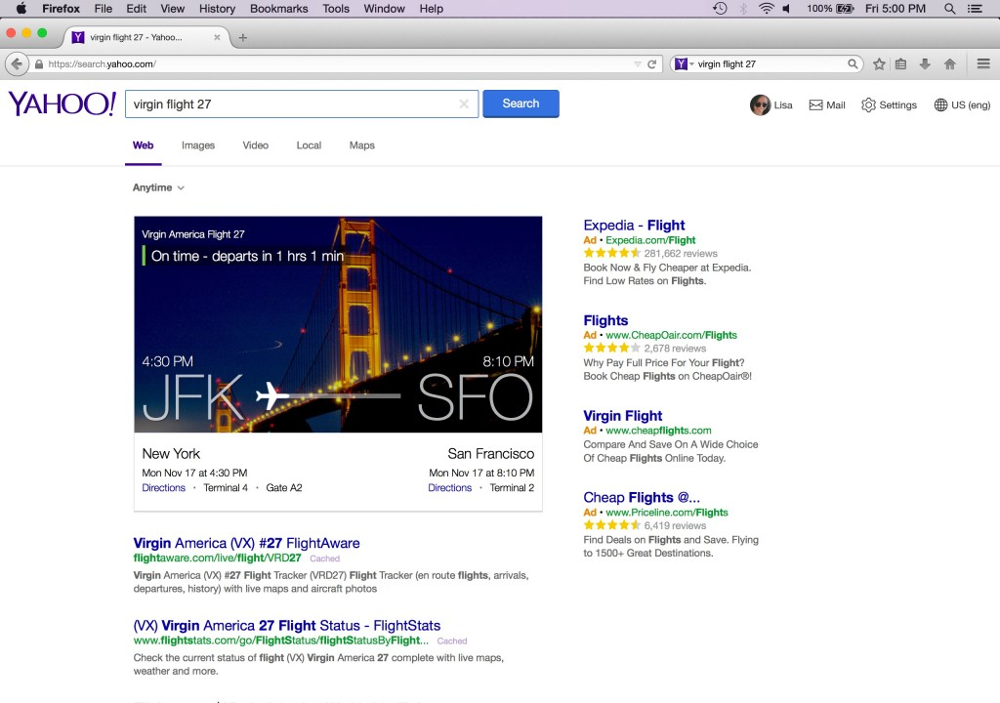
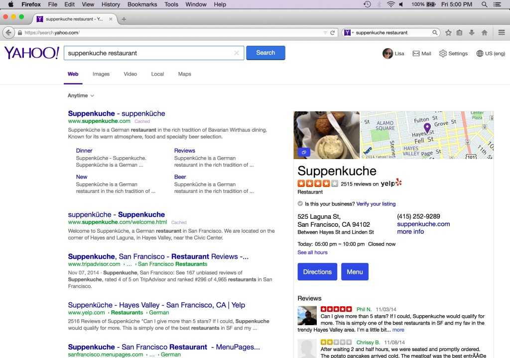
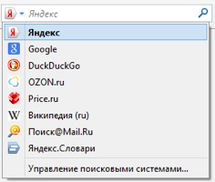

Mozilla 在十年前打造 Firefox，要將網際網路的力量交到所有人手上，即為眾人提供更多選擇，以掌握自己的線上生活。我們當時專心設計產品以獲得必要的能量、創造力、競爭力，進而保持 Web 的開放、獨立、普及度。我們在上週就[誓言要做得更好、更多](https://blog.mozilla.com.tw/posts/6684/)。

### Firefox 與線上搜尋

搜尋服務一直是所有人線上生活的核心 ─ 每年光是 Firefox 使用者的線上搜尋活動就超過一千億次。

透過 Firefox，我們更進一步整合並普及了瀏覽器的搜尋服務。包含 Google 與 Yahoo 在內，Mozilla 一直與多家網路公司合作，要提升搜尋體驗並達到更高效益，進而完成 [Mozilla 念茲在茲的使命](https://www.mozilla.org/zh-TW/about/manifesto/)。

當我們設定單一的預設搜尋選項時，也等於拒絕了排他性的商業條款而打破了業界標準。最近十年來，Firefox 仍持續內建多樣的搜尋引擎，且使用者均可依自己喜好而輕鬆更改、新增、移除相關服務。

從 2004 年起，Google 就一直是 Firefox 的預設搜尋引擎，而雙方所簽訂的協議正好在今年到了換約時間點。Mozilla藉此機會更重新審視了自己的競爭策略，並積極向外探尋更多選擇。

我們在評估搜尋服務的夥伴時，主要先考量自己的策略是否符合本身對選擇與獨立性的價值觀，並仍保有必要的創新性與發展性，得以繼續為 Web 與使用者提供最好的服務。最後，我們口袋裡的合作名單均具備健全的經濟條件，足以反應 Firefox 對整個生態系統所帶來的無比價值。但其實單一策略就能代表全盤的考量要點。

### 強化選擇與創新

Mozilla 在今天宣佈要改變 Firefox 搜尋服務的合作策略。我們不再與單一的全球搜尋服務商合作，而是海納更多當地特色且彈性的搜尋方式。Mozilla 在下列國家與新的搜尋夥伴合作，以強化 Web 的選擇性與創造力：

#### 美國

- 根據[今天宣佈](https://yahoo.tumblr.com/1313)的 5 年期新策略合作關係，Yahoo Search 將成為 Firefox 在美國境內的預設搜尋引擎。

- 從 12 月起，Firefox 使用者將擁有強化過的新 Yahoo Search 經驗，透過簡潔且前衛的介面獲得最佳 Web 焦點資訊。

- 基於此項合作關係，Yahoo 亦將支援 Firefox 的「[不要追蹤我 (Do Not Track，DNT)](https://mozilla.com.tw/firefox/desktop/trust/)」功能。

- Google、Bing、DuckDuckGo、eBay、Amazon、Twitter、Wikipedia 仍將內建為 Firefox 的其他搜尋服務選項。

#### 俄羅斯

- Yandex Search 將成為 Firefox 在俄羅斯境內的預設搜尋引擎。

- Google、DuckDuckGo、[OZON.ru](https://ozon.ru/)、[Price.ru](https://price.ru/)、[Mail.ru](https://mail.ru/)、Wikipedia 仍將內建為 Firefox 的其他搜尋服務選項。

#### 中國

- 百度 (Baidu) 仍將為 Firefox 在中國境內的預設搜尋引擎。

- Google、Bing、有道 (Youdao)、淘寶 (Taobao)，以及其他本地網站，仍將內建為 Firefox 的其他搜尋服務選項。

#### 所有國家

- 不論使用者的搜尋偏好為何，Firefox 仍是屬於所有人的瀏覽器。

- 與他款瀏覽器相較，Firefox 仍將提供更多的搜尋服務。Firefox 現已提供 88 種語言的版本，並內建 61 個搜尋服務商可供選擇。

- 即使 Mozilla 選擇不再續約全球性的預設搜尋引擎，但 Google 仍將是內建的搜尋選項。

- Google 亦將繼續強化 Firefox 的[安全瀏覽](https://developers.google.com/safe-browsing/)與[地理定位](https://www.mozilla.org/en-US/firefox/geolocation/)功能。

- Mozilla 現將專注拓展與夥伴之間的合作關係，期能行跨桌機與行動裝置，開發創新的搜尋介面、更完善的服務內容經驗，更強化的隱私防護功能。

Mozilla 的新搜尋策略，必將加速完成我們為所有人打造 Firefox 瀏覽器時的承諾。相信新的合作關係可嘉惠更多使用者，在更多地方提供更多創新的選擇與機會，最後讓大家都能更完整掌握自己的線上生活。

這也是 Mozilla 一直強調獨立性之所以重要的原因。非營利的本質促使我們自己要做出不同選擇。而這些選擇將保有 Web 的開放性、普及性、獨立性。Mozilla 認為今天就是朝正確方向邁出重要的一大步。

[新聞稿](https://blog.mozilla.org/press/2014/11/yahoo-and-mozilla-form-strategic-partnership/)

原文連結：[New Search Strategy for Firefox: Promoting Choice & Innovation](https://blog.mozilla.org/blog/2014/11/19/promoting-choice-and-innovation-on-the-web/)
