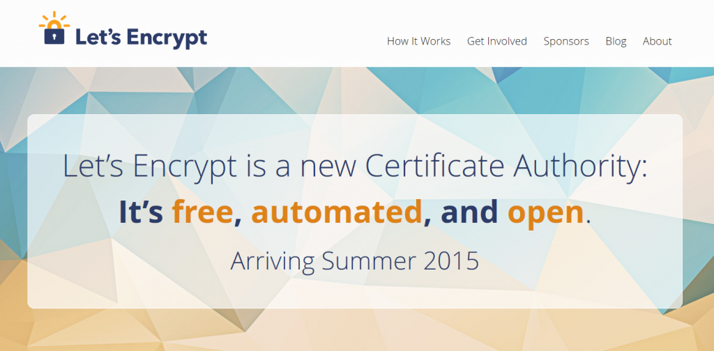

[Mozilla 宣言](https://www.mozilla.org/zh-TW/about/manifesto/)第四條即闡明：

使用者的網路安全及隱私為基本要求，不能妥協。

(Individuals’ security and privacy on the Internet are fundamental and must not be treated as optional.)

但可惜的是，當網站不使用 TLS (HTTPS)，卻是透過不安全的 HTTP 讓使用者連線時，就是對網路安全妥協了。這裡所說的「不安全」，就是你流通的資訊完全不設防。只要當下有其他人和你共用同一網路，就能夠讀取甚或修改你的資訊；跟你在星巴克或機場共用 WiFi 上網的陌生人都辦得到。

而網站並未佈署 TLS 的最大原因之一，就是網站本身必須取得數位憑證 ─ 此加密憑證可讓使用者的瀏覽器得知「自己的確連上正規網站，而非惡意網站」。這類憑證均是由憑證機構 (Certificate Authority，CA)，以土法煉鋼且易於出錯的手動程序所發出。造成數位憑證普及度偏低的另一個理由，就是因為大多數憑證機構都會收取費用。這筆金額當然不比在大賣場買日用品且銀貨兩訖就算了，還要加上如自動發放及後續的憑證展期等費用。

Mozilla 找到 IdenTrust、思科 (Cisco)、阿卡邁科技 (Akamai)、電子先鋒基金會 (EFF) 等合作夥伴，決定要改變目前的情形。我們一同組成「網際網路安全研究團隊 (Internet Security Research Group，暫譯)」，並將設立新的「[Let’s Encrypt](https://letsencrypt.org/)」憑證機構，要確保所有人的網路安全。Let’s Encrypt 有下列幾項基本原則：

- 免費：憑證應該無償提供。

- 自動：憑證應該透過公用或公開的 API 發出，讓 Web 伺服器軟體能在安裝期間即自動取得新的憑證，不需再有人工作業的介入。

- 獨立：不應由任一公司控制這類的重要機制。而 Let’s Encrypt 的母組織「ISRG」，即交由產業、學術、非營利等性質的組織所監督，確保其依循公共利益而運作。

- 開放：Let’s Encrypt 同樣公開其原始碼與通訊協定，且通訊協定亦已提交進入標準化程序，可供伺服器軟體及其他憑證機構一起使用。

Let’s Encrypt 將於 2015 年 Q2 發出第一批實際憑證。我們現已釋出一部分的[協定草案](https://github.com/letsencrypt/acme-spec)，另透過 [https://github.com/letsencrypt/node-acme](https://github.com/letsencrypt/node-acme) 與 [https://github.com/letsencrypt/heroku-acme](https://github.com/letsencrypt/heroku-acme%E9%87%8B%E5%87%BA) 提供用戶端與伺服端的相關展示。這些程式碼均已能正常運作，並可簽發測試用憑證。

雖然我們已經付出許多心血才邁出這一步，但未來仍有一大段路要走。至少已邁出 TLS 完全普及 (TLS Everywhere) 的重要一步。

─ Mozilla 技術長 Andreas Gal

原文連結：[Let’s Encrypt: One more step on the road to TLS Everywhere](https://andreasgal.com/2014/11/18/lets-encrypt-one-more-step-on-the-road-to-tls-everywhere/)
