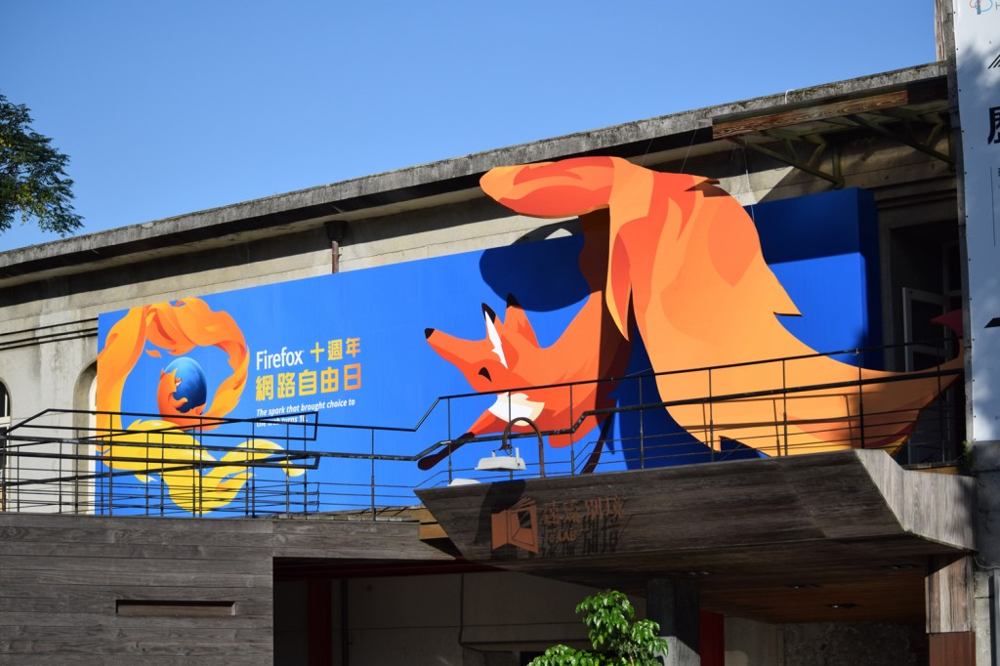
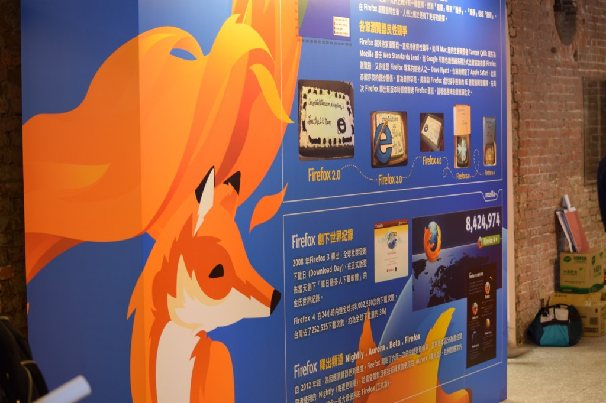
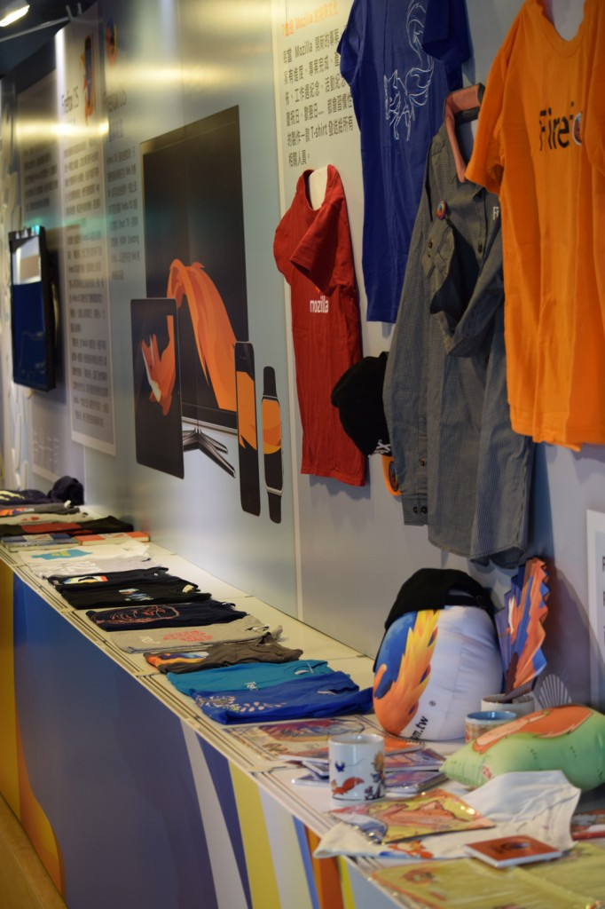
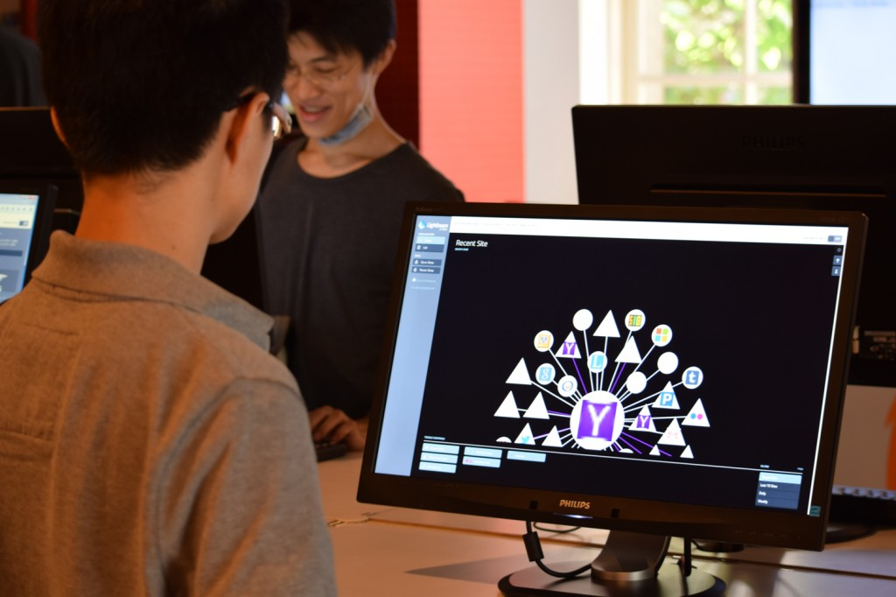
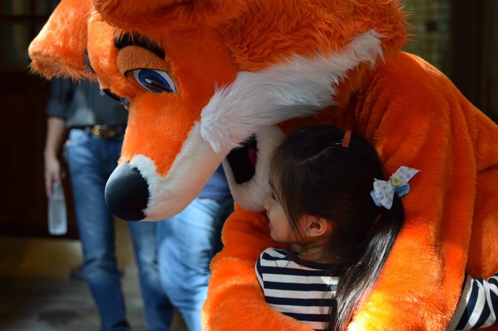
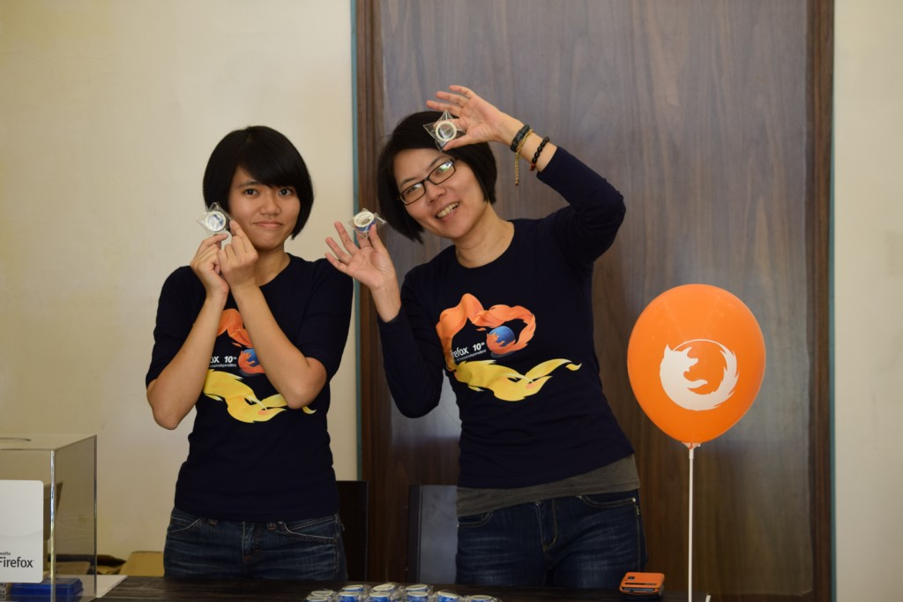
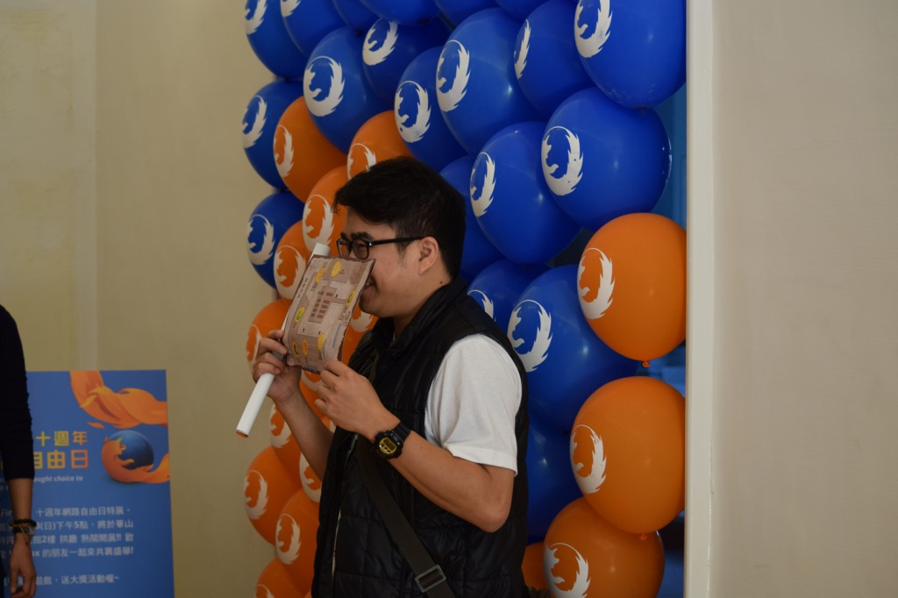
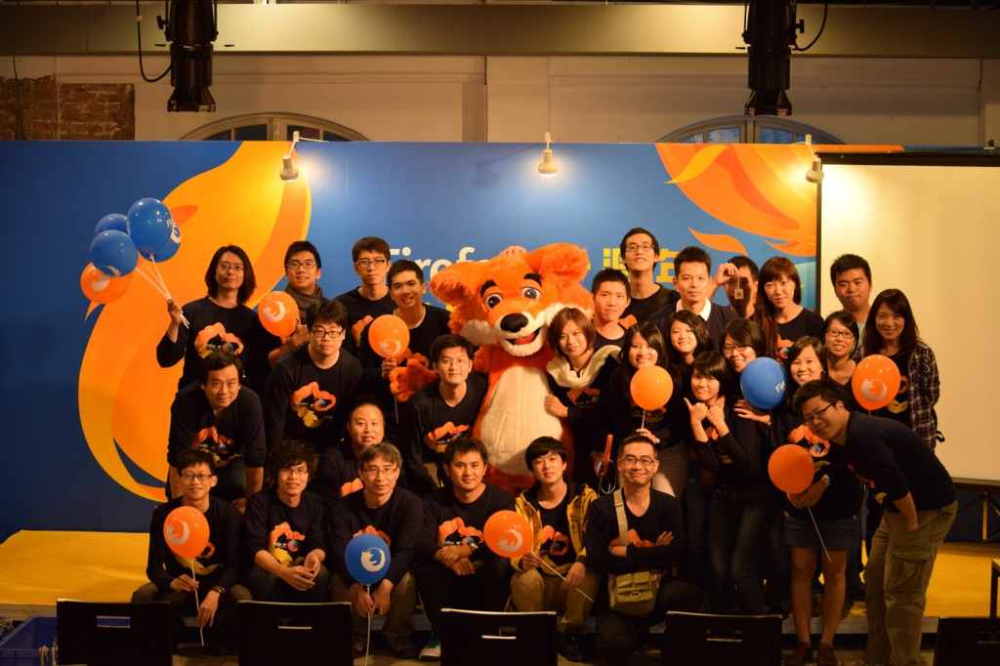

Firefox 在不知不覺間已經陪伴大家十年了，它代表的不單單只是一款瀏覽器，而是打破了壟斷，並致力於推廣開放標準，讓整個網路能朝著更自由與多元化的方向前進的一股動力。

11/22、23 的 Firefox 十週年特展活動，在華山文創產業園區以豐富的展覽內容帶領大家認識 Firefox 的點點滴滴以及各種功能特色。現場安排有闖關活動，透過 Firefox 時光走廊、互動體驗區、每天三場的社群議程，讓大家邊玩邊了解 Firefox 以及開源文化的特色。兩天來參與人數遠超過 2000 人，讓我們透過影片與照片的呈現，一起來回顧十週年特展的精采盛況！

 Firefox 十週年特展回顧影片

陽光耀眼的週末，Firefox 十週年特展就由通過炫目的狐狸大門開始。

現場的佈置充滿了屬於 Firefox 的藍色與橘色。

時光走廊細說 Firefox 的崛起與各家瀏覽器微妙的良性競爭關係。

你想要什麼樣的瀏覽器新功能? 把願望掛上許願樹吧！

Mozilla 大概是最愛做 T-shirt 跟週邊商品的公司了。這還只是一小部分呢！

宣傳 Firefox Hello 遠端功能視訊的拼拼樂遊戲。Firefox 瀏覽器支援 WebRTC ，免安裝任何外掛即能與他人進行免費視訊。

豐富的社群議程，讓你更深入了解 Firefox 及 Mozilla。

你知道瀏覽了一個網站後，背後有多少第三方網站在追蹤你? 透過 Lightbeam 功能，讓你更重視網路的安全性。

神秘嘉賓火狐與大家愛的抱抱。

Firefox「自訂」面板可新增、移動、移除任何按鈕，讓你的瀏覽器充滿個人風格！

 成功完成闖關遊戲後，即可兌換限量 Firefox 十週年精美贈品。

活動現場的氣球牆成為了熱門的拍照景點。

工作人員現場合影。

兩天的 Firefox 十週年特展活動就在歡樂愉悅的氣氛中圓滿結束。感謝大家的參與與支持。接下來 Firefox 會在哪裡現身? 請加入 [Mozilla Taiwan 粉絲團](https://www.facebook.com/MozillaTaiwan)，所有最新資訊讓你即時掌握不漏接！
