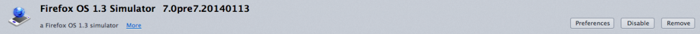
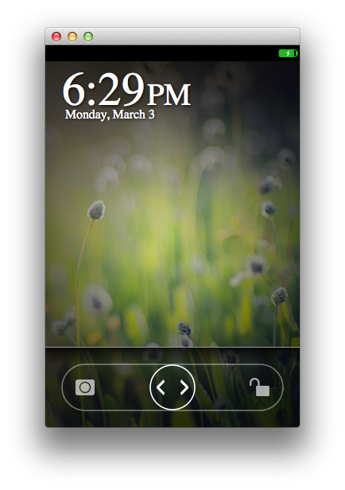

Mozilla 繼「應用程式管理員 (App Manager)」之後，再度提供新的 App 開發工具 ─ WebIDE，要讓開發者能更順利提供自己的作品。如果想先了解 WebIDE，可先參閱之前的《[淺談新開發工具 WebIDE](https://blog.mozilla.com.tw/posts/6442/webide-1)》共兩篇文章。

Firefox OS 模擬器 (Firefox OS Simulator) 已於 2014 年 2 月新增功能，可執行自訂的 B2G 執行環境及/或 Gaia 設定檔 (Profile)。本文將說明相關設定方式，並透過 [WebIDE](https://developer.mozilla.org/en-US/docs/Tools/WebIDE) 執行模擬器。

注意：在本文發表之時，滑鼠事件尚未能正確對應觸控事件。例如回到主畫面鈕並無法回應滑鼠點擊的動作。但只要使用 B2G Desktop 鍵盤指令，即可解決此問題。可參閱「[Using the B2G Desktop client](https://developer.mozilla.org/en-US/Firefox_OS/Using_the_B2G_desktop_client)」。

注意：如果你能提交 Try 版本，則可在各個 B2G 桌面平台的版本路徑中產生模擬器附加元件。如此可讓模擬器搭配自訂的 Gecko，或搭配對 Gaia 上進行的修改。在某些使用條件下可選用此較簡易的方式。

### 必要條件

要在模擬器內執行自訂版本，必須齊備相關工具。

- 安裝 Firefox 並確定其內有 [WebIDE](https://developer.mozilla.org/en-US/docs/Tools/WebIDE) (工具 > 網頁開發者 > WebIDE)。

- 安裝最新版 [B2G Desktop Nightly](https://nightly.mozilla.org/)，或[建構自己的版本](https://developer.mozilla.org/en-US/Firefox_OS/Using_the_B2G_desktop_client#Building_the_desktop_client)。

- 安裝[最新版 Firefox OS 模擬器](https://ftp.mozilla.org/pub/mozilla.org/labs/fxos-simulator/)套 件，即 7.0pre7.20140113 或更高版本。或可將 FXOS_SIMULATOR=1 添增到自己的 mozconfig，並使用 ./mach build && ./mach package，從自己的 B2G Desktop 原始碼來建構。

- 用 SIMULATOR=1 flag 建立 Gaia 設定檔。舉例來說，你可在自己的 Gaia 路徑中執行 make SIMULATOR=1 PROFILE_FOLDER=profile-b2g profile-b2g 指令 (請參閱 [Hacking Gaia](https://developer.mozilla.org/en-US/Firefox_OS/Platform/Gaia/Hacking#Make_options) 進一步了解)。

### 設定自己的模擬器

你必須完成某些設定，才能讓模擬器找到你的 B2G Desktop 與自訂的 Gaia。

- 打開附加元件管理分頁 (工具 > 附加元件；或在網址列中輸入 about:addons )。

- 點擊「擴充套件 (Extensions)」分頁，可列出現已安裝的套件。

- 在清單中找到新的 Firefox OS 模擬器擴充套件。應該會顯示如 Firefox OS 1.3 Simulator 7.0pre.7.20140113 。

- 點擊此擴充套件內的「選項 (Preferences)」按鈕。 

- 如果你要使用自訂的可執行檔 (最新的 B2G Desktop 版本)，以利於 WebIDE 中執行 Firefox OS，則點擊「 Select a custom runtime executable 」旁邊的「 Browse… 」按鈕，在檔案選擇介面中找到自己的 B2G Desktop 可執行檔。如果是 Windows/Linux 環境就很好找；而在 Mac 環境中，只要安裝於 Applications 路徑下，就可於 /Applications/B2G.app/Contents/MacOS/b2g 找到。

- 你也能在 WebIDE 中執行自訂的 Gaia 設定檔。同樣點擊「 Select a custom Gaia profile directory 」旁邊的「 Browse… 」按鈕，找到自訂的設定檔路徑 (應該是 gaia/profile-b2g )。

- 如果要回到非自訂的模擬器，只要重新設定組態值即可。但 不能 單純的刪除再重新安裝模擬器附加元件。你必須開 啟新的分頁，在網址列中輸入「about:config」，繼續在該頁的搜尋欄位中輸入「fxos」或「simulator」，找到如 「extensions.fxos_2_0_simulator@mozilla.org.customRuntime」，或 「extensions.fxos_2_0_simulator@mozilla.org.gaiaProfile」。這時按下滑鼠右鍵並點選 「Reset」。最後重新啟動模擬器版本，就能使用非自訂版本的模擬器。

### 使用自訂的模擬器

最後說明該如何使用自訂的模擬器。

- 啟動 [WebIDE](https://developer.mozilla.org/en-US/docs/Tools/WebIDE) (工具 > 網頁開發者 > WebIDE)；或可按下「Shift + F8」。

- 點擊右上方的按鈕，開啟「Runtime」選單。

- 點擊「Firefox OS 1.3」按鈕 (或你安裝的任何最新版本)。即使你的 B2G desktop/Gaia 版本比較新，仍建議點選 Firefox OS 1.3 版。

- 接著就會啟動模擬器，將載入 B2G Desktop 並執行你的 B2G Nightly 版本與自訂 Gaia！

Mozilla 開發者社群網站 (MDN) 原文連結：[Running custom Firefox OS/Gaia builds in WebIDE](https://developer.mozilla.org/en-US/Firefox_OS/Running_custom_builds_in_the_App_Manager)

你也可閱讀中文版的《[在 WebIDE 中執行 Firefox OS/Gaia 自訂版本](https://developer.mozilla.org/zh-TW/Firefox_OS/Running_custom_builds_in_the_App_Manager)》；並參閱 MDN 上的更多 Firefox OS 或 Marketplace 相關文章。

原文文章將不定期有所增刪，我們也將儘快更新中文版本，以期讓開發者能隨時看到最新的內容。
