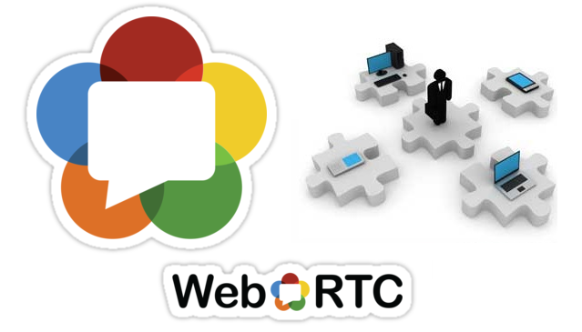

### 藉以強化 WebRTC 並協助標準化程序

Web Real-Time Communications (WebRTC) 可讓開發者將即時通訊功能輕鬆整合到網站、行動 Web App、視訊會議系統之上，進而改變著大家在 Web 上的通訊方式。WebRTC 可讓所有人輕鬆享受複雜的即時通訊技術，並引領一波通訊服務的新潮流，讓使用者有更多的通訊選擇。

圖片來源：getvoip.com

Mozilla 與合作夥伴 Telenor 因而建立了「WebRTC Competency Center」。其主要目的，是要加入通訊產業前導廠商的力量，讓 Mozilla 的 WebRTC 軟體堆疊推向領先地位。這些領導廠商亦將為此中心貢獻相關軟體工程、領域知識，以及其他資源。如此都是為了要讓 WebRTC 能引領營運商與 App 開發者持續創新通訊經驗。

由於網際網路工程工作小組 (Internet Engineering Task Force，IETF) 已要求裝置與瀏覽器必須能同時支援 [H.264 以及 VP8 視訊編碼](https://andreasgal.com/2014/11/16/vp8-and-h-264-to-both-become-mandatory-for-webrtc/)，且 Microsoft 最近[亦宣佈支援](https://blogs.msdn.com/b/ie/archive/2014/10/27/bringing-interoperable-real-time-communications-to-the-web.aspx)極為相近的[「ORTC」標準](https://ortc.org/)，因此 WebRTC 勢將橫跨平台與裝置而成為通用的通訊技術。

Telenor 與未來的 WebRTC Competency Center 夥伴，均將貢獻核心的 [Mozilla WebRTC stack](https://developer.mozilla.org/docs/Web/Guide/API/WebRTC)。透過 WebRTC 的開發作業，相關夥伴將可主導 WebRTC 標準的未來方向，並協助找出支援廣度以及最佳化程度之間的平衡；例如通訊作業基礎架構的互用性 (音訊＼視訊、編＼解碼、in-net TURN 等)，以及點對點視訊會議。而且 Mozilla 同樣開放 WebRTC 堆疊的原始碼，讓開發者能夠自由將 WebRTC 整合到自己的產品與服務之中。

Mozilla 技術長 Andreas Gal 說：「我們專心將 Web 提升為創新平台，並看到 WebRTC 的潛力足以在 Web 上執行所有通訊服務。身為 WebRTC 的早期開發者，Mozilla 很高興能與 Telenor 合作打造此技術中心，要讓 WebRTC 成為通用技術，以利所有人都能將之整合到自己的產品中。」

WebRTC Competency Center 所著重的研發範圍，將依據後續加入的夥伴而逐年調整，初期即設立於美國加州的山景城 (Mountain View)，與挪威首都奧斯陸 (Oslo)。

早期合作夥伴對 WebRTC Competency Center 的數則感想如下：

「Telenor 承諾投入新的通訊技術，而發現 WebRTC 即為絕佳的創新機會。我們很高興能再次拓展與 Mozilla 的合作關係，並能於奧斯陸主持新的 WebRTC Competency Center。我們的工程師已經開發 WebRTC 超過兩年，並希望相關貢獻能帶領 WebRTC 成為更普及的通訊標準。奧斯陸這裡也已經有多家公司動手開發 WebRTC，而 Telenor 也期待他們能早日加入此中心。」

– Telenor Digital 執行長 Rolv-Erik Spilling

「思科 (Cisco) 與 Mozilla 的合作關係，將透過許多關鍵的『第一次』而打破 WebRTC 尚未普及的障礙。不論是 Firefox 與瀏覽器之間，或是 Firefox 與思科『Squared』專案的現成視訊硬體之間，均已內建 WebRTC 通話功能所使用的 OpenH264 協定。我們期待能透過 Mozilla 與 Telenor 所共同主持的 WebRTC Competency Center，培養出更多 WebRTC 技術的工程師與開發者。」

– Cisco 技術長 Jonathan Rosenberg

若要進一步了解 WebRTC Competency Center，可來信聯絡 [webrtc-cc@mozilla.com](mailto:webrtc-cc@mozilla.com) 或 [oslowebrtc@telenordigital.com](mailto:oslowebrtc@telenordigital.com)。

原文連結：[Mozilla and Telenor Announce WebRTC Competency Center to Advance WebRTC and Help Standardization](https://blog.mozilla.org/blog/2014/12/09/mozilla-and-telenor-announce-webrtc-competency-center-to-advance-webrtc-and-help-standardization/)
