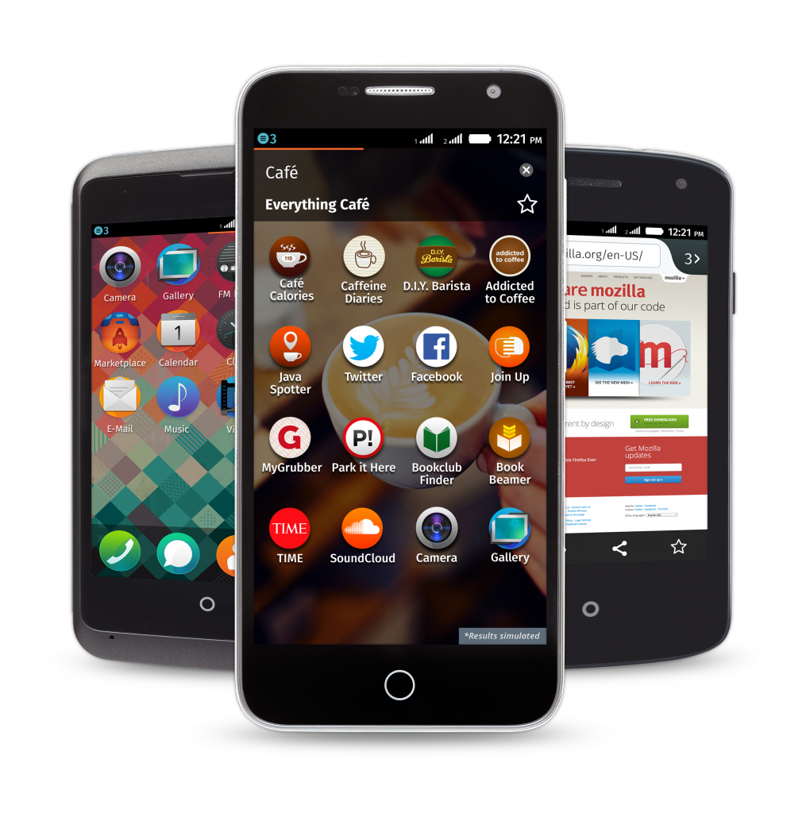

### 已拓展至全球近 30 國巿場

### 繼亞洲、中南美洲、歐洲與澳洲巿場 非洲明年將入列

Mozilla 在 2014 年即將進入尾聲之際，持續向全球展現推廣 Firefox OS 開放行動生態系統的成果。Firefox OS 目前已搭載於 14 款手機之中，於全球近 30 個國家上巿。除亞洲、中南美洲與歐洲，非洲明年也將入列。Firefox OS 打破私有專利系統的限制，讓更多人能夠投入更獨立、更創新、更多選擇的行動生態系統。

#### 亞洲市場有更多元的選擇

- 菲律賓手機領導廠商 Cherry Mobile [最近發佈](https://blog.mozilla.com.tw/posts/6736)其國內首款 Firefox OS 智慧型手機，且是目前全球最親民價格的智慧型手機。

- KDDI 確認 12 月將於日本 (Japan) 發表 Firefox OS 手機。

- 數週之前，ALCATEL ONETOUCH 也於孟加拉 (Bangladesh) 發表了超低價 Firefox OS 智慧型手機。

#### 已於中美洲全境上巿

- Telefónica 甫於哥斯大黎加 (Costa Rica) [發表](https://blog.mozilla.org/press-latam/2014/12/05/con-el-lanzamiento-en-costa-rica-firefox-os-ya-esta-disponible-en-todo-centroamerica/) Firefox OS，透過 Movistar 完成該公司的中美洲版圖。而在過去幾個月內，Movistar 亦已開始於智利 (Chile) 及墨西哥 (Mexico) 販售 ALCATEL ONETOUCH Fire C。

- Telefónica 更即將透過 Movistar 於阿根廷 (Argentina) 發表 Firefox OS 裝置。

#### 持續拓展歐洲巿場

- Megafon 將首次於俄羅斯 (Russia) 發表 ALCATEL ONETOUCH Fire C。

- 德國電信 (Deutsche Telekom) 已透過 T-Mobile，於匈牙利 (Hungary) 與蒙特內哥羅 (Montenegro) 境內分別發售 ALCATEL ONETOUCH Fire E 以及 ALCATEL ONETOUCH FIRE C。

#### Firefox OS 增加新生力軍 澳洲與非洲入列

- JB Hi-Fi 已於澳洲 (Australia) 發表首款 Firefox OS 智慧型手機 ─ ZTE Open C。

- Firefox OS 另將配合 Millicom 旗下的 Airtel、MTN South Africa、Tigo 共 3 家重要夥伴，於非洲境內[迅速拓展](https://blog.mozilla.org/blog/2014/11/05/firefox-os-ecosystem-to-expand-to-africa-with-support-from-new-partners/)。

#### 提供更多元的全球與當地內容

- Firefox OS 使用者現可至 Firefox Marketplace 找到與本地更高度相關的內容，現已於印度 (India) 上架的「Taxiforsure」，以及印度與孟加拉均可用的「OLAcabs」等多款計程車 App。

- 印度與孟加拉的新創公司經營者將可使用「Bikroy」市集 App；菲律賓與拉丁美洲使用者則能利用「OLX」分類廣告 App。

- 歐洲人若想購買二手車，則可使用歐洲最大的線上汽車市集「Autoscout24」；德國人如要進一步了解某個特殊產品，則可透過「Barcoo」輕鬆取得相關資訊。

Mozilla 總裁宮力博士表示：「只要 Web 的靈活性可滿足無所不在的行動裝置，屆時 Web 可說是無所不能了。Firefox OS 已成功重新定義了入門產品，更提供了目前全球最低價位的智慧型手機。換個角度來看，我們除了既有的中階手機之外，高階的 Firefox OS 智慧型手機也指日可待。今年，Firefox OS 已成功為不同的使用者帶來不同的使用經驗，亦為所有人提供更多元的選擇。」

原文連結：[Firefox OS Expands to Nearly 30 Countries](https://blog.mozilla.org/blog/2014/12/16/firefox-os-expands-to-nearly-30-countries/)
