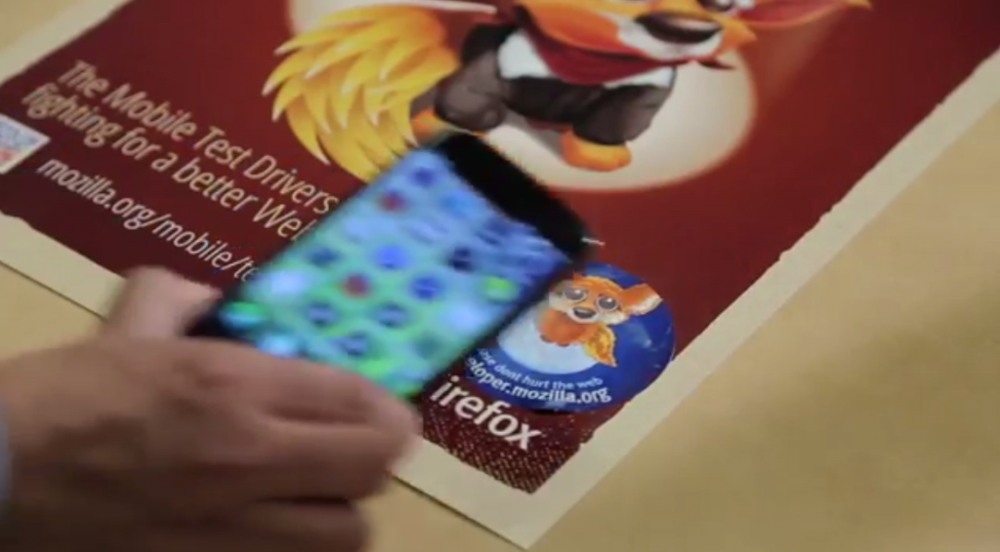

Firefox OS 一直是交由 Mozilla 的社群與夥伴共同開發而成。依循此精神，Mozilla 與德國電信 (Deutsche Telekom，DT) 團隊在過去一年以來，密切合作開發 Firefox OS 平台的 NFC 功能支援。而在這段期間內，雙方團隊均依照開發週期而定期召開產品與工程設計的會議。

從 NFC API 的提案、定義整體架構、構思＼製作原型，直到將完整功能放進要出貨的成品，整個生產的合作模式還算順利，也展現出得以推動 Web 前進的「開放 (包含開放的技術與貢獻模式)」力量；這也是 Mozilla 與 Firefox OS 所代表的精神。

我們將透過本篇文章說明 Firefox OS 對 NFC 建置實例的數項基礎。

### NFC 發展藍圖

目前的 Firefox OS 2.0 即支援 NFC 的內容分享功能 (聯絡人資訊、圖片、影片、網址)，而支援 NFC 標籤 (標籤讀取) 中所儲存的資訊，亦可透過無線方式讀取之。而分享的使用情境，均相容於其他作業系統 (如 Android/Windows) 支援 NFC 的裝置。我們的 NFC API (首次出現於 1.3 版) 已用於 2.0 版核心 App 的分享作業之中。

[可至此 Wiki 頁面參閱 B2G 整體進程](https://wiki.mozilla.org/B2G/Roadmap)。

### WebNFC API

只要是支援 NFC Data Type Exchange format (NDEF) 的任兩款裝置，Firefox 的 NFC API 則可進行點對點 (Peer to Peer，P2P) 通訊作業。NFC 主動標籤將本身呈現為 NDEF 相容的可讀取＼寫入標籤。Firefox OS 的 NFC 實例目前僅用於 Certified App。但基於以上所述，未來將開放其成為 Marketplace App 所用的 API，以支援更多使用情境與資料格式。

看到這裡，你是否更了解 Firefox OS 往後對 NPC 功能的規劃了呢？若有興趣參考更多相關的影片、程式碼，以及說明文件，請點擊下列連結回到原文文章就能找到相關資訊。

原文連結：[NFC in Firefox OS](https://hacks.mozilla.org/2014/11/nfc-in-firefox-os/)
