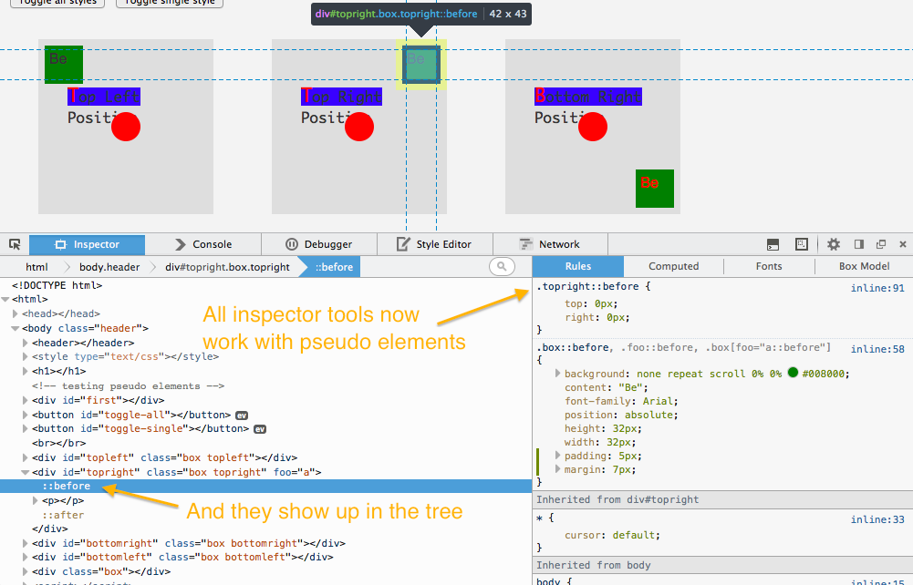
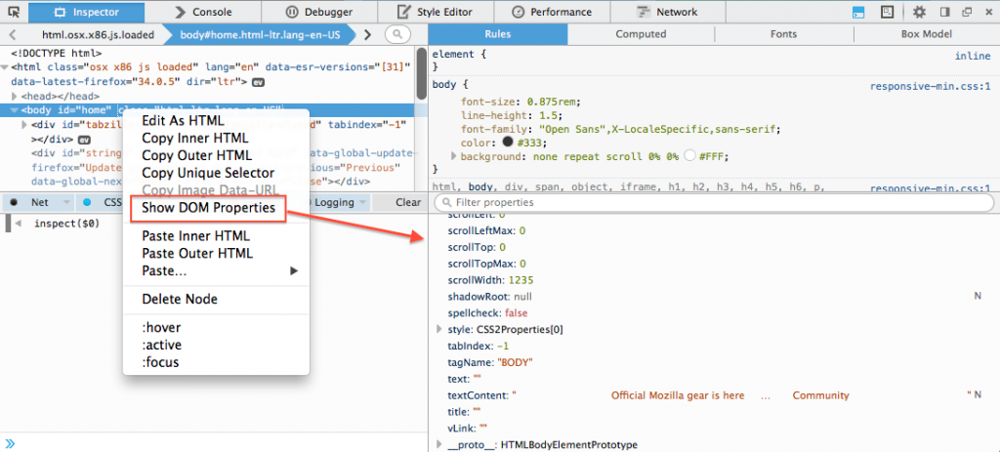
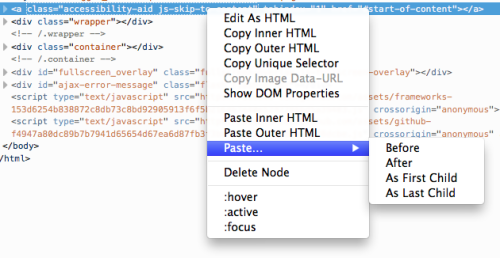
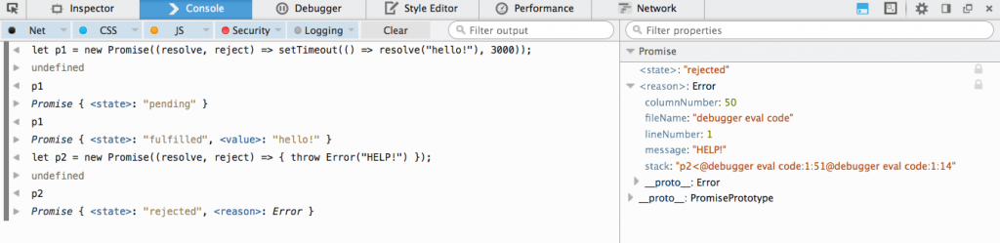
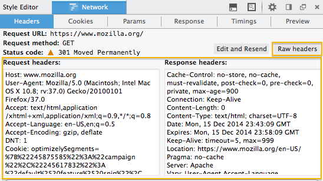

#### 「Promise」檢視功能、虛擬元素 (Pseudo element)、原始檔頭 (Raw header)，還有更多

Firefox 36 現已進入[「開發者 (Developer) 」版本](https://mozilla.com.tw/firefox/channel/#aurora)釋出頻道，先來看看又新增了哪些重要的開發者工具。另外針對[開發者版本發表](https://blog.mozilla.com.tw/posts/6679)之前不久一起釋出的 Firefox 35，也將一併說明其上的數項變化。

#### 檢測器 (Inspector)

現在已可檢測「::before」與「::after」這兩種虛擬元素 (Pseudo element)。而這些元素在「標記結構樹狀檢視欄 (Markup tree)」與「檢測器」側邊欄中的呈現方式，均與其他元素相同 (版本 35 的[開發討論記錄](https://bugzil.la/920141))。

標記結構樹狀檢視欄的右鍵選單現新增了「顯示 DOM 屬性 (Show DOM Properties)」(版本 35 的[開發討論記錄](https://bugzil.la/992679)、MDN 上的[本功能說明文件](https://developer.mozilla.org/en-US/docs/Tools/Page_Inspector#Element_popup_menu_2))。

Box Model 的強調功能 (Highlighter) 現可用於遠端的目標元素上，因此不論是在 Firefox for Android 頁面或是 Firefox OS App 上除錯，都能有完整的強調功能 (版本 36 的[開發討論記錄](https://bugzil.la/985597)，還有[技術說明文章](https://wiki.mozilla.org/DevTools/Highlighter)可帶你建構自訂的強調器)。

現在亦可於標記結構樹狀檢視欄中看到 Shadow DOM 內容。另請注意：開發者必須將 dom.webcomponents.enabled 設定為「true」，進而測試此功能 (版本 36 的[開發討論記錄](https://bugzil.la/1079185)，並可參閱 [bug 1053898](https://bugzil.la/1053898) 以了解相關資訊)。

我們另外從 Firebug 借用了一項功能，只要對標記結構樹狀檢視欄中的節點按下滑鼠右鍵，就能獲得更多「貼上 (Paste)」的功能選項 (版本 36 的[開發討論記錄](https://bugzil.la/1095521)、MDN 上的[本功能說明文件](https://developer.mozilla.org/en-US/docs/Tools/Page_Inspector#Element_popup_menu_2))。

而 Firefox 35 與 36 中的檢測器另有更多變化：

- 在刪除節點後，會選擇前一個相鄰節點，而不會選到上層節點 ( 版本 36 的 [開發討論記錄](https://bugzil.la/1094622))

- 在「M arkup view」 模式中，將滑鼠游標停於節點之上，將以更強烈的對比效果顯示 ( 版本 36 的 [開發討論記錄](https://bugzil.la/1102084)) 。

- 在「計算樣式 computed 」檢視分頁中，將滑鼠游標停於 CSS 選擇器之上，即可強調顯示網頁上符合該選擇器的所有節點 ( 版本 35 的 [開發討論記錄](https://bugzil.la/1059360)) 。

#### 除錯器 (Debugger)＼主控台 (Console)

現在已可檢視 [DOM Promises](https://developer.mozilla.org/en-US/docs/Web/JavaScript/Reference/Global_Objects/Promise)，並能隨時檢視 Promises 的狀態與數值 (版本 36 的[開發討論記錄](https://bugzil.la/1033153))。

經過「eval」函式執行的程式碼，均可由除錯器辨識並搭配除錯 (版本 36 的[開發討論記錄](https://bugzil.la/905700))。

「eval」函式執行的程式碼現支援 //# sourceURL=path.js 語法，使其於除錯器中，以及由 Error.prototype.stack 回報的呼叫堆疊中，均顯示為正常檔案。可參閱 [http://fitzgeraldnick.com/ weblog/59/](https://fitzgeraldnick.com/weblog/59/) 以進一步了解 (版本 36 的[開發討論記錄](https://bugzil.la/1107541)；[更多討論記錄](https://bugzil.la/583083))。

主控台內的訊息除了顯示既有的「行」數之外，亦提供來源程式碼的「欄」數 (版本 36 的[開發討論記錄](https://bugzil.la/684096))。

#### WebIDE

開發者現可透過 WebIDE 連上 Firefox for Android。可參閱 MDN 上的《[debugging firefox for android](https://developer.mozilla.org/en-US/docs/Tools/Remote_Debugging/Debugging_Firefox_for_Android_with_WebIDE)》以進一步了解 (版本 36 的[開發討論記錄](https://bugzil.la/982890))。

另外進行數項修正，提升 WebIDE 的使用者經驗：

- 當選擇某執行環境 (Runtime) 的 App ＼分頁時，亦預設帶出開發者工具 ( 版本 35 的 [開發討論記錄](https://bugzil.la/1055279)) 。

- 若連接執行環境時，就會重新連上該環境中最近開啟過的 App 專案 ( 版本 35 的 [開發討論記錄](https://bugzil.la/1055666)) 。

- 如果找得到最近使用的執行環境，則會自動選擇並連線 ( 版本 35 的 [開發討論記錄](https://bugzil.la/1045660)) 。

- 可縮放字形大小 ( 版本 36 的 [開發討論記錄](https://bugzil.la/1027817)) 。

- 只要輸入網址 ( 如： [http://example.com](https://example.com/)) ，即可新增托管＼ 架設式 (Hosted) App 專案，而不需再輸入 manifest.webapp 檔案的完整路徑 ( 版本 35 的 [開發討論記錄](https://bugzil.la/913711)) 。

#### 網路監測器 (Network Monitor)

新增了純文字的請求＼回應檔頭 (Request/response header) 檢視模式，可輕鬆檢視並複製某一請求上的原始檔頭 (版本 35 的[開發討論記錄](https://bugzil.la/859133))。

另列出[已解決的 Firefox 35 錯誤](https://mzl.la/1oltPdy)，以及[已解決的 Firefox 36 錯誤](https://mzl.la/1tS0R2i)。

如果你有任何問題、意見、功能需求，甚或想回報錯誤，同樣都能在下方留言，[到 UserVoice 填寫＼投票給某個意見](https://mzl.la/devtools)，也能[到 Twitter 上聯絡 @FirefoxDevTools 團隊](https://twitter.com/FirefoxDevTools)。

原文連結：[Pseudo elements, promise inspection, raw headers, and much more – Firefox Developer Edition 36](https://hacks.mozilla.org/2014/12/pseudo-elements-promise-inspection-raw-headers-and-much-more-firefox-developer-edition-36/)
