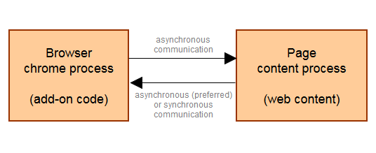
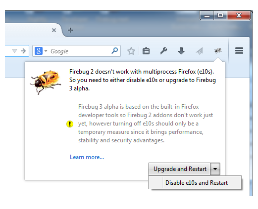

Firebug 3 封閉測試 (Alpha) 已於數週之前[開跑](https://blog.getfirebug.com/2014/11/10/firebug-3-next-generation-of-firebug/)。此版本代表新一代 Firebug 是完全以 Firefox 原生開發者工具所建構而成。

說到 Firebug 以 Firefox 原生開發者工具架構的優點，其中之一就是可緊密整合現成平台，進而輕鬆使用既有的平台元件。對 Firefox 即將支援的多程序 (Multiprocess) 亦格外重要；此即我們所謂的「Electrolysis」或「E10S」專案。

摘錄於 Mozilla 的 [Wiki](https://wiki.mozilla.org/Electrolysis) 頁面：

The goal of the Electrolysis project (“e10s” for short) is to run web content in a separate process from Firefox itself. The two major advantages of this model are security and performance.

「Electrolysis」專案 (簡稱為「e10s」) 的目標，就是要在 Firefox 之外，以獨立的程序執行 Web 內容。而此模式的兩大優點就是安全與效能。

E10S 將引領安全與效能大幅躍進，並進一步強調附加元件 (Add-on) 的內部架構。而對許多擴充套件 (Extension) 而言，其主要挑戰即是要能解決程序之間的溝通問題。簡單來說，附加元件的程式碼執行於瀏覽器的主程序上 (chrome process)；有別於個別網頁內容的程序，如下圖所示。只要擴充套件要存取網頁，就必須搭配目前可用的程序間通訊 (Inter-process communication，IPC) 通道，如[訊息管理員 (Message manager)](https://developer.mozilla.org/en-US/docs/The_message_manager) 或[遠端除錯協定 (Remote debugging protocol)](https://wiki.mozilla.org/Remote_Debugging_Protocol)。附加元件的程式往後將無法直接存取網頁的內容。這也代表許多現有的同步 API 將轉為非同步 API。

包含 Firebug 在內的開發者工具，均有多種可處理網頁內容的方式。這些工具往往蒐集了大量除錯頁面的資料 (也有 metadata)，並將之呈現給使用者。不同的 CSS 與 DOM 檢測器 (Inspector) 不僅會顯示內部的內容資料，也能讓使用者進一步編輯並即時呈現相關變化。這些功能均須仰賴工具與網頁內容之間密集的溝通互動。

既然 Firebug 是以現成的開發者工具為其架構，當然也保留了本身與除錯頁面之間的基本互動功能，讓我們得以更專注於新功能與使用者經驗。

#### Firebug 相容性

Firebug 2.0 現可相容於 Firefox 30 ~ 36 版本，並將支援後續「非多程序」的瀏覽器 (以及最近針對開發者所發表的[瀏覽器](https://blog.mozilla.com.tw/posts/6679/))。

Firebug 3.0 封閉測試版 (也就是 [Firebug.next](https://github.com/firebug/firebug.next)) 現可相容於 Firefox 35 ~ 36 版本，並將支援後續的多程序 (非多程序亦包含在內) 瀏覽器。

#### 自 Firebug 2 升級

如果你將 Firebug 2 安裝到可支援多程序 (e10s) 的瀏覽器中，就會看到系統建議升級到 Firebug 3，或請你關閉多程序支援功能。

[進一步了解……](https://getfirebug.com/firebug3)

當然我們建議你升級到 Firebug 3。因為 Firebug 3 現仍屬封閉測試階段，雖然你可能無法使用 Firebug 2 中的某些功能 (如 Firebug 的擴充套件)，但你能提供意見給我們，即時讓我們知道你最想要的功能。

你也能透過 [Twitter](https://twitter.com/firebugnews/) 隨時獲得最新資訊。

另可透過 Firebug 的[消息群組](https://groups.google.com/forum/#%21forum/firebug)或下方留言板寫下你的意見。

─ Jan ‘Honza’ Odvarko

原文連結：[Firebug 3 & Multiprocess Firefox (e10s)](https://hacks.mozilla.org/2014/12/firebug-3-multiprocess-firefox-e10s/)
