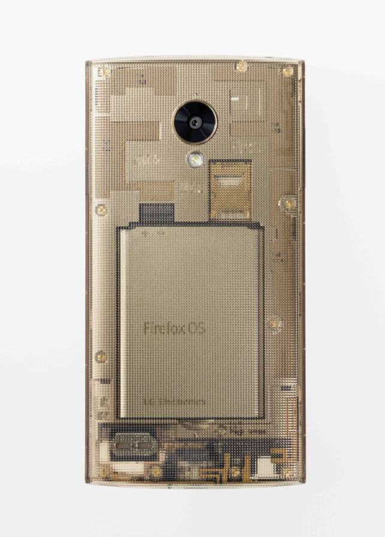
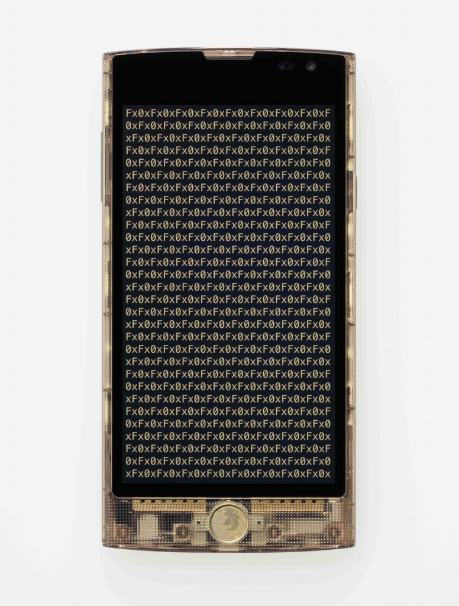

#### 首款高階 Firefox OS 智慧型手機「Fx0」

#### 支援 4G LTE、NFC、WebRTC 等創新技術

Mozilla 在聖誕佳節前夕與日本電信商 [KDDI](https://news.kddi.com/kddi/corporate/english/newsrelease/2014/12/23/844.html) 共同發表首款 Firefox OS 智慧型手機。即將上巿的「Fx0」，是由世界知名設計師[吉岡德仁 (Tokujin Yoshioka)](https://www.tokujin.com/en/) 所設計，為 Firefox OS 第一款高階機種。

Mozilla 與 KDDI 今日於東京 (Tokyo) 的記者會上發表最新款 Firefox OS 智慧型手機「Fx0」，並宣佈於 12 月 25 日開賣。Fx0 是第一款高階  Firefox OS  智慧型手機，搭載最新 Firefox OS。Fx0 亦是首款支援高速 4G LTE 資料傳輸的 Firefox OS 智慧型手機，搭載高通 (Qualcomm®) 的 Snapdragon™ 400 處理器，同時亦配備 HD 顯示功能。此次 Firefox OS 更新亦可支援如 NFC  與 WebRTC 等創新技術，讓 Fx0 能夠提供更多功能。

值得注意的是，Fx0 是由世界知名設計師吉岡德仁操刀設計，在新款手機上完全體現 Mozilla 核心使命與 Firefox OS 所代表的價值 ─ 開放、自由、透明，帶領 Firefox OS 手機邁入嶄新階段。

KDDI 社長田中孝司 (Takashi Tanaka) 說：「我們很高興能於日本市場發表第一款以 Web  技術所打造的 Firefox OS 智慧型手機。KDDI  希望能透過 WoT 的概念建構 Web 新紀元，讓所有人都能自訂連網的 Web 體驗。」

Firefox OS 不僅釋放 Web 平台的效能，並讓多款裝置與使用經驗得以互通有無。Mozilla 很高興能與 KDDI 成為合作夥伴，進一步建構出「Web of Things (WoT)」，即以 Web 技術銜接所有類型的裝置，並橫跨電腦或行動連線裝置而達到更多創新且自訂的使用經驗。上述這些都不過是第一步而已。

在這次發表活動之後，已有 29 個國家發售 16 款 Firefox OS 智慧型手機，為 Firefox OS 在 持續成長2014 年交出亮眼成績單。

原文連結：[Mozilla and KDDI Launch First Firefox OS Smartphone in Japan](https://blog.mozilla.org/blog/2014/12/22/mozilla-and-kddi-launch-first-firefox-os-smartphone-in-japan/)
