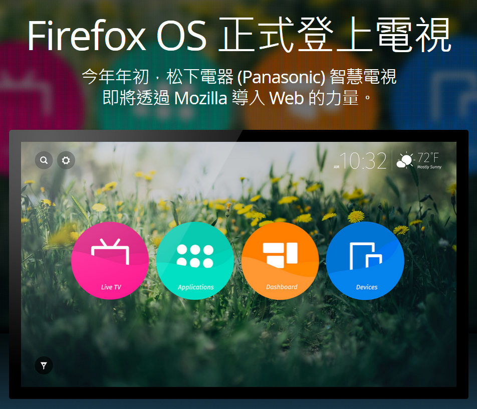

松下電器 (Panasonic) 於 CES 發表首款搭載 Firefox OS 的 4K Life+Screen 智慧電視

以推動網路、平等、開放為宗旨的 Mozilla，在今日展開的 2015 消費性電子展 (Consumer Electronics Show；CES) 展現 Firefox OS 最新成果。作為 Mozilla 合作夥伴之一的松下電器 (Panasonic)，在此次展覽中發表其首款搭載 Firefox OS 的 4K 超高解析度 Life+Screen 智慧電視，充份顯示 Firefox OS 以 Web 為平台的力量與靈活性，並能串連各種裝置與不同使用經驗的強大優勢。

#### Firefox OS 為多樣裝置帶來強大功能

今年 CES 甫開展，身為 Firefox OS 合作夥伴的松下電器 (Panasonic) 即發表其 2015 年新一代 Life+Screen 智慧電視，達到 4K 的超高解析度畫質。

Mozilla 與 Panasonic 合作，以 Firefox OS 打造創新、互動、可自訂的使用者介面，並將於今年春季現身於 Panasonic 新款 Life+Screen 智慧電視上。透過此次合作，Panasonic 在 2015 年的電視使用者介面將大幅躍進，讓使用者更能輕鬆取得自己最愛的內容，包含網站、電視節目、應用程式，以及其他裝置上的內容。這同時也是 Panasonic 的智慧電視首次搭載 Firefox OS，代表電視螢幕將顯示應用程式所推播的通知，而未來更將擴及各種相容連線裝置的推播通知。

Panasonic 集團家庭娛樂事業部總監 Yuki Kusumi 指出：「 Life+Screen 的 4K 超高解析度智慧電視導入 Firefox OS 之後，我們發現消費者能更輕鬆找到自己最愛的內容與程式，並可自訂最合適的使用者介面。Firefox OS 使用 Open Web 技術，讓我們的產品達到最佳相容性，使智慧型手機與筆記型電腦等其他裝置也能傳送內容 (如相片或影片) 到電視上。」

Mozilla 技術長 Andreas Gal 表示：「從智慧型手機到如電視與串流裝置的新款產品，Firefox OS 都能夠提供 Web 作為平台所展現的強大功能與靈活性。Mozilla 很高興能與 Panasonic 合作提供首款 Firefox OS 智慧電視，讓開發者與消費者都能輕鬆自訂本身喜愛的方式，橫跨所有裝置享受自己 Firefox 的網路經驗。」

#### Web 即是平台

Firefox OS 釋放了以 Web 為平台的力量，並串連了多款裝置與不同使用經驗。Mozilla 很高興能打造新一代的「物聯網 (Web of Things；WoT)」，並以 Open Web 技術連接所有類型的裝置，讓開發者與硬體製造商得以打造多樣的新產品以及應用程式，使消費者可橫跨連線裝置相互使用。

舉例來說，Matchstick (甫發表世界首款搭載 Firefox OS 的開放軟硬體串流電視裝置) 即於今天宣佈新的合作關係，將與飛利浦 (Philips)＼艾德蒙 (AOC) 以及 TCL 打造更多 Firefox OS 裝置。

透過 Panasonic 智慧電視、Matchstick 串流電視裝置，以及其他 Firefox OS 裝置，消費者將能享受自訂的連網經驗，橫跨不同類型的裝置 (電腦、平板電腦、智慧型手機、大螢幕電視) 而取得自己喜愛的內容 (網站、影片、照片、應用程式)，不再受限於單一品牌或專利生態系統。

#### 目前最新、最強功能的 Firefox OS 智慧型手機

Firefox OS 持續拓展版圖，期能透過更多裝置現身遍佈於更多國家。由 [KDDI 甫發表](https://blog.mozilla.com.tw/posts/6893/)的「Fx0」已於全日本境內 au 商店販售。Fx0 為首款高規格 Firefox OS 智慧型手機，其內搭載最新版的 Firefox OS，且使該款手機完整體現 Mozilla 使命與 Firefox OS 核心價值的開放、自由、透明等概念。

新版 Firefox OS 另支援了 NFC、LTE、WebRTC 等創新技術，亦讓 Fx0 成為首次納入相關技術的 Firefox OS 手機。

這些發展已充份說明了 [Firefox OS 的強勁動能](https://blog.mozilla.com.tw/posts/6852/)，目前已有共 16 款手機於全球近 30 個國家上巿。

[更多 Life+ Screen TV 搭載 Firefox OS 圖片欣賞](https://blog.mozilla.org/press/media-library/screenshots/)

原文連結：[Mozilla and KDDI Launch First Firefox OS Smartphone in Japan](https://blog.mozilla.org/blog/2014/12/22/mozilla-and-kddi-launch-first-firefox-os-smartphone-in-japan/)
