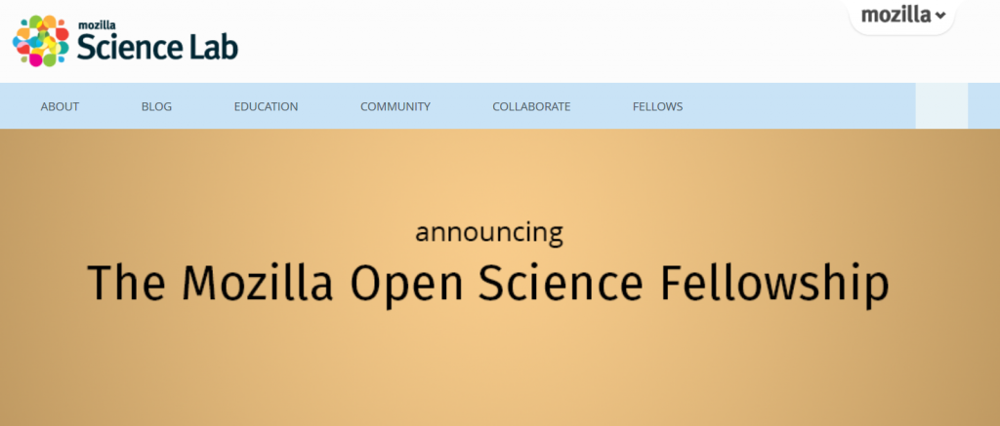

有賴「Leona M. and Harry B. Helmsley Charitable Trust」慈善信託的慷慨解囊，Mozilla 很高興宣佈 [Mozilla](https://mozillascience.org/)[Science Lab](https://mozillascience.org/) 的第一屆 Open Science 獎學金正式啟動。此筆獎學金亦屬於該慈善信託機構新贊助的方案之一，將首次針對生醫科學的再現性 (Reproducibility)、合作研究、基礎設施等投資活動提供補助。

Mozilla 兩年期獎助金將發出共一百七十萬美金，針對生醫與自然科學領域，支援我們目前技術訓練以及能力培養的教學活動。另有獎學金可供青年學者推動更高效率的合作研究活動，並塑造其對社群的領導能力。為期十個月的獎學金將涵蓋資訊方面的訓練與輔導，將培養 Open Science 的教學導師。除了訓練活動之外，獎學金亦將支援開發新的材料、工具、專案，以進一步深化 Web 科學。

此筆獎學金另將援助研究人員的課程設計、資料訓練規劃、導師訓練活動，以拓展 Mozilla Science Lab 現有專案，活絡研究人員的學習過程。

由 Mozilla 基金會所創辦的 Mozilla Science Lab，即與全球夥伴合作轉化 Open Web 的原則以及價值，並進一步引領更高階的科學發現。Mozilla Science Lab 成立於 2013 年，已統合了研究社群而提供 Open Science 技術的訓練、輔導、支援，打造能讓實踐者開放工作的社群環境。

此筆獎學金即將於今年春季啟動，且起頭先著重於生醫與自然科學。歡迎[加入郵件群組](https://mail.mozilla.org/listinfo/mozillascience)或瀏覽 [mozillascience.org](https://mozillascience.org/) 以獲得更多資訊。另可到 Science Lab 的[訊息部落格](https://mozillascience.org/announcing-new-support-to-build-capacity-for-open-science/)獲得最新消息。

原文連結：[Announcing the Mozilla Science Lab Fellowship Program](https://blog.mozilla.org/blog/2015/01/12/announcing-the-mozilla-science-lab-fellowship-program/)
