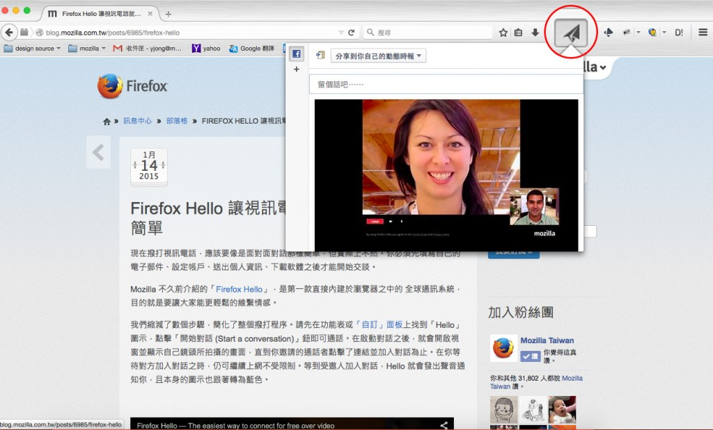

Firefox 讓你能控制自己的線上生活，並根據己身需要而自訂 Web 經驗。我們直接在 Firefox 內建 Web App、視訊電話、社交分享等功能，讓你能輕鬆享受 Web 上的所有美好事物。

Firefox 已內建三項新功能：1). 首次直接於瀏覽器中內建的全球通訊系統「Firefox Hello」，2).社交功能可透過自己最愛的社交網站，輕鬆與親友分享內容，3). Firefox Marketplace 測試版 (Beta) 可測試 Web App。均可到 Firefox 的工具列或「自訂」模式中找到。

#### Firefox Hello ─ 更簡單的溝通方式

我們剛介紹的 [Firefox Hello](https://blog.mozilla.com.tw/posts/6541/)，也是首次直接內建於瀏覽器上的全球通訊系統，除了可輕鬆於線上撥打語音＼視訊電話之外，也提供更友善的隱私功能。

Firefox Hello 的對話視窗

Firefox Hello 免費提供使用，且不須再登入任何帳戶。地球上任何人只要使用支援 WebRTC 的瀏覽器 (如 Firefox、Chrome、Opera)，都能透過 Firefox Hello 相互聯繫。在此之前，你必須先提供電子郵件位址又加上個人資訊，甚至還要再下載其他軟體，才能開始撥打視訊電話。

Mozilla 現在簡化了許多步驟，讓你能更輕鬆撥出電話，也能儲存並命名自己最愛的對話記錄。往後只要輕點一下就能迅速再次撥號給同一人。可[參閱本文以進一步 了解 Firefox Hello](https://blog.mozilla.com.tw/posts/6985/)。

#### Firefox Share ─ 經由你最愛的社交網路分享 Web

Firefox 現亦整合了你最愛用的所有社交網路，任一網站均可啟用你的社交網路並分享 Web 內容，完全不用跳開現正瀏覽中的網頁。

透過「紙飛機」的圖示就能輕鬆分享網頁內容

若要新增 Firefox 中的「分享 (Share)」功能，請先到「[Share Activation](https://activations.cdn.mozilla.net/zh-TW/)」頁面，點擊你想使用社交網站的「立刻啟用 (Activate Now)」按鈕。 現在[已能使用的社交網站](https://activations.cdn.mozilla.net/zh-TW/)包含 [Facebook](https://activations.cdn.mozilla.net/en-US/facebook.html)、[Twitter](https://activations.cdn.mozilla.net/en-US/twitter.html)、[Tumblr](https://activations.cdn.mozilla.net/en-US/tumblr.html)、[Linked In](https://activations.cdn.mozilla.net/en-US/linkedin.html)、[Google+](https://activations.cdn.mozilla.net/en-US/google.html)。

#### Firefox Marketplace 測試版 (Beta) ─ 協助測試 App

Firefox Marketplace Beta 現已開放於 Windows、Mac、Linux 的桌面版進行測試。以 Open Web 技術打造的 Firefox Marketplace Beta，將跨平台為開發者提供靈活的創造力，並讓消費者能享受一致的 App 使用經驗。請透過[支援頁面](https://support.mozilla.org/kb/marketplace-apps-firefox-desktop)以進一步了解該如何使用 Firefox Marketplace Beta。

更多資訊：

- [Windows、Mac、Linux 版 Firefox 的版本說明](https://www-dev.allizom.org/en-US/firefox/35.0/releasenotes/)

- [下載 Firefox](https://mozilla.com.tw/firefox/new/)

- [Firefox for Android 版本說明](https://www-dev.allizom.org/en-US/mobile/35.0/releasenotes/)

- [下載 Firefox for Android](https://www.mozilla.org/zh-TW/firefox/android/)

原文連結：[Firefox Enables You to Experience and Share More on the Web](https://blog.mozilla.org/blog/2015/01/13/firefox-enables-you-to-experience-and-share-more-on-the-web/)
