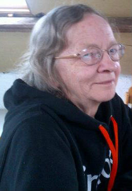
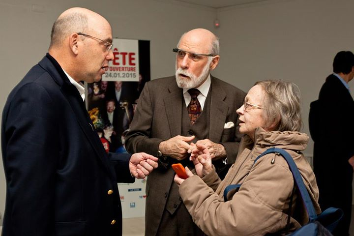

有了遍佈全球的 Mozillian 熱情支持，我們才能走到今日。就讓我們簡單介紹具代表性的幾位 Mozillian 吧！

這些人將分享自己對 Mozilla 與 Web 的想法，包含他們的回憶、身為 Mozillian 的日常生活，以及對下個十年甚至未來的期待。

莫妮可 (Monique) 是本系列首先介紹的 Mozillian。

### Monique Brunel

「Mozilla 讓我能加入強大的社群，為更好的 Web 貢獻一己之力。」

#### 首先就請妳簡單自我介紹一下吧！

我是莫妮可 (Monique)，但大家更熟悉我在 Twitter 或 IRC 上的暱稱：「webatou」，這也是我在部落格上用的筆名。

我在學校當圖書館員約二十年了，後來也兼任網站推廣顧問 (Accessibility consultant)。

我住在比利時的蒙斯 (Mons)，目前已經退休。

#### 可以代表妳自己生活的簡單三句話？

我的關鍵詞就是：開放的網路、所有人的網路、分享。

#### 妳是何時開始透過哪種方式了解網路？

我在 1989 年開始接觸電腦，幾年之後透過電腦雜誌了解到「網際網路」這個詞。接著再 1999 年開始上網，立刻就讓我的第一個網站上線 (當時我在一家體育俱樂部當秘書)。

#### 如果要妳向全世界說明網路與其潛力，妳怎麼說？

保持網路的開放性、安全度，且所有人都易於取得所需要的資源！

#### 妳和 Mozilla 的淵源：妳如何開始為 Mozilla 貢獻？為何貢獻？

我第一次對 Mozilla 的貢獻是在自由開源軟體開發者歐洲會議 (FOSDEM) 2004，當時我想跟 Mozilla 的歐洲團隊一起顧展位。

#### 簡單一個字或一句話代表 Mozilla？

對我來說，Mozilla 是能確保 Web 開放的組織！

#### 妳有任何 Mozilla 相關的軼事要向我們分享的嗎？

2013 年 10 月，我有機會在莫斯見到了 Vint Cerf (網際網路兩位創始人之一)。我手上剛好從 Mozilla Reps 那邊拿到了一支 Firefox OS 智慧型手機，也在當時向他介紹了 Firefox OS！

#### 說說妳或妳在地社群發生的有趣或特殊事件？

我很高興也很榮幸與 Benoit Leseul 貢獻創辦了 Mozilla Belgium；時值 FOSDEM 2011 之際！

比利時是個小國，會舉辦的 Mozilla 活動也不多。但我們積極參與法國境內舉辦的活動。

#### 妳和社群成員的美好回憶？

我記得當時有一個學生 Anthony Maton 首次參加了比利時的活動，而且他從那天開始就變成很積極的貢獻者。這件事讓我特別驕傲！

#### 請和我們聊聊未來十年：妳期待 Mozilla 能達成哪些任務？

Mozilla 讓我能透過強大社群而貢獻更好的網路。

#### 妳預期 Mozilla 將來能達到哪些有趣的事情呢？

透過 Firefox OS 讓 Web 成為真正的平台，且智慧型手機使用者能從 Web 的開放本質而獲益更多。

#### 妳對 Mozilla 與 Web 的展望？

希望 Mozilla 能長久經營，為使用者繼續提供自由的選擇。Web 當然應該持續開放並讓所有人易於取得自己所需的資訊！

謝謝莫妮可的無私貢獻！

原文連結：[10 Days of Mozillians: meet Monique!](https://blog.mozilla.org/community/2014/11/10/10-days-of-mozillians-meet-monique/)
