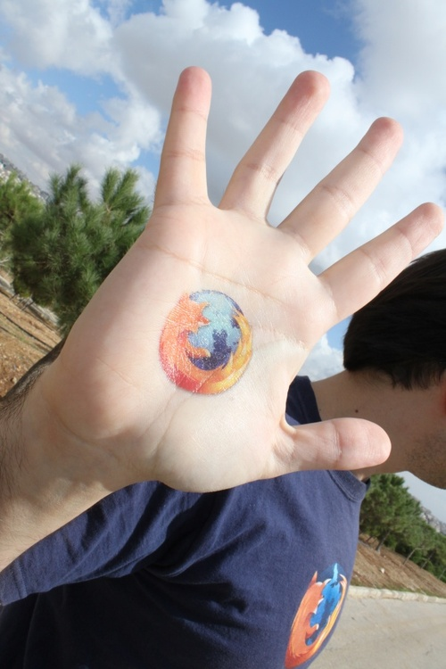

有了遍佈全球的 Mozillian 熱情支持，我們才能走到今日。就讓我們簡單介紹具代表性的幾位 Mozillian 吧！

這些人將分享自己對 Mozilla 與 Web 的想法，包含他們的回憶、身為 Mozillian 的日常生活，以及對下個十年甚至未來的期待。

#### 再來為大家介紹拉米 (Rami Khader)

「在我投入貢獻行列時，我覺得自己活在不同的世界。在這裡，貢獻者致力打造更好的 Web。」

#### 請拉米先簡單的自我介紹一下吧？

我是拉米 (Rami)，生於約旦 (Jordan) 現居荷蘭 (Netherlands)。我目前是「禁止化學武器組織 (Organization of Prohibition of Chemical Weapons，OPCW)」的程式設計師。我充滿熱忱且笑臉迎人，也是樂觀的資工阿宅，喜歡烹飪和瑜伽。

#### 你和 Web 的關係如何？又是何時開始接觸網路的呢？

我在 1996 年第一次接觸網路，那時我到舅舅家玩，他向我展示了網路的能耐。我花了點時間上網，也看了幾本雜誌要熟悉網路，最後我想在家裡弄網路，當然又花更多時間了解 Web 的無限可能。好幾個晚上我都睡不著！

我還記得當時家裡電話老是因為撥接上網所以佔線，一堆人抱怨家裡電話打不進來！

#### 你怎麼形容網路與其潛力？

我說網際網路等於知識，知識又等於力量。

#### 你怎麼用簡單一個字或一句話敘述 Mozilla？

Mozilla 是虛擬世界中的安全藏身處。

#### 你何時開始，用什麼樣的方法為 Mozilla 做出貢獻？

我在 2003 年開始貢獻。當時我很愛用 Netscape 瀏覽器，也認為應該要有 Internet Explorer 之外的第二個選擇。

有一天，我在雜誌上看到一款新的「Phoenix」瀏覽器剛進入 0.1 版。我回家之後就下載來試玩。我第一眼就愛上這瀏覽器，且當下就成為我的預設瀏覽器。

我在這款瀏覽器的 0.4 版時就決定要弄出阿拉伯文版。而到 Firebird 0.6.1 時就幾乎完成了阿拉伯文版本，並列入[版本說明](https://website-archive.mozilla.org/www.mozilla.org/firefox_releasenotes/en-US/firefox/releases/0.6.1.html)。

當年 11 月 9 日是我的大日子。我到處遊說人下載並體驗 Firefox。到現在我還保留了當時釋出時所發送的 Firefox 衣服與玩偶。我在約旦的時候，也努力找著《紐約時報 (New York Times)》想看 Firefox 的廣告。

2009 年，我在安曼 (Amman) 見到基金會主席 Mitchell Baker 本人是個轉捩點。我收到了 Mozilla Summit 2010 的邀請函，之後就建立了阿拉伯社群，也是 Mozilla 社群在中東地區的濫觴。

第一次阿拉伯網聚就在 2011 年的安曼舉行，隔年又在突尼西亞 (Tunisia) 舉辦了第二次。接著大家推舉我加入 Mozilla Reps Council。而我目前比較著重於社群的組織活動，協助 Firefox OS 的翻譯，並監督新加入的貢獻者。

#### 你有任何 Mozilla 相關軼事想分享的嗎？

「Mozilla 改變了我的生活」就足以代表我與 Mozilla 之間的故事。

在我開始為 Mozilla 貢獻之前，我已經在私人公司領導一個開發團隊，而且完全不知道開放源碼與社群的運作方式。讓公司賺錢是主要目的，而且我最愛秘密的閉門策略。

但當我開始貢獻，就像是活在完全不同的世界裡。貢獻者會在此開放環境中分享自己的心血，而志工就協助塑造更好的 Web，讓使用者擁有更多選擇。

因此我決定朝公領域邁進，且要能影響大家的線上與實際生活。我之前和聯合國的安曼辦公室合作，現在則是在荷蘭的另一間公家組織上班。

Mozilla 改變了我的職涯方向、影響了我的生活、開啟了我不同的眼界，所以我現在也試著要改變他人的生活。

#### 真是精采！那跟我們談談在你手上茁壯的社群吧。有任何特別有趣的事想跟我們分享的嗎？

我不屬於任何單一的社群。我認為自己既是 Mozilla 約旦社群的一員，也同樣是 Mozilla 阿爾及利亞 (Algerian) 社群、Mozilla 突尼西亞社群、Mozilla 埃及 (Egypt) 社群的一份子。

我們都說相同的語言，擁有相同的文化，因相同的理由而貢獻。雖然四散在不同的國家內，但卻凝聚在一起。我們對 Mozilla 的熱情讓我們成為最好的朋友。

簡單來說，我就是 Mozillian。

#### 跟我們說說未來吧！你對 Mozilla 有著什麼樣的期待？

我希望 Mozilla 能轉為較主動、支配的工作模式，且能跳出 IT 而參與其他產業。

#### 你對 Web 的想法？

Web 應該更自由，為使用者提供更多選擇。

謝謝拉米！

原文連結：[10 days of Mozillians: meet Rami!](https://blog.mozilla.org/community/2014/11/11/10-days-of-mozillians-meet-rami/)
