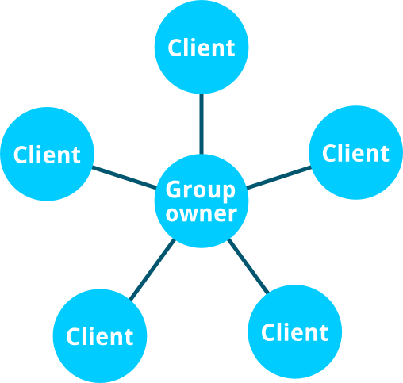

Mozilla 預見 Web 未來將不須網際網路，亦可讓所有人透過多樣裝置直接聯繫。現已有許多不同技術可用於建構點對點 (Peer-to-peer，P2P) 連線。本系列文章將向大家介紹相關技術。先來看看「Wi-Fi Direct」。

#### 「Wi-Fi Direct」是作什麼用的？

Wi-Fi Direct 是由「Wi-Fi 聯盟 (Wi-Fi Alliance，WFA)」所提出的通訊標準，可讓多款裝置在沒有區域網路的情況下互連，其優點即在於使用了快速且普及的 Wi-Fi 技術。

此標準可讓裝置發現其他可用的連線端，並啟用裝置上的 Wi-Fi 熱點共享功能，以利連線端互連。從 Wi-Fi Direct 的規格來看，此存取熱點即稱為「Group owner」，而連上 Group owner 的連線端均稱為「Client」或「Peer」。

#### 啟動「Flame」上的 Wi-Fi Direct

連線端的驅動程式須能支援 Wi-Fi Direct 才能使用，而[參考平台手機「Flame」](https://developer.mozilla.org/zh-TW/docs/Mozilla/Boot_to_Gecko/Boot_to_Gecko_developer_phone_guide/Flame)正好就能支援。在開始之前必須先啟動支援功能。請先將取得 Root 權限的手機連上電腦，並執行[這段 Gist 上的程式碼](https://gist.github.com/justindarc/1d88d7d14e3264e8a666)。

Firefox OS 中的 Wi-Fi Direct API 目前僅能用於 Certified App。另別忘了在 manifest.webapp 檔案中請求 [wifi-manage 的許可](https://developer.mozilla.org/en-US/Apps/Build/App_permissions#wifi-manage)。這也代表你不能在 Firefox Marketplace 中發表此類 App，但仍可自己使用或把玩此技術。

本文所提的 JavaScript 程式碼，則使用了 [promise](https://developer.mozilla.org/en-US/docs/Web/JavaScript/Reference/Global_Objects/Promise) 與最新版 Firefox OS 所支援的某些 ES6 架構。請先確認自己很熟悉這些東西！

#### 看看有誰在附近

你可透過 avigator.mozWifiP2pManager 存取 Wi-Fi Direct API。接著就是啟動 Wi-Fi Direct 找出附近可用的連線端。而啟動函式為 setScanEnabled(true)、連線端搜尋函式為 getPeerList()；且均會回傳 promise。

		
		

navigator.mozWifiP2pManager.setScanEnabled(true)
  .then(result => {
    if (!result) {
      throw(new Error('wifiP2pManager activation failed.'));
    }
 
    // Wi-Fi Direct is enabled! Now, let's check who's around.
    return navigator.mozWifiP2pManager.getPeerList();
  })
  .then(peers => {
    console.log(`Number of guys around: ${peers.length}!`);
  });
			
				
					
				
					123456789101112
				
						navigator.mozWifiP2pManager.setScanEnabled(true)  .then(result => {    if (!result) {      throw(new Error('wifiP2pManager activation failed.'));    }     // Wi-Fi Direct is enabled! Now, let's check who's around.    return navigator.mozWifiP2pManager.getPeerList();  })  .then(peers => {    console.log(`Number of guys around: ${peers.length}!`);  });
					
				
			
		

將 true 傳送給 navigator.mozWifiP2pManager.setScanEnabled() 即可啟動 Wi-Fi Direct。只要啟動成功，promise 就會回傳 true。此方法可檢查自己的裝置是否支援 Wi-Fi Direct。

由 navigator.mozWifiP2pManager.getPeerList() 所回傳的 promise，則會回傳物件陣列，代表附近已啟動 Wi-Fi Direct 的連線端：

		
		

{
  name: "Guillaume's Flame",
  connectionStatus: "disconnected",
  address: "02:0a:f5:f7:38:44", // MAC address of the device
  isGroupOwner: false
}
			
				
					
				
					123456
				
						{  name: "Guillaume's Flame",  connectionStatus: "disconnected",  address: "02:0a:f5:f7:38:44", // MAC address of the device  isGroupOwner: false}
					
				
			
		

另可透過 navigator.mozWifiP2pManager.setDeviceName(Guillaume's Flame) 設定連線端的名稱。此字串可協助我們識別該連線端。

一如你想的，connectionStatu 屬性可告訴我們該裝置是否已連線。共有以下四種數值：

- ‘disconnected’

- ‘connecting’

- ‘connected’

- ‘disconnecting’

你可監聽由 navigator.mozWifiP2pManager 所發出的 peerinfoupdate 事件，得知連線端的狀態是否改變 (如任一連線端出現＼消失；連線端的連線狀態改變)。後續必須呼叫 getPeerList() 以更新資訊。

#### 敲敲門！有人在嗎？

現在我們知道附近有哪些裝置了，快用 navigator.mozWifiP2pManager.connect(address, wps, intent) 連線吧！此三筆參數代表：

- 裝置的 MAC 位址

- WPS 方法 (如 ‘pbc’)

- intent 的值可為 0 ~ 15

在 getPeerList() 取得的連線端物件 (Peer object) 內，即可找到 MAC 位址。目前你可放心忽略 WPS 函式，但請[留意 MDN](https://developer.mozilla.org/en-US/docs/Web/API/MozWifiP2pManager.connect) 所提供的新資訊。

在初始連線期間，可透過 intent 發送的值決定哪一款裝置要作為此 Wi-Fi Direct 網路的「Group owner」。數值越高就越有可能是 Group owner 裝置。

		
		

// Given `peer`, a peer object.
navigator.mozWifiP2pManager.connect(peer.address, 'pbc', 1)
  .then(result => {
    if (!result) {
      throw(new Error(`Cannot request a connection with ${peer.name}.`));
    }
 
    // The connect request was successfully issued.
  });
			
				
					
				
					123456789
				
						// Given `peer`, a peer object.navigator.mozWifiP2pManager.connect(peer.address, 'pbc', 1)  .then(result => {    if (!result) {      throw(new Error(`Cannot request a connection with ${peer.name}.`));    }     // The connect request was successfully issued.  });
					
				
			
		

這個階段還沒連上附近的連線端。你可透過回傳的值知道連線作業是否已經開始。

若要知道連線狀態，就必須監聽事件。

#### 破冰聊天

Wi-Fi Direct 物件會放出不同的事件。只要有其他裝置連上線，就會放出 statuschange 事件。

你可在 navigator.mozWifiP2pManager.groupOwner 找到連線作業的詳細資訊。可使用下列屬性所提供的資訊：

- isLocal ：得知該裝置是否為 Group owner。

- ipAddress ：即 Group owner 的 IP 位址。

另外也有許多屬性，但上述屬性即足以建立基本的應用。

若有其他連線端透過 navigator.mozWifiP2pManager.disconnect(address) 中斷連線，同樣會觸發 statuschange。

#### 打個招呼吧

Wi-Fi Direct 只是連線協定，所以你必須決定通訊的方式。連線之後就會取得 Group owner 的 IP 位址。此位址可搭配裝置上執行的 Web 伺服器「[fxos-web-server](https://github.com/justindarc/fxos-web-server)」，以要求資訊。而 Group owner 接著就可作為伺服器。

你也可以使用 [p2p-helper.js](https://github.com/justindarc/p2p-helper.js)，即由 [Justin D’Arcangelo](https://twitter.com/justindarc) 所開發的輔助函式庫，除了簡化 Wi-Fi Direct API 之外，亦能更輕鬆開發 App。

建議大家看一下範例程式碼：

- [Firedrop](https://github.com/justindarc/firedrop) 為範例 App，可於裝置之間分享媒體案。

- [Wi-Fi Columns](https://github.com/gmarty/wifi-columns) 則是可跨多款裝置運作的遊戲。下方為示範。

說到這裡，應該要換你開發有趣的 App，並設法在沒有行動數據或無直接連線的狀態下，也能讓多款裝置互動！

原文連結：[The P2P Web: Wi-Fi Direct in Firefox OS](https://hacks.mozilla.org/2015/01/the-p2p-web-wi-fi-direct-in-firefox-os/)
