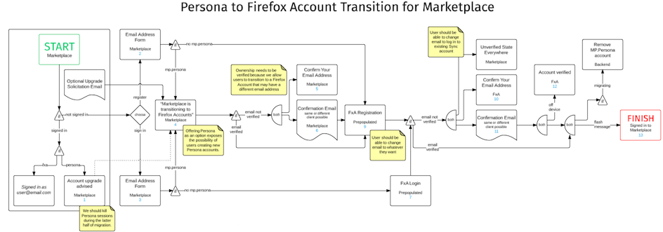
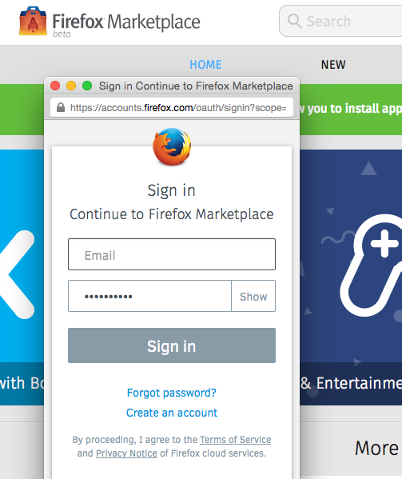

[Firefox Marketplace](https://marketplace.firefox.com/) 已於去年從[Persona](https://login.persona.org/) 轉往使用[Firefox Accounts](https://blog.mozilla.com.tw/posts/4903/)。促成這項安排的理由很多，但最主要的原因應該就是 Firefox OS 當時也正轉往 Firefox Accounts。只要你在 Firefox OS 手機上登入過一次，以後也就會自動登入 Marketplace。

其實 Marketplace 的這項轉移作業，遇上其他專案沒有過的特殊難題：

- 「Marketplace」這個 App 可向下支援 Firefox OS 1.1 版本

- Marketplace 網站支援 Android 與桌機的消費者

- Persona 過去接受了某些未認證過的電子郵件位址

- Marketplace 的付款服務使用了[Trusted UI](https://bugzilla.mozilla.org/show_bug.cgi?id=794999)

現有兩種方式可登入 Firefox Accounts，即 1). Firefox OS 既有的登入流程，以及 2). Android 與桌機用戶端所用的 OAuth 方式。類似的登入流程實在成長太快，遠超乎我們所能控制的範圍，因此我們專心讓消費者能在所有裝置上使用 OAuth 架構的流程。

以資料庫角度所開始的轉移過程還不算太複雜。我們先儲存 Persona 內的使用者電子郵件位址。只要使用者現仍在用自己的帳戶並曾經登入過，我們就能再從 Firefox Accounts 的角度檢視這些電子郵件。即便使用者目前沒有帳戶，那也只須建立新帳戶就能加入。

但那些未認證過的電子郵件就讓人頭疼了。這類電子郵件代表使用者＼開發者的電子郵件位址根本沒用或無法收發郵件。所以在轉移到 Firefox Accounts 時，我們的認證電子郵件根本寄不到這些舊信箱，整個流程也就無法繼續。除了以人工儘量檢驗並搬移這些帳戶之外，似乎想不到其他替代方法。

如果你是透過「Sync」同步功能而擁有 Firefox Account，並想在 Marketplace 繼續使用同一帳戶，則 Firefox Accounts 團隊也提供了預先認證過的「Token」，可讓你還是以使用者的身分開始註冊流程，但是可在 Firefox Accounts 中以不同的電子郵件登入。Marketplace 將於流程結束時偵測電子郵件的差異，並可識別該流程所用的帳戶並確實連動。

以下為多方努力思考所得出的流程圖，且後續當然還有相關規劃：

這一路上當然不算順利，另可[參考除錯清單](https://bugzilla.mozilla.org/show_bug.cgi?id=1007956)了解我們遇上的錯誤。我們本來以為 OAuth 與 Persona 流程之間的差異，已經算是整個轉移作業的最大難題了，但如前面提到的，Trusted UI 才是最複雜的地方。

在佈署完畢後，我們隨即寄發電子郵件給所有人，等待使用者再度加入。當然許多人都收到通知，並在 48 小時之內就有許多人完成了帳戶移轉作業。

在整個寄發作業期間，我們也確認該電子郵件信箱可正常接收使用者回覆的信件，以利之後能持續追蹤任何遇上問題的使用者，同時也記錄所有登入活動，以利我們發現問題並修復之後，就能直接通知相關收件者。其實只有兩名使用者在這個階段遇上問題。當然我們也很高興能為大家解決疑難雜症。

Firefox Accounts 啟用已超過三個月，我們已經在本週關閉了特殊轉移流程。且在觀察到已有許多使用者＼開發者完成轉移程序之後，另亦刪除了轉移流程。

#### 接下來呢？

- 針對 Firefox OS 2.1 準備既定流程。

- 轉用 iframe 架構的流程，並移除彈出視窗的流程。

- 更進一步整合 Firefox Accounts 的未來功能，如大頭照的功能。

感謝 Marketplace 團隊的努力，還有 Firefox Accounts 團隊的一路相助。

原文連結：[Marketplace migration to Firefox Accounts](https://blog.mozilla.org/services/2015/01/30/marketplace-migration-to-firefox-accounts/)
