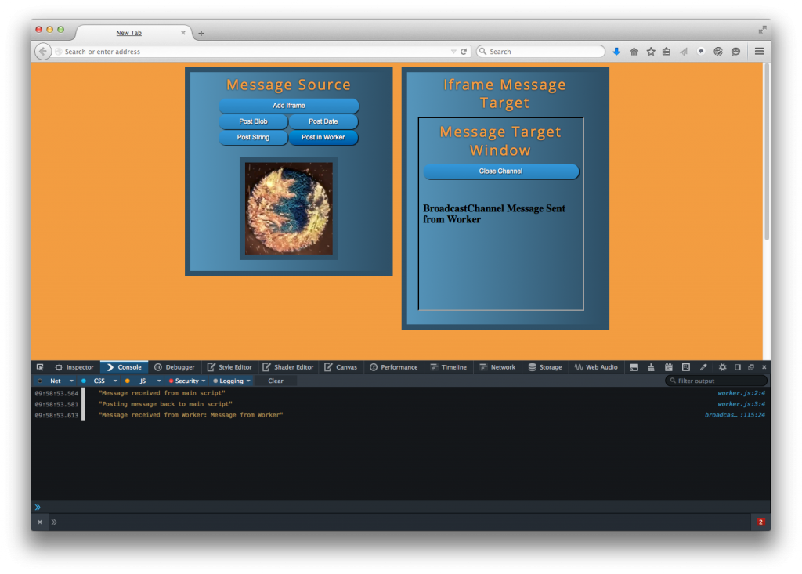

[BroadcastChannel API](https://developer.mozilla.org/en-US/docs/Web/API/Broadcast_Channel_API) 最近已經進入 Firefox 38。若網頁內容的來源及其所使用的瀏覽器均相同，則此 API 就能在瀏覽器的內容之間進行簡單的訊息傳遞作業。此 API 現已擴充到 Windows 與 Worker 之上，並可於 iframes、Worker、瀏覽器分頁的執行緒之間進行通訊。

BroadcastChannel API 本來是想在 Web App 瀏覽器的內容之間，進行簡易的訊息通訊作業。舉例來說，只要使用者登入 App 的網頁之一，即可依其個人資訊而更新其他所有的內容 (如分頁或獨立視窗)。或是使用者將照片上傳到瀏覽器視窗，亦可一併傳送到該 App 之內所開啟的其他頁面。此 API 本不是為了處理複雜作業所設計。如鎖定已分享的資源，或透過伺服器同步多個用戶端等的複雜作業，則 Shared worker 還更適合。

### API 概述

我們可用下列程式碼建立 BroadcastChannel 物件：

		
		

var myChannel = new BroadcastChannel("channelname");
			
				
					
				
					1
				
						var myChannel = new BroadcastChannel("channelname");
					
				
			
		

channelname 的大小寫有別。BroadcastChannel 實例包含兩組函式，即 postMessage 與 close。函式 postMessage 可寄送訊息到 channel。而訊息內容可為任何物件，包含圖片、陣列、物件陣列等的複雜物件。只要瀏覽器內容的來源、使用的瀏覽器、BroadcastChannel 的頻道名稱均相同，都會收到訊息。舉例來說，下列程式碼就會送出簡單字串：

		
		

myChannel.postMessage("Simple String");
			
				
					
				
					1
				
						myChannel.postMessage("Simple String");
					
				
			
		

任何頁面只要搭配 BroadcastChannel 物件的 onmessage 事件處理器來開啟頻道，都能處理所分派出的訊息。

		
		

myChannel.onmessage = function(event) {
    console.log(event.data);
}
			
				
					
				
					123
				
						myChannel.onmessage = function(event) {    console.log(event.data);}
					
				
			
		

另請注意，事件的資料屬性包含了訊息資料，且你也可能想了解事件的其他屬性。舉例來說，你可透過 event.origin 屬性，或 event.target.name 屬性中看到的頻道名稱來檢查 Web App 的來源。

而 close 函式可關閉特定瀏覽器內容的頻道，只要以下程式碼即可呼叫：

		
		

broadCastChannel.close();
			
				
					
				
					1
				
						broadCastChannel.close();
					
				
			
		

### 張貼 Blob 訊息

傳送字串或其他基本型別的資料都很簡單，但其實 BroadcastChannel API 仍可支援更複雜的物件。舉例來說，如果要將圖片傳送到另一組內容中，可使用下列程式碼：

		
		

var broadcastExample = {};
broadcastExample.setupChannel = function() {
    if ("BroadcastChannel" in window) {
        if (typeof broadcastExample.channel === 'undefined' ||
           !broadcastExample.channel) {
            //create channel
            broadcastExample.channel = new BroadcastChannel("foo");
        }
    }
}
broadcastExample.pMessage = function() {
    broadcastExample.setupChannel();
    //get image element
    var img = document.getElementById("ffimg");
    //create canvas with image
    var canvas = document.createElement("canvas");
    canvas.width = img.width;
    canvas.height = img.height;
    var ctx = canvas.getContext("2d");
    ctx.drawImage(img, 0, 0);
    //get blob of canvas
    canvas.toBlob(function(blob) {
        //broadcast blob
        broadcastExample.channel.postMessage(blob);
    });
}
			
				
					
				
					1234567891011121314151617181920212223242526
				
						var broadcastExample = {};broadcastExample.setupChannel = function() {    if ("BroadcastChannel" in window) {        if (typeof broadcastExample.channel === 'undefined' ||           !broadcastExample.channel) {            //create channel            broadcastExample.channel = new BroadcastChannel("foo");        }    }}broadcastExample.pMessage = function() {    broadcastExample.setupChannel();    //get image element    var img = document.getElementById("ffimg");    //create canvas with image    var canvas = document.createElement("canvas");    canvas.width = img.width;    canvas.height = img.height;    var ctx = canvas.getContext("2d");    ctx.drawImage(img, 0, 0);    //get blob of canvas    canvas.toBlob(function(blob) {        //broadcast blob        broadcastExample.channel.postMessage(blob);    });}
					
				
			
		

上列程式碼包含兩組函式，代表 BroadcastChannel 的傳送端。setupChannel 函式僅會開啟 BroadcastChannel，而 pMessage 函式則檢查頁面的圖素並將之轉換為 Blob。最後將 Blob 張貼到 BroadcastChannel。接收頁面必須已準備監聽 BroadcastChannel 完畢以利接收訊息，且可將接收頁面撰寫如下：

		
		

var broadcastFrame = {};
 
//setup broadcast channel
broadcastFrame.setup = function() {
    if ("BroadcastChannel" in window) {
        if (typeof broadcastFrame.channel === 'undefined' || !broadcastFrame.channel) {
            broadcastFrame.channel = new BroadcastChannel("foo");
        }
        //function to process broadcast messages
        function func(e) {
            if (e.data instanceof Blob) {
                //if message is a blob create a new image element and add to page
                var blob = e.data;
                var newImg = document.createElement("img"),
                    url = URL.createObjectURL(blob);
                newImg.onload = function() {
                    // no longer need to read the blob so it's revoked
                    URL.revokeObjectURL(url);
               };
                newImg.src = url;
                var content = document.getElementById("content");
                content.innerHTML = "";
                content.appendChild(newImg);
            }
        };
        //set broadcast channel message handler
        broadcastFrame.channel.onmessage = func;
    }
}
window.onload = broadcastFrame.setup();
			
				
					
				
					123456789101112131415161718192021222324252627282930
				
						var broadcastFrame = {}; //setup broadcast channelbroadcastFrame.setup = function() {    if ("BroadcastChannel" in window) {        if (typeof broadcastFrame.channel === 'undefined' || !broadcastFrame.channel) {            broadcastFrame.channel = new BroadcastChannel("foo");        }        //function to process broadcast messages        function func(e) {            if (e.data instanceof Blob) {                //if message is a blob create a new image element and add to page                var blob = e.data;                var newImg = document.createElement("img"),                    url = URL.createObjectURL(blob);                newImg.onload = function() {                    // no longer need to read the blob so it's revoked                    URL.revokeObjectURL(url);               };                newImg.src = url;                var content = document.getElementById("content");                content.innerHTML = "";                content.appendChild(newImg);            }        };        //set broadcast channel message handler        broadcastFrame.channel.onmessage = func;    }}window.onload = broadcastFrame.setup();
					
				
			
		

此程式碼可從廣播訊息中取得 Blob 並建立圖素，再加入接收端頁面。

### Workers 與 BroadcastChannel 訊息

BroadcastChannel API 亦可搭配專屬與共用的[workers](https://developer.mozilla.org/en-US/docs/Web/API/Web_Workers_API/basic_usage)。先簡單假設現已啟動 worker，且已透過主要指令碼傳送一則訊息到該 worker，接著就會由 worker 廣播訊息到 BroadcastChannel。

		
		

var broadcastExample = {};
broadcastExample.setupChannel = function() {
    if ("BroadcastChannel" in window) {
        if (typeof broadcastExample.channel === 'undefined' ||
           !broadcastExample.channel) {
            //create channel
            broadcastExample.channel = new BroadcastChannel("foo");
        }
    }
}
 
function callWorker() {
    broadcastExample.setupChannel();
    //verify compat
    if (!!window.Worker) {
        var myWorker = new Worker("worker.js");
        //ping worker to post to Broadcast Channel
        myWorker.postMessage("Broadcast from Worker");
    }
}
 
 
//Worker.js
onmessage = function(e) {
    //Broadcast Channel Message with Worker
    if ("BroadcastChannel" in this) {
        var workerChannel = new BroadcastChannel("foo");
        workerChannel.postMessage("BroadcastChannel Message Sent from Worker");
        workerChannel.close();
    }
}
			
				
					
				
					12345678910111213141516171819202122232425262728293031
				
						var broadcastExample = {};broadcastExample.setupChannel = function() {    if ("BroadcastChannel" in window) {        if (typeof broadcastExample.channel === 'undefined' ||           !broadcastExample.channel) {            //create channel            broadcastExample.channel = new BroadcastChannel("foo");        }    }} function callWorker() {    broadcastExample.setupChannel();    //verify compat    if (!!window.Worker) {        var myWorker = new Worker("worker.js");        //ping worker to post to Broadcast Channel        myWorker.postMessage("Broadcast from Worker");    }}  //Worker.jsonmessage = function(e) {    //Broadcast Channel Message with Worker    if ("BroadcastChannel" in this) {        var workerChannel = new BroadcastChannel("foo");        workerChannel.postMessage("BroadcastChannel Message Sent from Worker");        workerChannel.close();    }}
					
				
			
		

接著就會依本文前述過的相同方式，於主頁面中處理該則訊息。

以 Worker 廣播訊息至 iframe

### 更多資訊

如果要進一步了解該如何於 iframe 中使用，則可到[github](https://github.com/JasonWeathersby/broadcastchannelexample) 找到本文所提的另一組範例程式碼。另可透過到[規格](https://html.spec.whatwg.org/multipage/comms.html#broadcasting-to-other-browsing-contexts)、[bugzilla 討論串](https://bugzilla.mozilla.org/show_bug.cgi?id=966439)、[MDN](https://developer.mozilla.org/en-US/docs/Web/API/Broadcast_Channel_API) 進一步了解BroadcastChannel API。亦可到 gecko[原始碼](https://github.com/mozilla/gecko-dev/tree/master/dom/broadcastchannel)找到此 API 的程式碼與測試頁面。

原文連結：[BroadcastChannel API in Firefox 38](https://hacks.mozilla.org/2015/02/broadcastchannel-api-in-firefox-38/)
