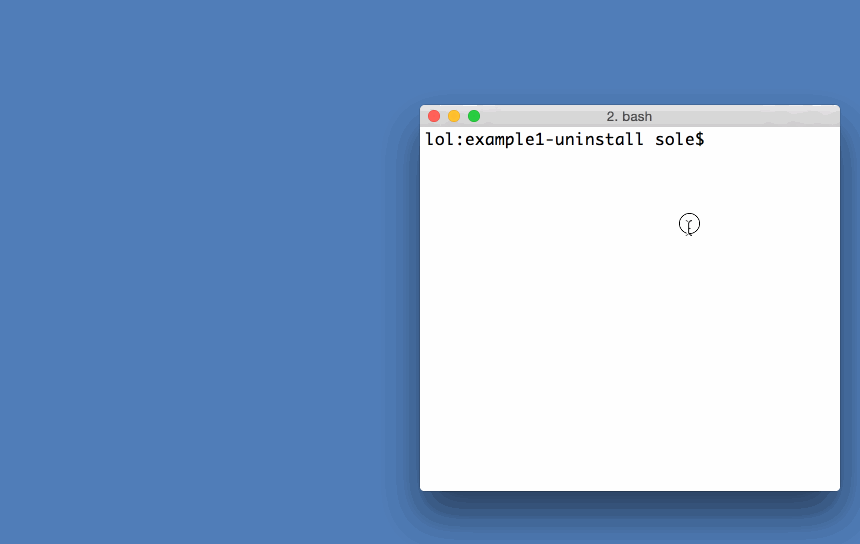

你已經是 App 開發的老鳥，手邊早累積了一堆自己愛用且慣用的 App 開發工具嗎？在轉而開發 Open Web App 時，是否覺得有點難度或障礙呢？快來看看新的「node-firefox」能如何協助你！

我們在剛結束的「自由與開放源碼軟體開發者歐洲會議 (Free and Open Source Developers’ European Meeting，FOSDEM)」上，發表了此專案。但不是所有人都能親臨比利時的會議現場，所以我們想透過本文簡介「[node-firefox](https://github.com/mozilla/node-firefox)」並幫助大家增強 Firefox OS App 的開發功力！

Mozilla 努力簡化開發者的生活。在聽到 App 開發者「入門撰寫 [Open Web App](https://developer.mozilla.org/Apps/Quickstart/Build/Intro_to_open_web_apps) 很痛苦」的意見時，我們就致力讓「[應用程式管理員 (App Manager)](https://developer.mozilla.org/en-US/Firefox_OS/Using_the_App_Manager)」成為更友善的入門環境，即轉而為「[WebIDE](https://developer.mozilla.org/en-US/docs/Tools/WebIDE)」。此工具簡化許多之前緩慢又乏味的步驟，像是建立新的 App、下載＼安裝模擬器、執行＼除錯 App。

但還是有部分功力深厚的開發者不滿意，甚至覺得他們自己遭冷落了！這些人都已經有自己愛用的 node.js 架構工具，並搭配如靜態檔案最佳化 (Asset optimisation)、程式碼提示 (Code hinting)、執行測試 (Test running) 等作業。他們也常使用如[Browserify](https://browserify.org/) 的工具，且可能根本沒使用 JavaScript，而愛用如 CoffeeScript 的東西代替。但這些好東西都需要你先弄好 App 或網站，再將這些東西推送到裝置或重新載入瀏覽器。

基本上，我們希望這些開發者能離開自己所熟悉的指令列 (或編輯軟體的快捷鍵)，嘗試 WebIDE 的滑鼠點擊大法並佈署 App，再回到自己愛用的編輯軟體。而這些人全都回答：「但我們不喜歡用滑鼠點點點，我們就是喜歡在終端機畫面上敲鍵盤！」

#### 如何更有效率？

開發者不喜歡的原因，主要是工作無法在終端機內一氣呵成，還要切到 WebIDE 手動完成佈署。這種行為很沒有效率。我們工程師除了打造新東西之外，最喜歡的大概就是對工作流程進行最佳化了。

既然我們都已經寫好指令碼了，要將 App 丟上執行環境 (Runtime) 的最後一步就是佈署，這也是 WebIDE 的主要用途。所以問題就在於：我們能否讓程式執行 WebIDE 所進行的佈署作業？

#### 伺服器與「Actor」

Firefox 所有執行環境都有所謂的[遠端除錯伺服器 (Remote debugger server)](https://developer.mozilla.org/en-US/docs/Tools/Remote_Debugging)。此功能基於安全理由是預設關閉的。但只要開啟之後，終端即可連接並利用多樣功能，如 App 安裝、存取主控台等。而這些就是 WebIDE 於[內部運作](https://mxr.mozilla.org/mozilla-central/source/toolkit/devtools/apps/app-actor-front.js#235)的作業。

這些功能均是由一組「Actor」所進行。假設我們想列出已安裝的 App，就要：

- 先找到「 webApps 」這個 Actor

- 執行 getAll 指令

- 最後獲得 App 清單

另外再拿封裝式 (Packaged) App 為例，應該：

- 透過你愛用的函式庫或任何方法，先壓縮 App 內容

- 取得「 webApps 」這個 Actor

- 以 ZIP 檔案的內容，於「 webApps」 中呼叫 uploadPackage 指令

- 此呼叫的結果則成為「 File 」這個 Actor

- 以回傳的「 File 」，於「 webApps 」中呼叫 install 指令

- 完成！

因此安裝 App 的所有流程，都不是在 WebIDE 之內，卻是在伺服器內發生的！我們另可透過程式設計來利用此流程，但若要從頭開始建構終端，就必須建構 TCP 連線並剖析 (Parsing) 封包。不過你主要應該想寫 App 並送入裝置，而不會想做上面這些「雜事」吧？

還好有[node-firefox](https://github.com/mozilla/node-firefox) 可幫你省下這些事情。node-firefox 可不單只是程式碼而已，更是一系列的 node.js 模組，且各自執行不同的作業，架設於自己獨立的 Repo 之上，並如模範公民般幫你將模組發佈到[npm registry](https://www.npmjs.com/)。你可在自己的指令碼或作業執行環境中儘量使用，最後不須離開終端機介面也能編譯並執行自己 App。

說了這麼多，你應該很想看看實際的範例程式碼吧？可別錯過《[簡介 node-firefox (下)](https://blog.mozilla.com.tw/posts/7098/)》，讓自己能順利加入 Firefox OS App 的開發行列，並讓自身功力突飛猛進。

原文連結：[Introducing node-firefox](https://hacks.mozilla.org/2015/02/introducing-node-firefox/)
