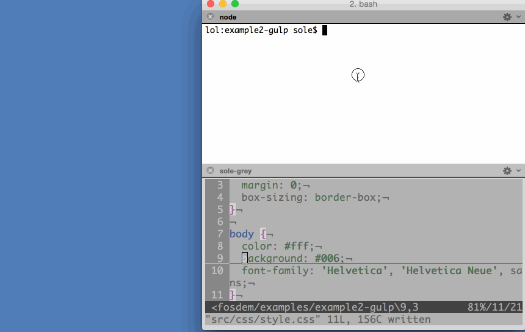
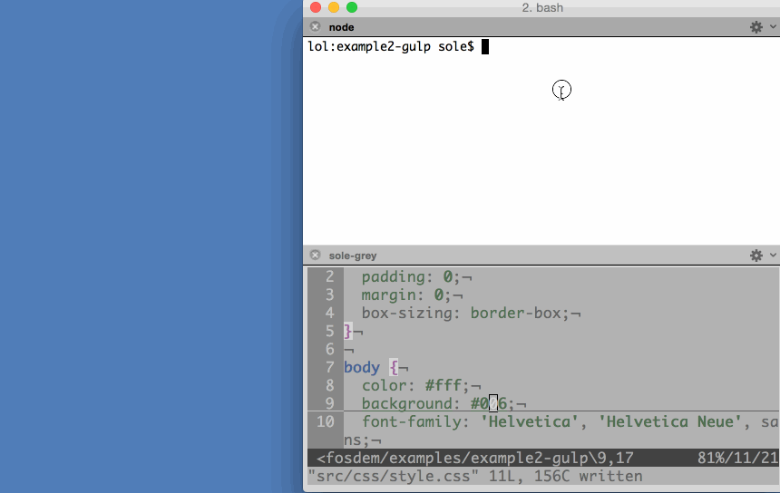

在看過了《[簡介 node-firefox (上)](https://blog.mozilla.com.tw/posts/7093/node-firefox-1)》之後，你應該已經對 node-firefox 有初步的認識了吧？緊接著來看看範例程式碼吧！

#### 別說了，先來看吧

先來看看如何撰寫可啟動模擬器的指令碼吧！

首先用 npm 在自己的專案中安裝此模組：

		
		

npm install --save node-firefox-start-simulator
			
				
					
				
					1
				
						npm install --save node-firefox-start-simulator
					
				
			
		

指令碼看起來就像這樣：

		
		

var startSimulator = require('node-firefox-start-simulator');
 
startSimulator({ version: '2.2' })
  .then(function(simulator) {
    console.log('Listening in port', simulator.port);
  });
			
				
					
				
					123456
				
						var startSimulator = require('node-firefox-start-simulator'); startSimulator({ version: '2.2' })  .then(function(simulator) {    console.log('Listening in port', simulator.port);  });
					
				
			
		

就這麼簡單！不過幾行程式碼，就能以程式設計的方式啟動 2.2 版本的模擬器。如果你不在乎版本問題，就不要放過 startSimulator 的任何設定，並啟動其遇到的第一組模擬器：

		
		

startSimulator().then(function(simulator) {
  // your code
});
			
				
					
				
					123
				
						startSimulator().then(function(simulator) {  // your code});
					
				
			
		

再來看看實際情況。現在我們完全以 node.js 指令碼啟動了模擬器、安裝並啟用了 App：

此範例中的程式碼，其實就是[node-firefox-uninstall-app](https://github.com/mozilla/node-firefox-uninstall-app) 模組的範例。所有 node-firefox 模組都有 examples 資料夾，讓你能快速入門。

如前面所提，許多 Web 開發者都想續用自己熟悉的作業執行環境而轉開發 App，所以我們也透過[gulp](https://gulpjs.com/) 範例來引導你使用 node-firefox。

先執行 default-one 試試看吧！會先啟動模擬器、佈署 App、監看 CSS 變化 (如果你想有點挑戰性)。如果你編輯並儲存了任何 App 的樣式表 (Stylesheet)，則檔案監控程式 (File watcher) 就會偵測到變化而送出新的檔案內容 (且動態取代之) 至執行環境，而不須停止、推送、重新啟動整個 App。可看看下方的背景顏色，就是從深藍色即時改變為 [Paul Rouget](https://paulrouget.com/) 的粉紅色！

在打造＼測試 UI 介面時，即時重新載入 CSS 的功能確實好用。你不須重新載入 App 就能看到自己要動手修改的特定配置，真的很省時間。真希望開發 Android App 的時候就能這樣！

當然不只如此。default-all 不僅能辦到跟 default-one 一樣的功能，而且還擴及系統中已安裝的所有模擬器。所以你可同時在所有模擬器中看到 CSS 改變所造成的效果：

但是 2.1 與 2.2 版的模擬器還有[錯誤](https://github.com/mozilla/node-firefox-reload-css/issues/1)，導致此兩個版本不會重新載入樣式表的變化，不過已經有人提報這個問題且很快就會修復。

#### 目前我們能怎麼做？

目前的模組集合可讓你[找到執行環境正監聽中的通訊埠](https://github.com/mozilla/node-firefox-find-ports)、[尋找](https://github.com/mozilla/node-firefox-find-simulators)＼[啟動模擬器](https://github.com/mozilla/node-firefox-start-simulator)、[連接](https://github.com/mozilla/node-firefox-connect)到執行環境、[尋找](https://github.com/mozilla/node-firefox-find-app)＼[安裝](https://github.com/mozilla/node-firefox-install-app)＼[解除安裝](https://github.com/mozilla/node-firefox-uninstall-app)＼[啟動](https://github.com/mozilla/node-firefox-launch-app) App、[重新載入樣式表](https://github.com/mozilla/node-firefox-reload-css)。

Philosophy

你應該已經注意到了某個模式。但為了避免這些還不足以說服你，我們正試著撰寫特別簡單的模組。各個模組僅會執行單一行動、回傳 Promise，並儘量達到最低的相依性。

小型模組比較容易觀察、使用、測試。同樣的，未來的大多數 Web API 都會為了能搭配 [Promises](https://developer.mozilla.org/en-US/docs/Web/JavaScript/Reference/Global_Objects/Promise) 而設計。我們當然要寫就寫未來的程式碼。此外，若能降低程式碼之間的相依性，就不用花太多時間了解不熟悉的元素，也有利於更多人加入貢獻行列。

最後，因為所有模組的作業方式都一樣，所以你只要知道任一模組的使用方式，也就會用其他模組了。唯一會變化的就是參數與結果。

#### 理想概念 (或可說目前還做不到的)

我們希望未來能進行許多事。有些人稱之為功能或特色，我則說是「理想概念」。

一再有人提及的「WebCLI」即是相對於 WebIDE 的工具。只要是能用 WebIDE 辦到的，都能在 WebCLI 中以單一指令列工具達到。我不停的在「這想法不錯」與「也許根本不需要，光作業的函式庫就夠用」之間游移不定，但許多人都喜歡這個概念，所以這概念或許沒那麼糟。

另一個絕佳想法，就是用指令列啟動 App，再將開發者工具的除錯器附掛到該 App 上。但這個概念最後還是沒能成功。用指令列啟動 App 很讚，但指令列除錯器就沒那麼有趣。如果能兼顧雙方不更好嗎？

或許這個概念可簡化為「從指令列控制任何瀏覽器」，並透過[Valence](https://developer.mozilla.org/en-US/docs/Tools/Valence) 介面達到互動！

最後則是我自己最愛的理想概念：Firefox OS 客製版本。想像我們只要寫個指令碼就能創造出空白的 Firefox OS 樣版，丟進自己愛用的 App 與設定、產生完整的 Firefox OS 映像檔並刷進裝置。又因為這並非二進制檔案卻是指令碼，我們也能將之發佈至 Repo 之中，讓其他人取用並打造自己的 Firefox OS。

#### 如何完成？

現在還有很長的一段路要走，且須逐一克服許多領域。也許目前大多數的緊急需求，都是要能更妥善支援多款平台。目前我們只能透過網路來與其他執行環境互動，而非實體裝置。同樣的，對於 Mac OS 以外平台的支援度仍有很大的努力空間。

測試也是重要的一環。如果能儘早開始測試，往往能找出如 CSS 的問題，避免在設計 gulp 展示時卡住。我們在多個平台上執行這些模組，並連接其他不同平台 (包含實體裝置)。

當然我們需要更多模組與範例！為了確保不致有兩個人撰寫相同的模組，我們會透過專案最上方的問題討論串，提案打造[新模組](https://github.com/mozilla/node-firefox/labels/new-module)並討論。我們想看到更多範例，要是能搭配我們的程式碼，與其他 node 模組中的現有功能掛勾就更好了；例如透過[firefox-app-validator-manifest](https://github.com/mozilla/firefox-app-validator-manifest) 模組來添增 manifest 檔案的檢驗功能。

我們需要大家的參與。我們不是你，也無法得知你心裡的需要或想法，也不知道各位的軟體使用方式。我們需要所有人的加入與貢獻！

我們期待看到你用[node-firefox](https://github.com/mozilla/node-firefox) 所打造的東西。任何問題可透過[File issues](https://github.com/mozilla/node-firefox/issues) 或 irc 告訴我們。我們幾乎都掛在 irc.mozilla.org 的 #apps 與 #devtools 頻道上。

#### 感謝

感謝去年在 Mozilla 實習的 Nicola Greco。他想出獨立 node 模組的概念，期待能協助大家開發 Firefox OS 的 App。另可欣賞他有趣又富啟發性的[實習期末報告](https://air.mozilla.org/nicola-greco-node-fxos-ninja-tools-for-firefoxos-development/)。

另要感謝開發者工具團隊的所有人 (而且超有耐心的)：Ryan Stinnet、Alexandre Poirot、Jeff Griffiths、Dave Camp，幫我們想辦法找到遠端伺服器與 Actor 變通方法。另大大感謝[Heather Arthur](https://github.com/harthur/) 寫出[firefox-client](https://github.com/harthur/firefox-client)，還簡化 node-firefox 的撰寫方式。

原文連結：[Introducing node-firefox](https://hacks.mozilla.org/2015/02/introducing-node-firefox/)
