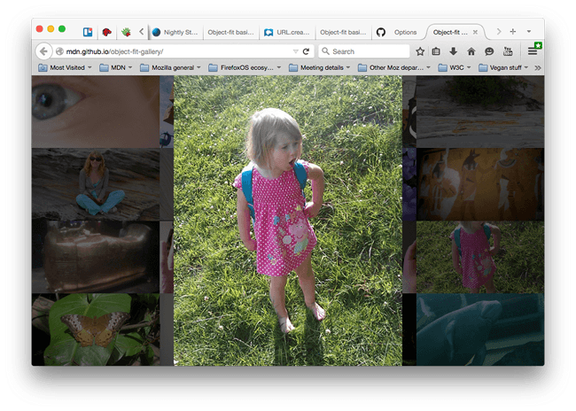

在相關 Web 文件上常見的問題之一，就是要讓同一地方顯示不同尺寸的圖片 (或影片)。或許你正在撰寫動態圖庫 App，以接收使用者所提交的檔案。但你無法要求所有人上傳的圖片都是一樣的解析度或長寬比。這時候該怎麼辦呢？

雖然可以不管圖片長寬比例，逕自讓圖片填滿「[置換元素 (Replaced element)](https://developer.mozilla.org/zh-TW/docs/Web/CSS/Replaced_element)」，但效果往往不佳且看起來不甚美觀。又如果每次都即時執行一些動態切割或縮放，又比整個網頁的建構作業還要麻煩 (舉例來說，你可能正在 CMS 上工作，但你根本沒有網頁內容之外的編輯權限)。

而 [CSS Image Values and Replaced Content](https://dev.w3.org/csswg/css-images/) 模組則提供所謂「[object-fit](https://developer.mozilla.org/en-US/docs/Web/CSS/object-fit)」屬性，可解決類似問題；另有「[object-position](https://developer.mozilla.org/en-US/docs/Web/CSS/object-position)」可設定內容在元素內部的垂直與水平位置。

這些元素都已經能完整支援目前的主要瀏覽器 (但 IE 除外)。而我們將透過本文說明其中幾項使用範例。

注意：object-fit 可搭配 SVG 內容，但只要設定 SVG 內部的 preserveAspectRatio="" 屬性，亦可達到相同效果。

如果你正在設計圖庫類的 App，也遇上類似難題而相關功能，就可[參閱原文](https://hacks.mozilla.org/2015/02/exploring-object-fit/)後段介紹的程式碼與展示喔！

原文連結：[Exploring object-fit](https://hacks.mozilla.org/2015/02/exploring-object-fit/)
