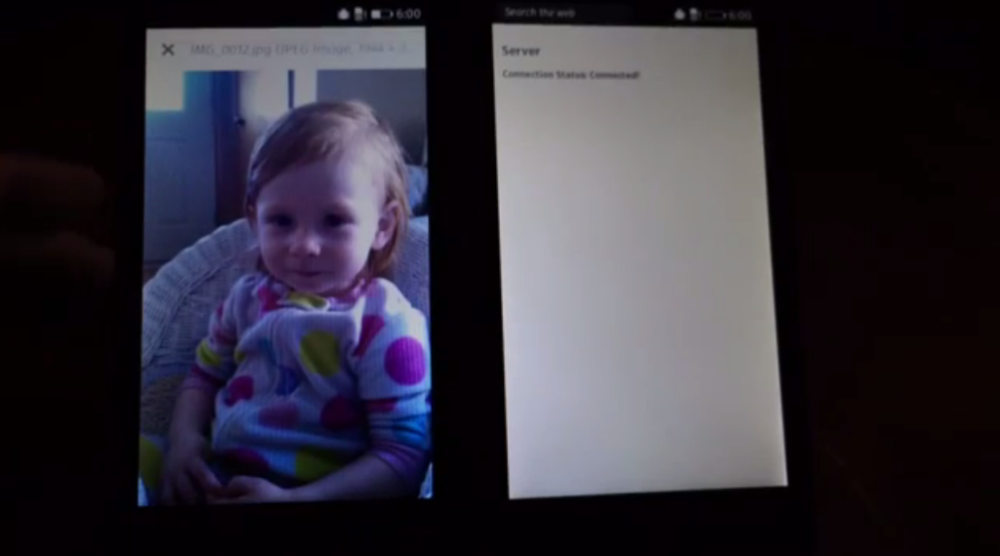

Mozilla 員工在去年底群聚一堂，在一週的時間內共同擬定來年計畫。另有某一團隊也在這一週內成形，並預見到 [Firefox OS](https://developer.mozilla.org/en-US/Firefox_OS) 未來必會將 Web 的重心擺在點對點 (P2P) 作業之上。確切一點來說，我們正努力駕馭如[NFC](https://developer.mozilla.org/en-US/docs/Web/API/NFC_API)、[WiFi Direct](https://developer.mozilla.org/en-US/docs/Web/API/MozWifiP2pManager)、[藍牙](https://developer.mozilla.org/en-US/docs/Web/API/Web_Bluetooth_API)等的相關技術，期能達到離線的 P2P 連線功能。

因為這些技術只能算是裝置之間的通訊方式，所以我們當然也需要 App 之間的通訊協定，以利傳送＼接收資料。而說到要在 Web App 之間傳輸資料，我立刻就想到現成、標準、可用的通訊協定，也就是 HTTP。

使用 HTTP，就等於用戶端 App 傳送＼接收資料的所有工具均已完備，但仍需要在瀏覽器中執行 Web 伺服器，以啟動離線 P2P 通訊作業。而此類型 HTTP 伺服器的功能，可能最適合作為標準化的 [WebAPI](https://developer.mozilla.org/en-US/docs/WebAPI) 以成為 Gecko 的一部分。Firefox OS 實際上已經具備了必要的全部工具，立刻就能使用 JavaScript 建構 P2P 的應用！

### navigator.mozTCPSocket

[封裝式 (Packaged) App](https://developer.mozilla.org/zh-TW/Apps/Developing/Packaged_apps/Packaged_apps) 可存取原始的 TCP 與 UDP 網路 socket。但因為我們正使用 HTTP，所以只要考量 TCP socket 即可。[TCPSocket](https://developer.mozilla.org/en-US/docs/Web/API/TCPSocket) API 目前須透過[navigator.mozTCPSocket](https://developer.mozilla.org/en-US/docs/Web/API/Navigator.mozTCPSocket) 進行存取，並須於「Privileged」的封裝式 App 中宣告 [tcp-socket](https://developer.mozilla.org/en-US/Apps/Build/App_permissions#tcp-socket) 的權限：

		
		

<code>"type": "privileged",
"permissions": {
  "tcp-socket": {}
},
</code>
			
				
					
				
					12345
				
						<code>"type": "privileged","permissions": {  "tcp-socket": {}},</code>
					
				
			
		

如果你認同 P2P 將是 Firefox OS 未來的趨勢，也正需要「HTTP Web Server」的類似功能，可別錯過[原文](https://hacks.mozilla.org/2015/02/embedding-an-http-web-server-in-firefox-os/)後半部所介紹的程式碼，並有[展示影片](https://www.youtube.com/watch?v=-WY2ku-f574)欣賞喔！

原文連結：[Embedding an HTTP Web Server in Firefox OS](https://hacks.mozilla.org/2015/02/embedding-an-http-web-server-in-firefox-os/)
