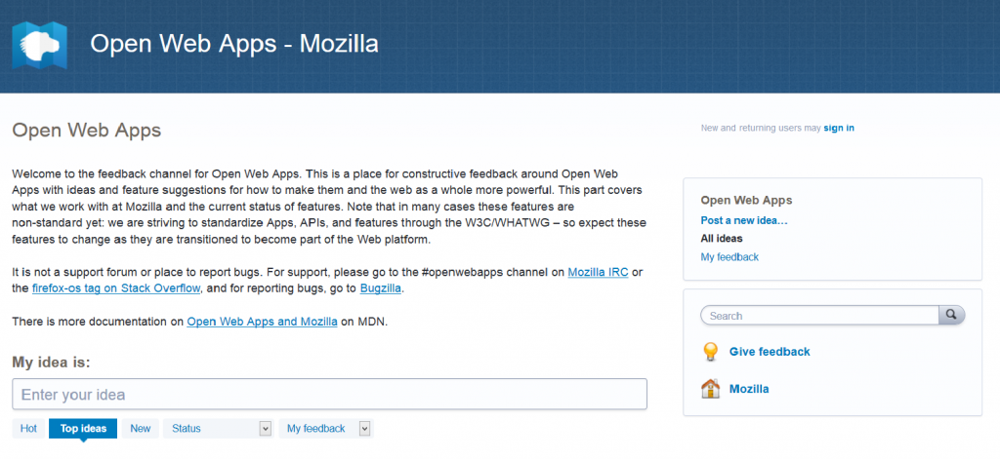

2014 年 8 月，我們在 UserVoice 上[新啟用了 Web App 意見反饋頻道](https://blog.mozilla.com.tw/posts/6312/)，且誘發了許多不錯的討論主題，以下列出其中幾個要點：

- [本討論](https://openwebapps.uservoice.com/forums/258478-open-web-apps/suggestions/6329093-enabling-the-file-system-api-on-all-systems-instea)顯現初期[FileSystem API](https://w3c.github.io/filesystem-api) 的重要性。

- [對背景服務的建議](https://openwebapps.uservoice.com/forums/258478-open-web-apps/suggestions/6258744-background-service-for-apps)則強化如[BackgroundSync API](https://github.com/slightlyoff/BackgroundSync/) 提案的需要。此概念則針對 Firefox OS 建構出些許不同，但名稱近似的「[requestSync API](https://bugzilla.mozilla.org/show_bug.cgi?id=1018320)」暫時為權宜之計，等到 Firefox OS[建構](https://bugzilla.mozilla.org/show_bug.cgi?id=1059784)出完整的[Service Worker](https://github.com/slightlyoff/ServiceWorker/) 為止。

- [討論磁碟儲存容量的集中管理](https://openwebapps.uservoice.com/forums/258478-open-web-apps/suggestions/6268041-a-quote-api-for-local-storage-and-indexeddb)，確保類似初期[quota API](https://www.w3.org/TR/quota-api/) 的東西仍會是 Mozilla Gecko 開發者的優先處理要務。

- [要求新版本的 localStorage](https://openwebapps.uservoice.com/forums/258478-open-web-apps/suggestions/6323700-localstorage-2-asynchronous-and-object-ready)，期能成為主要的儲存機制，以取代目前太多不同的選擇。

對參與討論且提供實際建議的許多人，我們鄭重表達感謝之意。可惜的是，剛開始的參與程度雖然不錯，但後續活動就逐漸降低。我們認為現在該是停用[openwebapps.uservoice.com](https://openwebapps.uservoice.com/) 的時候了。透過 UserVoice 的大量資料匯出服務，我們已經妥善儲存了之前發生的討論與意見。

我們仍須各方工程師拋磚引玉，請繼續反應意見並建議應有的功能給我們。往後會直接將反應意見導回郵件＼消息群組 (可參閱[IRC 頻道與郵件群組的清單](https://wiki.mozilla.org/Apps#IRC_Chat_and_Mailing_Lists)，找到 Mozilla 專屬的 App 頻道)；另有[specifiction.org/](https://specifiction.org/) 是建構 Web 標準的專屬討論區；當然還有[Bugzilla](https://bugzilla.mozilla.org/)。

備註：在 UserVoice 上 Firefox 開發者工具意見反應頻道 ([devtools.uservoice.com](https://devtools.uservoice.com/)) 仍繼續使用中，同時將會繼續開放！

原文連結：[Open Web Apps feedback: Consolidating our channels](https://hacks.mozilla.org/2015/02/open-web-apps-feedback-consolidating-our-channels/)
