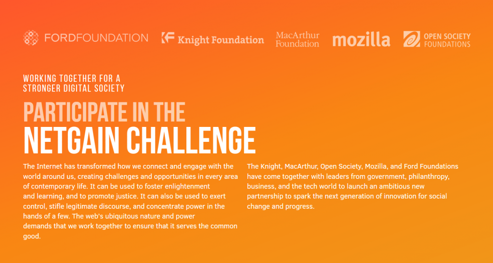

我常常思索著：如同環境、公民權，以及其他許多社會議題運動，Open Web 的保護與推展，也一樣需要投入與關注度。畢竟網際網路已經全面影響到我們的生活，從就學＼經濟發到政治議題的言論與集會結社自由都是。

今天透過「[NetGain](https://netgainchallenge.org/)」活動，我們聚集了全球許多大型基金會，要共同為此情要事發聲：「保持網路開放」本身就是獨立的社會議題，而自由開放的 Web 更是所有議題得以進展的基礎。

#### Net Gain 來得正是時候。

我們現正處於 Web 自由與開放運動的轉捩點。從一方面來說，我們手上掌握了目前的籌碼，已於許多 Web 的戰場上取得勝利。如推動美國的網路中立性 (Net Neutrality)、促成巴西的「Marco Civil」、退回歐洲的網路使用稅條款。這些都是由數百萬人同心協力，以採取集體行動捍衛 Web 並形成公眾議題的絕佳範例。

雖然我們現在掌握了先機，但仍有許多危機亟待我們解決。我們必須尋求法律以外的途徑克服這些問題。

許多公司都嘗試要控制 Web、公眾輿論、企業監控，以及言論自由的寒蟬效應。如果下一波的數十億網民誤以為網路只存在於高牆聳立的平台 (如 Facebook 與 WhatsApp) 上，就更難以解決這些問題。最可怕的情況，莫過於大家放棄對自己「眼睛能看到、手上能創造」的選擇權利，卻隨便交由網路守門人替我們決定。

Mozilla 就是為了解決這些挑戰而生，而上述問題也是讓 NetGain 訴求之所以如此重要的原因。我們爭取瀏覽器的多元選擇，並在政府與公司監控活動中保護公眾的隱私權。對於 Web 能交由網民自由掌握的範疇，這些活動也當然起了決定性的作用。

那我們需要什麼？我們如何掌握 Web 的優勢並妥善利用，以對抗可能的控制威脅？

只有大家都意識到自己不僅是全世界的公民，同時也是 Web 的公民之時，我們才有機會完全發揮潛力。因此，我們必須先將 Web 的自由性與親民性打造為「數位包容 (Digital inclusion)」的權利。我們也必須相信目前所掌握的工具。這是指使用者必須能主動信任 Mozilla 的相關產品，而並非只是簡單口號或事後才產生的印象。提到個人隱私與資料安全，信任感不僅特別重要，亦會是我們往後持續加強的重點。

我們也需要真正的領導菁英。我們必須尋找並培養跨領域 (商界、政府、公民社會) 的人，才有機會兌現對網際網路的承諾。這些後起之秀未來能制定相關法律，將 Web 塑造成全球共享的資源。

很高興能看到許多慈善機構正陸續加入 Net Gain 的行列。基金會一直致力將網際網路轉化為良善力量。在如網路中立的議題上，我們正投資打造跨領域的聯盟、培養領導人才，並進入市場失能而造成強烈影響的地方。

但網路又影響了基金會所能著墨的每個領域 ─ 從教育到政治參與；從健康到經濟失衡等等。所以現在正是投入雙倍心血，讓所有基金會都能為自由且開放 Web 盡一份力量的最佳時刻。

我們現正處於 Web 的另一個轉捩點上，而全球多個大型基金會在加入 NetGain 之餘，也一同聲明保護 Web 是極為重要的事情。現正是我們推動 Web 自由與開放運動的機會。就像慈善家為全球議題做出的貢獻，讓我們也一同為網路的未來而努力。

─ by Mark Surman

原文連結：[A Watershed Moment to Protect the Free and Open Web](https://blog.mozilla.org/blog/2015/02/11/a-watershed-moment-to-protect-the-free-and-open-web/)
